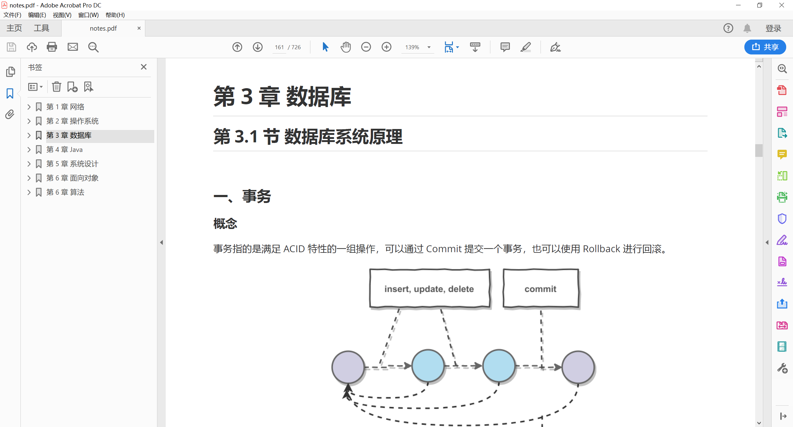
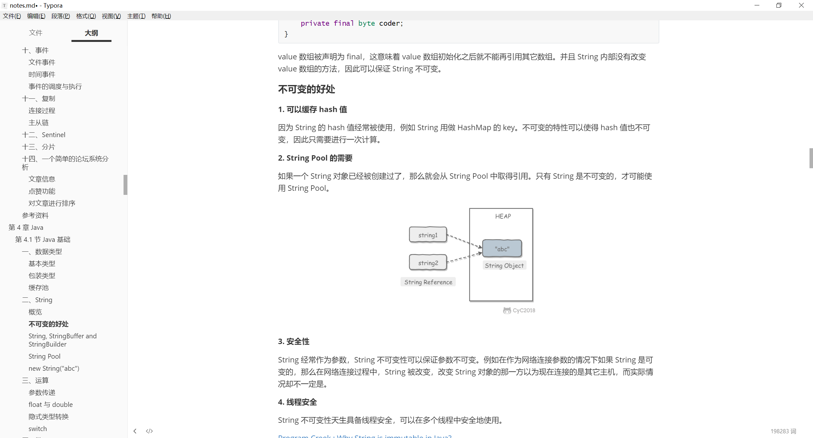
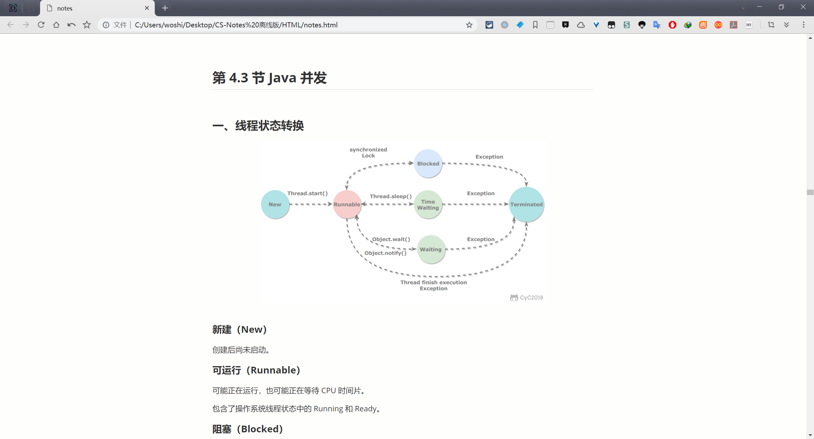

# 目的

考慮到有部分讀者的網絡環境較差，有時候在線訪問速度很慢，導致閱讀體驗不佳。另外，PDF 等格式的離線版本相比於網頁在線版本更方便做筆記。因此提供離線閱讀版本給大家下載。

# 內容

有三種格式的離線版本：PDF、Markdown 和 HTML 。

## PDF

優點是方便做筆記；缺點是不能顯示 GIF 圖片（所以“劍指 Offer 題解”不建議使用 PDF 進行閱讀），以及顯示效果不佳。

## Markdown

優點是能很好地顯示 GIF 圖片，顯示效果也很好；缺點是由於將所有內容整合在同一個文件中，導致實時渲染有點卡頓。

## HTML

優點是和 Markdown 的顯示效果幾乎一致，同時不需要 Markdown 的實時渲染，因此瀏覽速度更快；缺點是目錄功能還不是很完善。

如果想在安卓手機端閱讀，推薦使用這種格式，將 html 文件和圖片文件都複製到手機上，用瀏覽器打開 html 文件並存成書籤，以後就可以快速地離線閱讀。

# 如何下載

離線版本由公眾號 **CyC2018** 發佈，最新版本也會在上面及時發佈，在公眾號後臺回覆 **離線下載** 即可獲取下載鏈接。

</img>

