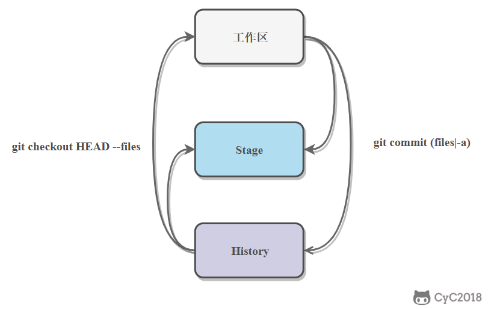
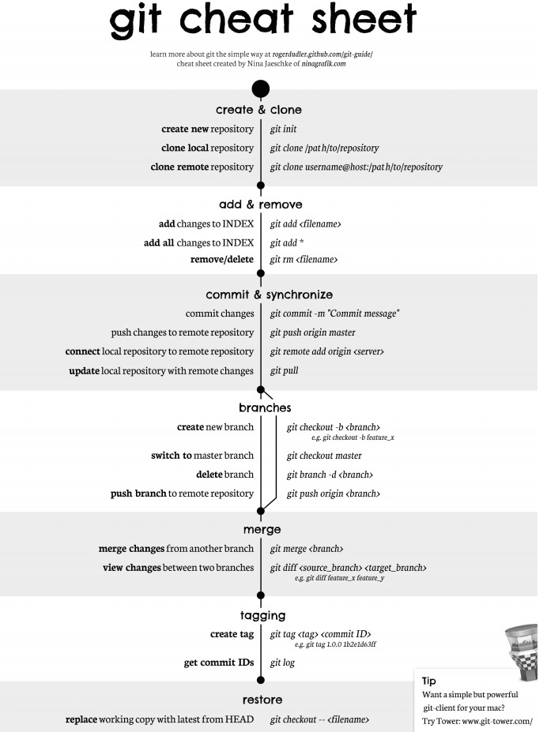

<!-- GFM-TOC -->
* [集中式與分佈式](#集中式與分佈式)
* [中心服務器](#中心服務器)
* [工作流](#工作流)
* [分支實現](#分支實現)
* [衝突](#衝突)
* [Fast forward](#fast-forward)
* [分支管理策略](#分支管理策略)
* [儲藏（Stashing）](#儲藏stashing)
* [SSH 傳輸設置](#ssh-傳輸設置)
* [.gitignore 文件](#gitignore-文件)
* [Git 命令一覽](#git-命令一覽)
* [參考資料](#參考資料)
<!-- GFM-TOC -->


# 集中式與分佈式

Git 屬於分佈式版本控制系統，而 SVN 屬於集中式。

<div align="center">  </div><br>

集中式版本控制只有中心服務器擁有一份代碼，而分佈式版本控制每個人的電腦上就有一份完整的代碼。

集中式版本控制有安全性問題，當中心服務器掛了所有人都沒辦法工作了。

集中式版本控制需要連網才能工作，如果網速過慢，那麼提交一個文件會慢的無法讓人忍受。而分佈式版本控制不需要連網就能工作。

分佈式版本控制新建分支、合併分支操作速度非常快，而集中式版本控制新建一個分支相當於複製一份完整代碼。

# 中心服務器

中心服務器用來交換每個用戶的修改，沒有中心服務器也能工作，但是中心服務器能夠 24 小時保持開機狀態，這樣就能更方便的交換修改。

Github 就是一箇中心服務器。

# 工作流

新建一個倉庫之後，當前目錄就成為了工作區，工作區下有一個隱藏目錄 .git，它屬於 Git 的版本庫。

Git 的版本庫有一個稱為 Stage 的暫存區以及最後的 History 版本庫，History 存儲所有分支信息，使用一個 HEAD 指針指向當前分支。

<div align="center">  </div><br>

- git add files 把文件的修改添加到暫存區
- git commit 把暫存區的修改提交到當前分支，提交之後暫存區就被清空了
- git reset -- files 使用當前分支上的修改覆蓋暫存區，用來撤銷最後一次 git add files
- git checkout -- files 使用暫存區的修改覆蓋工作目錄，用來撤銷本地修改

<div align="center">  </div><br>

可以跳過暫存區域直接從分支中取出修改，或者直接提交修改到分支中。

- git commit -a 直接把所有文件的修改添加到暫存區然後執行提交
- git checkout HEAD -- files 取出最後一次修改，可以用來進行回滾操作

<div align="center">  </div><br>

# 分支實現

使用指針將每個提交連接成一條時間線，HEAD 指針指向當前分支指針。

<div align="center">  </div><br>

新建分支是新建一個指針指向時間線的最後一個節點，並讓 HEAD 指針指向新分支，表示新分支成為當前分支。

<div align="center">  </div><br>

每次提交只會讓當前分支指針向前移動，而其它分支指針不會移動。

<div align="center">  </div><br>

合併分支也只需要改變指針即可。

<div align="center">  </div><br>

# 衝突

當兩個分支都對同一個文件的同一行進行了修改，在分支合併時就會產生衝突。

<div align="center">  </div><br>

Git 會使用 <<<<<<< ，======= ，>>>>>>> 標記出不同分支的內容，只需要把不同分支中衝突部分修改成一樣就能解決衝突。

```
<<<<<<< HEAD
Creating a new branch is quick & simple.
=======
Creating a new branch is quick AND simple.
>>>>>>> feature1
```

# Fast forward

"快進式合併"（fast-farward merge），會直接將 master 分支指向合併的分支，這種模式下進行分支合併會丟失分支信息，也就不能在分支歷史上看出分支信息。

可以在合併時加上 --no-ff 參數來禁用 Fast forward 模式，並且加上 -m 參數讓合併時產生一個新的 commit。

```
$ git merge --no-ff -m "merge with no-ff" dev
```

<div align="center">  </div><br>

# 分支管理策略

master 分支應該是非常穩定的，只用來發布新版本；

日常開發在開發分支 dev 上進行。

<div align="center">  </div><br>

# 儲藏（Stashing）

在一個分支上操作之後，如果還沒有將修改提交到分支上，此時進行切換分支，那麼另一個分支上也能看到新的修改。這是因為所有分支都共用一個工作區的緣故。

可以使用 git stash 將當前分支的修改儲藏起來，此時當前工作區的所有修改都會被存到棧中，也就是說當前工作區是乾淨的，沒有任何未提交的修改。此時就可以安全的切換到其它分支上了。

```
$ git stash
Saved working directory and index state \ "WIP on master: 049d078 added the index file"
HEAD is now at 049d078 added the index file (To restore them type "git stash apply")
```

該功能可以用於 bug 分支的實現。如果當前正在 dev 分支上進行開發，但是此時 master 上有個 bug 需要修復，但是 dev 分支上的開發還未完成，不想立即提交。在新建 bug 分支並切換到 bug 分支之前就需要使用 git stash 將 dev 分支的未提交修改儲藏起來。

# SSH 傳輸設置

Git 倉庫和 Github 中心倉庫之間的傳輸是通過 SSH 加密。

如果工作區下沒有 .ssh 目錄，或者該目錄下沒有 id_rsa 和 id_rsa.pub 這兩個文件，可以通過以下命令來創建 SSH Key：

```
$ ssh-keygen -t rsa -C "youremail@example.com"
```

然後把公鑰 id_rsa.pub 的內容複製到 Github "Account settings" 的 SSH Keys 中。

# .gitignore 文件

忽略以下文件：

- 操作系統自動生成的文件，比如縮略圖；
- 編譯生成的中間文件，比如 Java 編譯產生的 .class 文件；
- 自己的敏感信息，比如存放口令的配置文件。

不需要全部自己編寫，可以到 [https://github.com/github/gitignore](https://github.com/github/gitignore) 中進行查詢。

# Git 命令一覽

<div align="center">  </div><br>

比較詳細的地址：http://www.cheat-sheets.org/saved-copy/git-cheat-sheet.pdf

# 參考資料

- [Git - 簡明指南](http://rogerdudler.github.io/git-guide/index.zh.html)
- [圖解 Git](http://marklodato.github.io/visual-git-guide/index-zh-cn.html)
- [廖雪峰 : Git 教程](https://www.liaoxuefeng.com/wiki/0013739516305929606dd18361248578c67b8067c8c017b000)
- [Learn Git Branching](https://learngitbranching.js.org/)


# 微信公眾號


更多精彩內容將發佈在微信公眾號 CyC2018 上，你也可以在公眾號後臺和我交流學習和求職相關的問題。另外，公眾號提供了該項目的 PDF 等離線閱讀版本，後臺回覆 "下載" 即可領取。公眾號也提供了一份技術面試複習大綱，不僅系統整理了面試知識點，而且標註了各個知識點的重要程度，從而幫你理清多而雜的面試知識點，後臺回覆 "大綱" 即可領取。我基本是按照這個大綱來進行復習的，對我拿到了 BAT 頭條等 Offer 起到很大的幫助。你們完全可以和我一樣根據大綱上列的知識點來進行復習，就不用看很多不重要的內容，也可以知道哪些內容很重要從而多安排一些複習時間。


<br><div align="center"></img></div>
