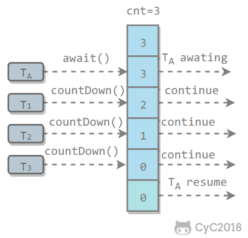
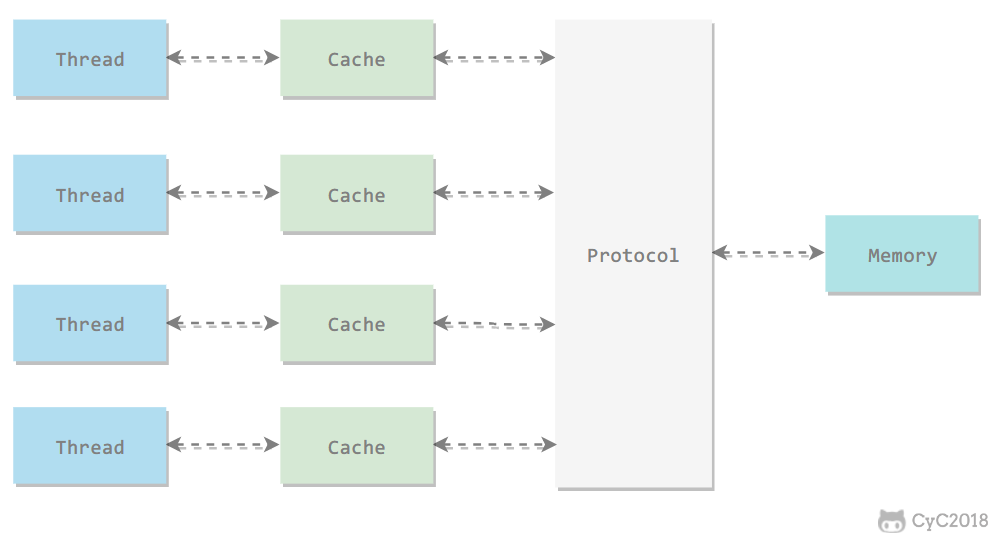
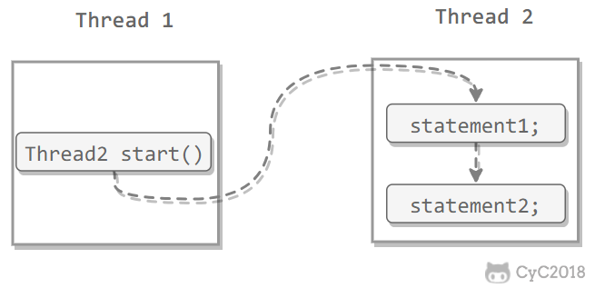
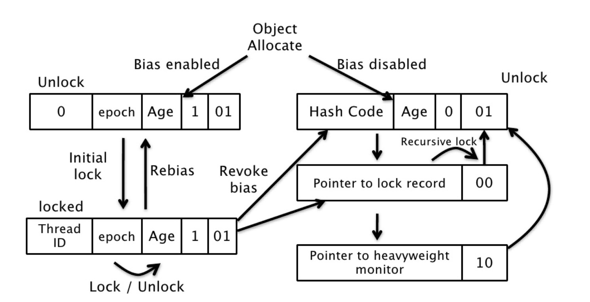

<!-- GFM-TOC -->
* [一、線程狀態轉換](#一線程狀態轉換)
    * [新建（New）](#新建new)
    * [可運行（Runnable）](#可運行runnable)
    * [阻塞（Blocked）](#阻塞blocked)
    * [無限期等待（Waiting）](#無限期等待waiting)
    * [限期等待（Timed Waiting）](#限期等待timed-waiting)
    * [死亡（Terminated）](#死亡terminated)
* [二、使用線程](#二使用線程)
    * [實現 Runnable 接口](#實現-runnable-接口)
    * [實現 Callable 接口](#實現-callable-接口)
    * [繼承 Thread 類](#繼承-thread-類)
    * [實現接口 VS 繼承 Thread](#實現接口-vs-繼承-thread)
* [三、基礎線程機制](#三基礎線程機制)
    * [Executor](#executor)
    * [Daemon](#daemon)
    * [sleep()](#sleep)
    * [yield()](#yield)
* [四、中斷](#四中斷)
    * [InterruptedException](#interruptedexception)
    * [interrupted()](#interrupted)
    * [Executor 的中斷操作](#executor-的中斷操作)
* [五、互斥同步](#五互斥同步)
    * [synchronized](#synchronized)
    * [ReentrantLock](#reentrantlock)
    * [比較](#比較)
    * [使用選擇](#使用選擇)
* [六、線程之間的協作](#六線程之間的協作)
    * [join()](#join)
    * [wait() notify() notifyAll()](#wait-notify-notifyall)
    * [await() signal() signalAll()](#await-signal-signalall)
* [七、J.U.C - AQS](#七juc---aqs)
    * [CountDownLatch](#countdownlatch)
    * [CyclicBarrier](#cyclicbarrier)
    * [Semaphore](#semaphore)
* [八、J.U.C - 其它組件](#八juc---其它組件)
    * [FutureTask](#futuretask)
    * [BlockingQueue](#blockingqueue)
    * [ForkJoin](#forkjoin)
* [九、線程不安全示例](#九線程不安全示例)
* [十、Java 內存模型](#十java-內存模型)
    * [主內存與工作內存](#主內存與工作內存)
    * [內存間交互操作](#內存間交互操作)
    * [內存模型三大特性](#內存模型三大特性)
    * [先行發生原則](#先行發生原則)
* [十一、線程安全](#十一線程安全)
    * [不可變](#不可變)
    * [互斥同步](#互斥同步)
    * [非阻塞同步](#非阻塞同步)
    * [無同步方案](#無同步方案)
* [十二、鎖優化](#十二鎖優化)
    * [自旋鎖](#自旋鎖)
    * [鎖消除](#鎖消除)
    * [鎖粗化](#鎖粗化)
    * [輕量級鎖](#輕量級鎖)
    * [偏向鎖](#偏向鎖)
* [十三、多線程開發良好的實踐](#十三多線程開發良好的實踐)
* [參考資料](#參考資料)
<!-- GFM-TOC -->


# 一、線程狀態轉換

<div align="center">  </div><br>

## 新建（New）

創建後尚未啟動。

## 可運行（Runnable）

可能正在運行，也可能正在等待 CPU 時間片。

包含了操作系統線程狀態中的 Running 和 Ready。

## 阻塞（Blocked）

等待獲取一個排它鎖，如果其線程釋放了鎖就會結束此狀態。

## 無限期等待（Waiting）

等待其它線程顯式地喚醒，否則不會被分配 CPU 時間片。

| 進入方法 | 退出方法 |
| --- | --- |
| 沒有設置 Timeout 參數的 Object.wait() 方法 | Object.notify() / Object.notifyAll() |
| 沒有設置 Timeout 參數的 Thread.join() 方法 | 被調用的線程執行完畢 |
| LockSupport.park() 方法 | LockSupport.unpark(Thread) |

## 限期等待（Timed Waiting）

無需等待其它線程顯式地喚醒，在一定時間之後會被系統自動喚醒。

調用 Thread.sleep() 方法使線程進入限期等待狀態時，常常用“使一個線程睡眠”進行描述。

調用 Object.wait() 方法使線程進入限期等待或者無限期等待時，常常用“掛起一個線程”進行描述。

睡眠和掛起是用來描述行為，而阻塞和等待用來描述狀態。

阻塞和等待的區別在於，阻塞是被動的，它是在等待獲取一個排它鎖。而等待是主動的，通過調用 Thread.sleep() 和 Object.wait() 等方法進入。

| 進入方法 | 退出方法 |
| --- | --- |
| Thread.sleep() 方法 | 時間結束 |
| 設置了 Timeout 參數的 Object.wait() 方法 | 時間結束 / Object.notify() / Object.notifyAll()  |
| 設置了 Timeout 參數的 Thread.join() 方法 | 時間結束 / 被調用的線程執行完畢 |
| LockSupport.parkNanos() 方法 | LockSupport.unpark(Thread) |
| LockSupport.parkUntil() 方法 | LockSupport.unpark(Thread) |

## 死亡（Terminated）

可以是線程結束任務之後自己結束，或者產生了異常而結束。

# 二、使用線程

有三種使用線程的方法：

- 實現 Runnable 接口；
- 實現 Callable 接口；
- 繼承 Thread 類。

實現 Runnable 和 Callable 接口的類只能當做一個可以在線程中運行的任務，不是真正意義上的線程，因此最後還需要通過 Thread 來調用。可以說任務是通過線程驅動從而執行的。

## 實現 Runnable 接口

需要實現 run() 方法。

通過 Thread 調用 start() 方法來啟動線程。

```java
public class MyRunnable implements Runnable {
    public void run() {
        // ...
    }
}
```

```java
public static void main(String[] args) {
    MyRunnable instance = new MyRunnable();
    Thread thread = new Thread(instance);
    thread.start();
}
```

## 實現 Callable 接口

與 Runnable 相比，Callable 可以有返回值，返回值通過 FutureTask 進行封裝。

```java
public class MyCallable implements Callable<Integer> {
    public Integer call() {
        return 123;
    }
}
```

```java
public static void main(String[] args) throws ExecutionException, InterruptedException {
    MyCallable mc = new MyCallable();
    FutureTask<Integer> ft = new FutureTask<>(mc);
    Thread thread = new Thread(ft);
    thread.start();
    System.out.println(ft.get());
}
```

## 繼承 Thread 類

同樣也是需要實現 run() 方法，因為 Thread 類也實現了 Runable 接口。

當調用 start() 方法啟動一個線程時，虛擬機會將該線程放入就緒隊列中等待被調度，當一個線程被調度時會執行該線程的 run() 方法。

```java
public class MyThread extends Thread {
    public void run() {
        // ...
    }
}
```

```java
public static void main(String[] args) {
    MyThread mt = new MyThread();
    mt.start();
}
```

## 實現接口 VS 繼承 Thread

實現接口會更好一些，因為：

- Java 不支持多重繼承，因此繼承了 Thread 類就無法繼承其它類，但是可以實現多個接口；
- 類可能只要求可執行就行，繼承整個 Thread 類開銷過大。

# 三、基礎線程機制

## Executor

Executor 管理多個異步任務的執行，而無需程序員顯式地管理線程的生命週期。這裡的異步是指多個任務的執行互不干擾，不需要進行同步操作。

主要有三種 Executor：

- CachedThreadPool：一個任務創建一個線程；
- FixedThreadPool：所有任務只能使用固定大小的線程；
- SingleThreadExecutor：相當於大小為 1 的 FixedThreadPool。

```java
public static void main(String[] args) {
    ExecutorService executorService = Executors.newCachedThreadPool();
    for (int i = 0; i < 5; i++) {
        executorService.execute(new MyRunnable());
    }
    executorService.shutdown();
}
```

## Daemon

守護線程是程序運行時在後臺提供服務的線程，不屬於程序中不可或缺的部分。

當所有非守護線程結束時，程序也就終止，同時會殺死所有守護線程。

main() 屬於非守護線程。

在線程啟動之前使用 setDaemon() 方法可以將一個線程設置為守護線程。

```java
public static void main(String[] args) {
    Thread thread = new Thread(new MyRunnable());
    thread.setDaemon(true);
}
```

## sleep()

Thread.sleep(millisec) 方法會休眠當前正在執行的線程，millisec 單位為毫秒。

sleep() 可能會拋出 InterruptedException，因為異常不能跨線程傳播回 main() 中，因此必須在本地進行處理。線程中拋出的其它異常也同樣需要在本地進行處理。

```java
public void run() {
    try {
        Thread.sleep(3000);
    } catch (InterruptedException e) {
        e.printStackTrace();
    }
}
```

## yield()

對靜態方法 Thread.yield() 的調用聲明瞭當前線程已經完成了生命週期中最重要的部分，可以切換給其它線程來執行。該方法只是對線程調度器的一個建議，而且也只是建議具有相同優先級的其它線程可以運行。

```java
public void run() {
    Thread.yield();
}
```

# 四、中斷

一個線程執行完畢之後會自動結束，如果在運行過程中發生異常也會提前結束。

## InterruptedException

通過調用一個線程的 interrupt() 來中斷該線程，如果該線程處於阻塞、限期等待或者無限期等待狀態，那麼就會拋出 InterruptedException，從而提前結束該線程。但是不能中斷 I/O 阻塞和 synchronized 鎖阻塞。

對於以下代碼，在 main() 中啟動一個線程之後再中斷它，由於線程中調用了 Thread.sleep() 方法，因此會拋出一個 InterruptedException，從而提前結束線程，不執行之後的語句。

```java
public class InterruptExample {

    private static class MyThread1 extends Thread {
        @Override
        public void run() {
            try {
                Thread.sleep(2000);
                System.out.println("Thread run");
            } catch (InterruptedException e) {
                e.printStackTrace();
            }
        }
    }
}
```

```java
public static void main(String[] args) throws InterruptedException {
    Thread thread1 = new MyThread1();
    thread1.start();
    thread1.interrupt();
    System.out.println("Main run");
}
```

```html
Main run
java.lang.InterruptedException: sleep interrupted
    at java.lang.Thread.sleep(Native Method)
    at InterruptExample.lambda$main$0(InterruptExample.java:5)
    at InterruptExample$$Lambda$1/713338599.run(Unknown Source)
    at java.lang.Thread.run(Thread.java:745)
```

## interrupted()

如果一個線程的 run() 方法執行一個無限循環，並且沒有執行 sleep() 等會拋出 InterruptedException 的操作，那麼調用線程的 interrupt() 方法就無法使線程提前結束。

但是調用 interrupt() 方法會設置線程的中斷標記，此時調用 interrupted() 方法會返回 true。因此可以在循環體中使用 interrupted() 方法來判斷線程是否處於中斷狀態，從而提前結束線程。

```java
public class InterruptExample {

    private static class MyThread2 extends Thread {
        @Override
        public void run() {
            while (!interrupted()) {
                // ..
            }
            System.out.println("Thread end");
        }
    }
}
```

```java
public static void main(String[] args) throws InterruptedException {
    Thread thread2 = new MyThread2();
    thread2.start();
    thread2.interrupt();
}
```

```html
Thread end
```

## Executor 的中斷操作

調用 Executor 的 shutdown() 方法會等待線程都執行完畢之後再關閉，但是如果調用的是 shutdownNow() 方法，則相當於調用每個線程的 interrupt() 方法。

以下使用 Lambda 創建線程，相當於創建了一個匿名內部線程。

```java
public static void main(String[] args) {
    ExecutorService executorService = Executors.newCachedThreadPool();
    executorService.execute(() -> {
        try {
            Thread.sleep(2000);
            System.out.println("Thread run");
        } catch (InterruptedException e) {
            e.printStackTrace();
        }
    });
    executorService.shutdownNow();
    System.out.println("Main run");
}
```

```html
Main run
java.lang.InterruptedException: sleep interrupted
    at java.lang.Thread.sleep(Native Method)
    at ExecutorInterruptExample.lambda$main$0(ExecutorInterruptExample.java:9)
    at ExecutorInterruptExample$$Lambda$1/1160460865.run(Unknown Source)
    at java.util.concurrent.ThreadPoolExecutor.runWorker(ThreadPoolExecutor.java:1142)
    at java.util.concurrent.ThreadPoolExecutor$Worker.run(ThreadPoolExecutor.java:617)
    at java.lang.Thread.run(Thread.java:745)
```

如果只想中斷 Executor 中的一個線程，可以通過使用 submit() 方法來提交一個線程，它會返回一個 Future<?> 對象，通過調用該對象的 cancel(true) 方法就可以中斷線程。

```java
Future<?> future = executorService.submit(() -> {
    // ..
});
future.cancel(true);
```

# 五、互斥同步

Java 提供了兩種鎖機制來控制多個線程對共享資源的互斥訪問，第一個是 JVM 實現的 synchronized，而另一個是 JDK 實現的 ReentrantLock。

## synchronized

**1. 同步一個代碼塊** 

```java
public void func() {
    synchronized (this) {
        // ...
    }
}
```

它只作用於同一個對象，如果調用兩個對象上的同步代碼塊，就不會進行同步。

對於以下代碼，使用 ExecutorService 執行了兩個線程，由於調用的是同一個對象的同步代碼塊，因此這兩個線程會進行同步，當一個線程進入同步語句塊時，另一個線程就必須等待。

```java
public class SynchronizedExample {

    public void func1() {
        synchronized (this) {
            for (int i = 0; i < 10; i++) {
                System.out.print(i + " ");
            }
        }
    }
}
```

```java
public static void main(String[] args) {
    SynchronizedExample e1 = new SynchronizedExample();
    ExecutorService executorService = Executors.newCachedThreadPool();
    executorService.execute(() -> e1.func1());
    executorService.execute(() -> e1.func1());
}
```

```html
0 1 2 3 4 5 6 7 8 9 0 1 2 3 4 5 6 7 8 9
```

對於以下代碼，兩個線程調用了不同對象的同步代碼塊，因此這兩個線程就不需要同步。從輸出結果可以看出，兩個線程交叉執行。

```java
public static void main(String[] args) {
    SynchronizedExample e1 = new SynchronizedExample();
    SynchronizedExample e2 = new SynchronizedExample();
    ExecutorService executorService = Executors.newCachedThreadPool();
    executorService.execute(() -> e1.func1());
    executorService.execute(() -> e2.func1());
}
```

```html
0 0 1 1 2 2 3 3 4 4 5 5 6 6 7 7 8 8 9 9
```


**2. 同步一個方法** 

```java
public synchronized void func () {
    // ...
}
```

它和同步代碼塊一樣，作用於同一個對象。

**3. 同步一個類** 

```java
public void func() {
    synchronized (SynchronizedExample.class) {
        // ...
    }
}
```

作用於整個類，也就是說兩個線程調用同一個類的不同對象上的這種同步語句，也會進行同步。

```java
public class SynchronizedExample {

    public void func2() {
        synchronized (SynchronizedExample.class) {
            for (int i = 0; i < 10; i++) {
                System.out.print(i + " ");
            }
        }
    }
}
```

```java
public static void main(String[] args) {
    SynchronizedExample e1 = new SynchronizedExample();
    SynchronizedExample e2 = new SynchronizedExample();
    ExecutorService executorService = Executors.newCachedThreadPool();
    executorService.execute(() -> e1.func2());
    executorService.execute(() -> e2.func2());
}
```

```html
0 1 2 3 4 5 6 7 8 9 0 1 2 3 4 5 6 7 8 9
```

**4. 同步一個靜態方法** 

```java
public synchronized static void fun() {
    // ...
}
```

作用於整個類。

## ReentrantLock

ReentrantLock 是 java.util.concurrent（J.U.C）包中的鎖。

```java
public class LockExample {

    private Lock lock = new ReentrantLock();

    public void func() {
        lock.lock();
        try {
            for (int i = 0; i < 10; i++) {
                System.out.print(i + " ");
            }
        } finally {
            lock.unlock(); // 確保釋放鎖，從而避免發生死鎖。
        }
    }
}
```

```java
public static void main(String[] args) {
    LockExample lockExample = new LockExample();
    ExecutorService executorService = Executors.newCachedThreadPool();
    executorService.execute(() -> lockExample.func());
    executorService.execute(() -> lockExample.func());
}
```

```html
0 1 2 3 4 5 6 7 8 9 0 1 2 3 4 5 6 7 8 9
```


## 比較

**1. 鎖的實現** 

synchronized 是 JVM 實現的，而 ReentrantLock 是 JDK 實現的。

**2. 性能** 

新版本 Java 對 synchronized 進行了很多優化，例如自旋鎖等，synchronized 與 ReentrantLock 大致相同。

**3. 等待可中斷** 

當持有鎖的線程長期不釋放鎖的時候，正在等待的線程可以選擇放棄等待，改為處理其他事情。

ReentrantLock 可中斷，而 synchronized 不行。

**4. 公平鎖** 

公平鎖是指多個線程在等待同一個鎖時，必須按照申請鎖的時間順序來依次獲得鎖。

synchronized 中的鎖是非公平的，ReentrantLock 默認情況下也是非公平的，但是也可以是公平的。

**5. 鎖綁定多個條件** 

一個 ReentrantLock 可以同時綁定多個 Condition 對象。

## 使用選擇

除非需要使用 ReentrantLock 的高級功能，否則優先使用 synchronized。這是因為 synchronized 是 JVM 實現的一種鎖機制，JVM 原生地支持它，而 ReentrantLock 不是所有的 JDK 版本都支持。並且使用 synchronized 不用擔心沒有釋放鎖而導致死鎖問題，因為 JVM 會確保鎖的釋放。

# 六、線程之間的協作

當多個線程可以一起工作去解決某個問題時，如果某些部分必須在其它部分之前完成，那麼就需要對線程進行協調。

## join()

在線程中調用另一個線程的 join() 方法，會將當前線程掛起，而不是忙等待，直到目標線程結束。

對於以下代碼，雖然 b 線程先啟動，但是因為在 b 線程中調用了 a 線程的 join() 方法，b 線程會等待 a 線程結束才繼續執行，因此最後能夠保證 a 線程的輸出先於 b 線程的輸出。

```java
public class JoinExample {

    private class A extends Thread {
        @Override
        public void run() {
            System.out.println("A");
        }
    }

    private class B extends Thread {

        private A a;

        B(A a) {
            this.a = a;
        }

        @Override
        public void run() {
            try {
                a.join();
            } catch (InterruptedException e) {
                e.printStackTrace();
            }
            System.out.println("B");
        }
    }

    public void test() {
        A a = new A();
        B b = new B(a);
        b.start();
        a.start();
    }
}
```

```java
public static void main(String[] args) {
    JoinExample example = new JoinExample();
    example.test();
}
```

```
A
B
```

## wait() notify() notifyAll()

調用 wait() 使得線程等待某個條件滿足，線程在等待時會被掛起，當其他線程的運行使得這個條件滿足時，其它線程會調用 notify() 或者 notifyAll() 來喚醒掛起的線程。

它們都屬於 Object 的一部分，而不屬於 Thread。

只能用在同步方法或者同步控制塊中使用，否則會在運行時拋出 IllegalMonitorStateException。

使用 wait() 掛起期間，線程會釋放鎖。這是因為，如果沒有釋放鎖，那麼其它線程就無法進入對象的同步方法或者同步控制塊中，那麼就無法執行 notify() 或者 notifyAll() 來喚醒掛起的線程，造成死鎖。

```java
public class WaitNotifyExample {

    public synchronized void before() {
        System.out.println("before");
        notifyAll();
    }

    public synchronized void after() {
        try {
            wait();
        } catch (InterruptedException e) {
            e.printStackTrace();
        }
        System.out.println("after");
    }
}
```

```java
public static void main(String[] args) {
    ExecutorService executorService = Executors.newCachedThreadPool();
    WaitNotifyExample example = new WaitNotifyExample();
    executorService.execute(() -> example.after());
    executorService.execute(() -> example.before());
}
```

```html
before
after
```

**wait() 和 sleep() 的區別** 

- wait() 是 Object 的方法，而 sleep() 是 Thread 的靜態方法；
- wait() 會釋放鎖，sleep() 不會。

## await() signal() signalAll()

java.util.concurrent 類庫中提供了 Condition 類來實現線程之間的協調，可以在 Condition 上調用 await() 方法使線程等待，其它線程調用 signal() 或 signalAll() 方法喚醒等待的線程。

相比於 wait() 這種等待方式，await() 可以指定等待的條件，因此更加靈活。

使用 Lock 來獲取一個 Condition 對象。

```java
public class AwaitSignalExample {

    private Lock lock = new ReentrantLock();
    private Condition condition = lock.newCondition();

    public void before() {
        lock.lock();
        try {
            System.out.println("before");
            condition.signalAll();
        } finally {
            lock.unlock();
        }
    }

    public void after() {
        lock.lock();
        try {
            condition.await();
            System.out.println("after");
        } catch (InterruptedException e) {
            e.printStackTrace();
        } finally {
            lock.unlock();
        }
    }
}
```

```java
public static void main(String[] args) {
    ExecutorService executorService = Executors.newCachedThreadPool();
    AwaitSignalExample example = new AwaitSignalExample();
    executorService.execute(() -> example.after());
    executorService.execute(() -> example.before());
}
```

```html
before
after
```

# 七、J.U.C - AQS

java.util.concurrent（J.U.C）大大提高了併發性能，AQS 被認為是 J.U.C 的核心。

## CountDownLatch

用來控制一個或者多個線程等待多個線程。

維護了一個計數器 cnt，每次調用 countDown() 方法會讓計數器的值減 1，減到 0 的時候，那些因為調用 await() 方法而在等待的線程就會被喚醒。

<div align="center">  </div><br>

```java
public class CountdownLatchExample {

    public static void main(String[] args) throws InterruptedException {
        final int totalThread = 10;
        CountDownLatch countDownLatch = new CountDownLatch(totalThread);
        ExecutorService executorService = Executors.newCachedThreadPool();
        for (int i = 0; i < totalThread; i++) {
            executorService.execute(() -> {
                System.out.print("run..");
                countDownLatch.countDown();
            });
        }
        countDownLatch.await();
        System.out.println("end");
        executorService.shutdown();
    }
}
```

```html
run..run..run..run..run..run..run..run..run..run..end
```

## CyclicBarrier

用來控制多個線程互相等待，只有當多個線程都到達時，這些線程才會繼續執行。

和 CountdownLatch 相似，都是通過維護計數器來實現的。線程執行 await() 方法之後計數器會減 1，並進行等待，直到計數器為 0，所有調用 await() 方法而在等待的線程才能繼續執行。

CyclicBarrier 和 CountdownLatch 的一個區別是，CyclicBarrier 的計數器通過調用 reset() 方法可以循環使用，所以它才叫做循環屏障。

CyclicBarrier 有兩個構造函數，其中 parties 指示計數器的初始值，barrierAction 在所有線程都到達屏障的時候會執行一次。

```java
public CyclicBarrier(int parties, Runnable barrierAction) {
    if (parties <= 0) throw new IllegalArgumentException();
    this.parties = parties;
    this.count = parties;
    this.barrierCommand = barrierAction;
}

public CyclicBarrier(int parties) {
    this(parties, null);
}
```

<div align="center">  </div><br>

```java
public class CyclicBarrierExample {

    public static void main(String[] args) {
        final int totalThread = 10;
        CyclicBarrier cyclicBarrier = new CyclicBarrier(totalThread);
        ExecutorService executorService = Executors.newCachedThreadPool();
        for (int i = 0; i < totalThread; i++) {
            executorService.execute(() -> {
                System.out.print("before..");
                try {
                    cyclicBarrier.await();
                } catch (InterruptedException | BrokenBarrierException e) {
                    e.printStackTrace();
                }
                System.out.print("after..");
            });
        }
        executorService.shutdown();
    }
}
```

```html
before..before..before..before..before..before..before..before..before..before..after..after..after..after..after..after..after..after..after..after..
```

## Semaphore

Semaphore 類似於操作系統中的信號量，可以控制對互斥資源的訪問線程數。

以下代碼模擬了對某個服務的併發請求，每次只能有 3 個客戶端同時訪問，請求總數為 10。

```java
public class SemaphoreExample {

    public static void main(String[] args) {
        final int clientCount = 3;
        final int totalRequestCount = 10;
        Semaphore semaphore = new Semaphore(clientCount);
        ExecutorService executorService = Executors.newCachedThreadPool();
        for (int i = 0; i < totalRequestCount; i++) {
            executorService.execute(()->{
                try {
                    semaphore.acquire();
                    System.out.print(semaphore.availablePermits() + " ");
                } catch (InterruptedException e) {
                    e.printStackTrace();
                } finally {
                    semaphore.release();
                }
            });
        }
        executorService.shutdown();
    }
}
```

```html
2 1 2 2 2 2 2 1 2 2
```

# 八、J.U.C - 其它組件

## FutureTask

在介紹 Callable 時我們知道它可以有返回值，返回值通過 Future<V> 進行封裝。FutureTask 實現了 RunnableFuture 接口，該接口繼承自 Runnable 和 Future<V> 接口，這使得 FutureTask 既可以當做一個任務執行，也可以有返回值。

```java
public class FutureTask<V> implements RunnableFuture<V>
```

```java
public interface RunnableFuture<V> extends Runnable, Future<V>
```

FutureTask 可用於異步獲取執行結果或取消執行任務的場景。當一個計算任務需要執行很長時間，那麼就可以用 FutureTask 來封裝這個任務，主線程在完成自己的任務之後再去獲取結果。

```java
public class FutureTaskExample {

    public static void main(String[] args) throws ExecutionException, InterruptedException {
        FutureTask<Integer> futureTask = new FutureTask<Integer>(new Callable<Integer>() {
            @Override
            public Integer call() throws Exception {
                int result = 0;
                for (int i = 0; i < 100; i++) {
                    Thread.sleep(10);
                    result += i;
                }
                return result;
            }
        });

        Thread computeThread = new Thread(futureTask);
        computeThread.start();

        Thread otherThread = new Thread(() -> {
            System.out.println("other task is running...");
            try {
                Thread.sleep(1000);
            } catch (InterruptedException e) {
                e.printStackTrace();
            }
        });
        otherThread.start();
        System.out.println(futureTask.get());
    }
}
```

```html
other task is running...
4950
```

## BlockingQueue

java.util.concurrent.BlockingQueue 接口有以下阻塞隊列的實現：

-  **FIFO 隊列** ：LinkedBlockingQueue、ArrayBlockingQueue（固定長度）
-  **優先級隊列** ：PriorityBlockingQueue

提供了阻塞的 take() 和 put() 方法：如果隊列為空 take() 將阻塞，直到隊列中有內容；如果隊列為滿 put() 將阻塞，直到隊列有空閒位置。

**使用 BlockingQueue 實現生產者消費者問題** 

```java
public class ProducerConsumer {

    private static BlockingQueue<String> queue = new ArrayBlockingQueue<>(5);

    private static class Producer extends Thread {
        @Override
        public void run() {
            try {
                queue.put("product");
            } catch (InterruptedException e) {
                e.printStackTrace();
            }
            System.out.print("produce..");
        }
    }

    private static class Consumer extends Thread {

        @Override
        public void run() {
            try {
                String product = queue.take();
            } catch (InterruptedException e) {
                e.printStackTrace();
            }
            System.out.print("consume..");
        }
    }
}
```

```java
public static void main(String[] args) {
    for (int i = 0; i < 2; i++) {
        Producer producer = new Producer();
        producer.start();
    }
    for (int i = 0; i < 5; i++) {
        Consumer consumer = new Consumer();
        consumer.start();
    }
    for (int i = 0; i < 3; i++) {
        Producer producer = new Producer();
        producer.start();
    }
}
```

```html
produce..produce..consume..consume..produce..consume..produce..consume..produce..consume..
```

## ForkJoin

主要用於並行計算中，和 MapReduce 原理類似，都是把大的計算任務拆分成多個小任務並行計算。

```java
public class ForkJoinExample extends RecursiveTask<Integer> {

    private final int threshold = 5;
    private int first;
    private int last;

    public ForkJoinExample(int first, int last) {
        this.first = first;
        this.last = last;
    }

    @Override
    protected Integer compute() {
        int result = 0;
        if (last - first <= threshold) {
            // 任務足夠小則直接計算
            for (int i = first; i <= last; i++) {
                result += i;
            }
        } else {
            // 拆分成小任務
            int middle = first + (last - first) / 2;
            ForkJoinExample leftTask = new ForkJoinExample(first, middle);
            ForkJoinExample rightTask = new ForkJoinExample(middle + 1, last);
            leftTask.fork();
            rightTask.fork();
            result = leftTask.join() + rightTask.join();
        }
        return result;
    }
}
```

```java
public static void main(String[] args) throws ExecutionException, InterruptedException {
    ForkJoinExample example = new ForkJoinExample(1, 10000);
    ForkJoinPool forkJoinPool = new ForkJoinPool();
    Future result = forkJoinPool.submit(example);
    System.out.println(result.get());
}
```

ForkJoin 使用 ForkJoinPool 來啟動，它是一個特殊的線程池，線程數量取決於 CPU 核數。

```java
public class ForkJoinPool extends AbstractExecutorService
```

ForkJoinPool 實現了工作竊取算法來提高 CPU 的利用率。每個線程都維護了一個雙端隊列，用來存儲需要執行的任務。工作竊取算法允許空閒的線程從其它線程的雙端隊列中竊取一個任務來執行。竊取的任務必須是最晚的任務，避免和隊列所屬線程發生競爭。例如下圖中，Thread2 從 Thread1 的隊列中拿出最晚的 Task1 任務，Thread1 會拿出 Task2 來執行，這樣就避免發生競爭。但是如果隊列中只有一個任務時還是會發生競爭。

<div align="center">  </div><br>

# 九、線程不安全示例

如果多個線程對同一個共享數據進行訪問而不採取同步操作的話，那麼操作的結果是不一致的。

以下代碼演示了 1000 個線程同時對 cnt 執行自增操作，操作結束之後它的值有可能小於 1000。

```java
public class ThreadUnsafeExample {

    private int cnt = 0;

    public void add() {
        cnt++;
    }

    public int get() {
        return cnt;
    }
}
```

```java
public static void main(String[] args) throws InterruptedException {
    final int threadSize = 1000;
    ThreadUnsafeExample example = new ThreadUnsafeExample();
    final CountDownLatch countDownLatch = new CountDownLatch(threadSize);
    ExecutorService executorService = Executors.newCachedThreadPool();
    for (int i = 0; i < threadSize; i++) {
        executorService.execute(() -> {
            example.add();
            countDownLatch.countDown();
        });
    }
    countDownLatch.await();
    executorService.shutdown();
    System.out.println(example.get());
}
```

```html
997
```

# 十、Java 內存模型

Java 內存模型試圖屏蔽各種硬件和操作系統的內存訪問差異，以實現讓 Java 程序在各種平臺下都能達到一致的內存訪問效果。

## 主內存與工作內存

處理器上的寄存器的讀寫的速度比內存快幾個數量級，為了解決這種速度矛盾，在它們之間加入了高速緩存。

加入高速緩存帶來了一個新的問題：緩存一致性。如果多個緩存共享同一塊主內存區域，那麼多個緩存的數據可能會不一致，需要一些協議來解決這個問題。

<div align="center">  </div><br>

所有的變量都存儲在主內存中，每個線程還有自己的工作內存，工作內存存儲在高速緩存或者寄存器中，保存了該線程使用的變量的主內存副本拷貝。

線程只能直接操作工作內存中的變量，不同線程之間的變量值傳遞需要通過主內存來完成。

<div align="center">  </div><br>

## 內存間交互操作

Java 內存模型定義了 8 個操作來完成主內存和工作內存的交互操作。

<div align="center">  </div><br>

- read：把一個變量的值從主內存傳輸到工作內存中
- load：在 read 之後執行，把 read 得到的值放入工作內存的變量副本中
- use：把工作內存中一個變量的值傳遞給執行引擎
- assign：把一個從執行引擎接收到的值賦給工作內存的變量
- store：把工作內存的一個變量的值傳送到主內存中
- write：在 store 之後執行，把 store 得到的值放入主內存的變量中
- lock：作用於主內存的變量
- unlock

## 內存模型三大特性

### 1. 原子性

Java 內存模型保證了 read、load、use、assign、store、write、lock 和 unlock 操作具有原子性，例如對一個 int 類型的變量執行 assign 賦值操作，這個操作就是原子性的。但是 Java 內存模型允許虛擬機將沒有被 volatile 修飾的 64 位數據（long，double）的讀寫操作劃分為兩次 32 位的操作來進行，即 load、store、read 和 write 操作可以不具備原子性。

有一個錯誤認識就是，int 等原子性的類型在多線程環境中不會出現線程安全問題。前面的線程不安全示例代碼中，cnt 屬於 int 類型變量，1000 個線程對它進行自增操作之後，得到的值為 997 而不是 1000。

為了方便討論，將內存間的交互操作簡化為 3 個：load、assign、store。

下圖演示了兩個線程同時對 cnt 進行操作，load、assign、store 這一系列操作整體上看不具備原子性，那麼在 T1 修改 cnt 並且還沒有將修改後的值寫入主內存，T2 依然可以讀入舊值。可以看出，這兩個線程雖然執行了兩次自增運算，但是主內存中 cnt 的值最後為 1 而不是 2。因此對 int 類型讀寫操作滿足原子性只是說明 load、assign、store 這些單個操作具備原子性。

<div align="center">  </div><br>

AtomicInteger 能保證多個線程修改的原子性。

<div align="center">  </div><br>

使用 AtomicInteger 重寫之前線程不安全的代碼之後得到以下線程安全實現：

```java
public class AtomicExample {
    private AtomicInteger cnt = new AtomicInteger();

    public void add() {
        cnt.incrementAndGet();
    }

    public int get() {
        return cnt.get();
    }
}
```

```java
public static void main(String[] args) throws InterruptedException {
    final int threadSize = 1000;
    AtomicExample example = new AtomicExample(); // 只修改這條語句
    final CountDownLatch countDownLatch = new CountDownLatch(threadSize);
    ExecutorService executorService = Executors.newCachedThreadPool();
    for (int i = 0; i < threadSize; i++) {
        executorService.execute(() -> {
            example.add();
            countDownLatch.countDown();
        });
    }
    countDownLatch.await();
    executorService.shutdown();
    System.out.println(example.get());
}
```

```html
1000
```

除了使用原子類之外，也可以使用 synchronized 互斥鎖來保證操作的原子性。它對應的內存間交互操作為：lock 和 unlock，在虛擬機實現上對應的字節碼指令為 monitorenter 和 monitorexit。

```java
public class AtomicSynchronizedExample {
    private int cnt = 0;

    public synchronized void add() {
        cnt++;
    }

    public synchronized int get() {
        return cnt;
    }
}
```

```java
public static void main(String[] args) throws InterruptedException {
    final int threadSize = 1000;
    AtomicSynchronizedExample example = new AtomicSynchronizedExample();
    final CountDownLatch countDownLatch = new CountDownLatch(threadSize);
    ExecutorService executorService = Executors.newCachedThreadPool();
    for (int i = 0; i < threadSize; i++) {
        executorService.execute(() -> {
            example.add();
            countDownLatch.countDown();
        });
    }
    countDownLatch.await();
    executorService.shutdown();
    System.out.println(example.get());
}
```

```html
1000
```

### 2. 可見性

可見性指當一個線程修改了共享變量的值，其它線程能夠立即得知這個修改。Java 內存模型是通過在變量修改後將新值同步回主內存，在變量讀取前從主內存刷新變量值來實現可見性的。

主要有三種實現可見性的方式：

- volatile
- synchronized，對一個變量執行 unlock 操作之前，必須把變量值同步回主內存。
- final，被 final 關鍵字修飾的字段在構造器中一旦初始化完成，並且沒有發生 this 逃逸（其它線程通過 this 引用訪問到初始化了一半的對象），那麼其它線程就能看見 final 字段的值。

對前面的線程不安全示例中的 cnt 變量使用 volatile 修飾，不能解決線程不安全問題，因為 volatile 並不能保證操作的原子性。

### 3. 有序性

有序性是指：在本線程內觀察，所有操作都是有序的。在一個線程觀察另一個線程，所有操作都是無序的，無序是因為發生了指令重排序。在 Java 內存模型中，允許編譯器和處理器對指令進行重排序，重排序過程不會影響到單線程程序的執行，卻會影響到多線程併發執行的正確性。

volatile 關鍵字通過添加內存屏障的方式來禁止指令重排，即重排序時不能把後面的指令放到內存屏障之前。

也可以通過 synchronized 來保證有序性，它保證每個時刻只有一個線程執行同步代碼，相當於是讓線程順序執行同步代碼。

## 先行發生原則

上面提到了可以用 volatile 和 synchronized 來保證有序性。除此之外，JVM 還規定了先行發生原則，讓一個操作無需控制就能先於另一個操作完成。

### 1. 單一線程原則

> Single Thread rule

在一個線程內，在程序前面的操作先行發生於後面的操作。

<div align="center">  </div><br>

### 2. 管程鎖定規則

> Monitor Lock Rule

一個 unlock 操作先行發生於後面對同一個鎖的 lock 操作。

<div align="center">  </div><br>

### 3. volatile 變量規則

> Volatile Variable Rule

對一個 volatile 變量的寫操作先行發生於後面對這個變量的讀操作。

<div align="center">  </div><br>

### 4. 線程啟動規則

> Thread Start Rule

Thread 對象的 start() 方法調用先行發生於此線程的每一個動作。

<div align="center">  </div><br>

### 5. 線程加入規則

> Thread Join Rule

Thread 對象的結束先行發生於 join() 方法返回。

<div align="center">  </div><br>

### 6. 線程中斷規則

> Thread Interruption Rule

對線程 interrupt() 方法的調用先行發生於被中斷線程的代碼檢測到中斷事件的發生，可以通過 interrupted() 方法檢測到是否有中斷髮生。

### 7. 對象終結規則

> Finalizer Rule

一個對象的初始化完成（構造函數執行結束）先行發生於它的 finalize() 方法的開始。

### 8. 傳遞性

> Transitivity

如果操作 A 先行發生於操作 B，操作 B 先行發生於操作 C，那麼操作 A 先行發生於操作 C。

# 十一、線程安全

多個線程不管以何種方式訪問某個類，並且在主調代碼中不需要進行同步，都能表現正確的行為。

線程安全有以下幾種實現方式：

## 不可變

不可變（Immutable）的對象一定是線程安全的，不需要再採取任何的線程安全保障措施。只要一個不可變的對象被正確地構建出來，永遠也不會看到它在多個線程之中處於不一致的狀態。多線程環境下，應當儘量使對象成為不可變，來滿足線程安全。

不可變的類型：

- final 關鍵字修飾的基本數據類型
- String
- 枚舉類型
- Number 部分子類，如 Long 和 Double 等數值包裝類型，BigInteger 和 BigDecimal 等大數據類型。但同為 Number 的原子類 AtomicInteger 和 AtomicLong 則是可變的。

對於集合類型，可以使用 Collections.unmodifiableXXX() 方法來獲取一個不可變的集合。

```java
public class ImmutableExample {
    public static void main(String[] args) {
        Map<String, Integer> map = new HashMap<>();
        Map<String, Integer> unmodifiableMap = Collections.unmodifiableMap(map);
        unmodifiableMap.put("a", 1);
    }
}
```

```html
Exception in thread "main" java.lang.UnsupportedOperationException
    at java.util.Collections$UnmodifiableMap.put(Collections.java:1457)
    at ImmutableExample.main(ImmutableExample.java:9)
```

Collections.unmodifiableXXX() 先對原始的集合進行拷貝，需要對集合進行修改的方法都直接拋出異常。

```java
public V put(K key, V value) {
    throw new UnsupportedOperationException();
}
```

## 互斥同步

synchronized 和 ReentrantLock。

## 非阻塞同步

互斥同步最主要的問題就是線程阻塞和喚醒所帶來的性能問題，因此這種同步也稱為阻塞同步。

互斥同步屬於一種悲觀的併發策略，總是認為只要不去做正確的同步措施，那就肯定會出現問題。無論共享數據是否真的會出現競爭，它都要進行加鎖（這裡討論的是概念模型，實際上虛擬機會優化掉很大一部分不必要的加鎖）、用戶態核心態轉換、維護鎖計數器和檢查是否有被阻塞的線程需要喚醒等操作。

隨著硬件指令集的發展，我們可以使用基於衝突檢測的樂觀併發策略：先進行操作，如果沒有其它線程爭用共享數據，那操作就成功了，否則採取補償措施（不斷地重試，直到成功為止）。這種樂觀的併發策略的許多實現都不需要將線程阻塞，因此這種同步操作稱為非阻塞同步。

### 1. CAS

樂觀鎖需要操作和衝突檢測這兩個步驟具備原子性，這裡就不能再使用互斥同步來保證了，只能靠硬件來完成。硬件支持的原子性操作最典型的是：比較並交換（Compare-and-Swap，CAS）。CAS 指令需要有 3 個操作數，分別是內存地址 V、舊的預期值 A 和新值 B。當執行操作時，只有當 V 的值等於 A，才將 V 的值更新為 B。

### 2. AtomicInteger

J.U.C 包裡面的整數原子類 AtomicInteger 的方法調用了 Unsafe 類的 CAS 操作。

以下代碼使用了 AtomicInteger 執行了自增的操作。

```java
private AtomicInteger cnt = new AtomicInteger();

public void add() {
    cnt.incrementAndGet();
}
```

以下代碼是 incrementAndGet() 的源碼，它調用了 Unsafe 的 getAndAddInt() 。

```java
public final int incrementAndGet() {
    return unsafe.getAndAddInt(this, valueOffset, 1) + 1;
}
```

以下代碼是 getAndAddInt() 源碼，var1 指示對象內存地址，var2 指示該字段相對對象內存地址的偏移，var4 指示操作需要加的數值，這裡為 1。通過 getIntVolatile(var1, var2) 得到舊的預期值，通過調用 compareAndSwapInt() 來進行 CAS 比較，如果該字段內存地址中的值等於 var5，那麼就更新內存地址為 var1+var2 的變量為 var5+var4。

可以看到 getAndAddInt() 在一個循環中進行，發生衝突的做法是不斷的進行重試。

```java
public final int getAndAddInt(Object var1, long var2, int var4) {
    int var5;
    do {
        var5 = this.getIntVolatile(var1, var2);
    } while(!this.compareAndSwapInt(var1, var2, var5, var5 + var4));

    return var5;
}
```

### 3. ABA

如果一個變量初次讀取的時候是 A 值，它的值被改成了 B，後來又被改回為 A，那 CAS 操作就會誤認為它從來沒有被改變過。

J.U.C 包提供了一個帶有標記的原子引用類 AtomicStampedReference 來解決這個問題，它可以通過控制變量值的版本來保證 CAS 的正確性。大部分情況下 ABA 問題不會影響程序併發的正確性，如果需要解決 ABA 問題，改用傳統的互斥同步可能會比原子類更高效。

## 無同步方案

要保證線程安全，並不是一定就要進行同步。如果一個方法本來就不涉及共享數據，那它自然就無須任何同步措施去保證正確性。

### 1. 棧封閉

多個線程訪問同一個方法的局部變量時，不會出現線程安全問題，因為局部變量存儲在虛擬機棧中，屬於線程私有的。

```java
public class StackClosedExample {
    public void add100() {
        int cnt = 0;
        for (int i = 0; i < 100; i++) {
            cnt++;
        }
        System.out.println(cnt);
    }
}
```

```java
public static void main(String[] args) {
    StackClosedExample example = new StackClosedExample();
    ExecutorService executorService = Executors.newCachedThreadPool();
    executorService.execute(() -> example.add100());
    executorService.execute(() -> example.add100());
    executorService.shutdown();
}
```

```html
100
100
```

### 2. 線程本地存儲（Thread Local Storage）

如果一段代碼中所需要的數據必須與其他代碼共享，那就看看這些共享數據的代碼是否能保證在同一個線程中執行。如果能保證，我們就可以把共享數據的可見範圍限制在同一個線程之內，這樣，無須同步也能保證線程之間不出現數據爭用的問題。

符合這種特點的應用並不少見，大部分使用消費隊列的架構模式（如“生產者-消費者”模式）都會將產品的消費過程儘量在一個線程中消費完。其中最重要的一個應用實例就是經典 Web 交互模型中的“一個請求對應一個服務器線程”（Thread-per-Request）的處理方式，這種處理方式的廣泛應用使得很多 Web 服務端應用都可以使用線程本地存儲來解決線程安全問題。

可以使用 java.lang.ThreadLocal 類來實現線程本地存儲功能。

對於以下代碼，thread1 中設置 threadLocal 為 1，而 thread2 設置 threadLocal 為 2。過了一段時間之後，thread1 讀取 threadLocal 依然是 1，不受 thread2 的影響。

```java
public class ThreadLocalExample {
    public static void main(String[] args) {
        ThreadLocal threadLocal = new ThreadLocal();
        Thread thread1 = new Thread(() -> {
            threadLocal.set(1);
            try {
                Thread.sleep(1000);
            } catch (InterruptedException e) {
                e.printStackTrace();
            }
            System.out.println(threadLocal.get());
            threadLocal.remove();
        });
        Thread thread2 = new Thread(() -> {
            threadLocal.set(2);
            threadLocal.remove();
        });
        thread1.start();
        thread2.start();
    }
}
```

```html
1
```

為了理解 ThreadLocal，先看以下代碼：

```java
public class ThreadLocalExample1 {
    public static void main(String[] args) {
        ThreadLocal threadLocal1 = new ThreadLocal();
        ThreadLocal threadLocal2 = new ThreadLocal();
        Thread thread1 = new Thread(() -> {
            threadLocal1.set(1);
            threadLocal2.set(1);
        });
        Thread thread2 = new Thread(() -> {
            threadLocal1.set(2);
            threadLocal2.set(2);
        });
        thread1.start();
        thread2.start();
    }
}
```

它所對應的底層結構圖為：

<div align="center">  </div><br>

每個 Thread 都有一個 ThreadLocal.ThreadLocalMap 對象。

```java
/* ThreadLocal values pertaining to this thread. This map is maintained
 * by the ThreadLocal class. */
ThreadLocal.ThreadLocalMap threadLocals = null;
```

當調用一個 ThreadLocal 的 set(T value) 方法時，先得到當前線程的 ThreadLocalMap 對象，然後將 ThreadLocal->value 鍵值對插入到該 Map 中。

```java
public void set(T value) {
    Thread t = Thread.currentThread();
    ThreadLocalMap map = getMap(t);
    if (map != null)
        map.set(this, value);
    else
        createMap(t, value);
}
```

get() 方法類似。

```java
public T get() {
    Thread t = Thread.currentThread();
    ThreadLocalMap map = getMap(t);
    if (map != null) {
        ThreadLocalMap.Entry e = map.getEntry(this);
        if (e != null) {
            @SuppressWarnings("unchecked")
            T result = (T)e.value;
            return result;
        }
    }
    return setInitialValue();
}
```

ThreadLocal 從理論上講並不是用來解決多線程併發問題的，因為根本不存在多線程競爭。

在一些場景 (尤其是使用線程池) 下，由於 ThreadLocal.ThreadLocalMap 的底層數據結構導致 ThreadLocal 有內存洩漏的情況，應該儘可能在每次使用 ThreadLocal 後手動調用 remove()，以避免出現 ThreadLocal 經典的內存洩漏甚至是造成自身業務混亂的風險。

### 3. 可重入代碼（Reentrant Code）

這種代碼也叫做純代碼（Pure Code），可以在代碼執行的任何時刻中斷它，轉而去執行另外一段代碼（包括遞歸調用它本身），而在控制權返回後，原來的程序不會出現任何錯誤。

可重入代碼有一些共同的特徵，例如不依賴存儲在堆上的數據和公用的系統資源、用到的狀態量都由參數中傳入、不調用非可重入的方法等。

# 十二、鎖優化

這裡的鎖優化主要是指 JVM 對 synchronized 的優化。

## 自旋鎖

互斥同步進入阻塞狀態的開銷都很大，應該儘量避免。在許多應用中，共享數據的鎖定狀態只會持續很短的一段時間。自旋鎖的思想是讓一個線程在請求一個共享數據的鎖時執行忙循環（自旋）一段時間，如果在這段時間內能獲得鎖，就可以避免進入阻塞狀態。

自旋鎖雖然能避免進入阻塞狀態從而減少開銷，但是它需要進行忙循環操作佔用 CPU 時間，它只適用於共享數據的鎖定狀態很短的場景。

在 JDK 1.6 中引入了自適應的自旋鎖。自適應意味著自旋的次數不再固定了，而是由前一次在同一個鎖上的自旋次數及鎖的擁有者的狀態來決定。

## 鎖消除

鎖消除是指對於被檢測出不可能存在競爭的共享數據的鎖進行消除。

鎖消除主要是通過逃逸分析來支持，如果堆上的共享數據不可能逃逸出去被其它線程訪問到，那麼就可以把它們當成私有數據對待，也就可以將它們的鎖進行消除。

對於一些看起來沒有加鎖的代碼，其實隱式的加了很多鎖。例如下面的字符串拼接代碼就隱式加了鎖：

```java
public static String concatString(String s1, String s2, String s3) {
    return s1 + s2 + s3;
}
```

String 是一個不可變的類，編譯器會對 String 的拼接自動優化。在 JDK 1.5 之前，會轉化為 StringBuffer 對象的連續 append() 操作：

```java
public static String concatString(String s1, String s2, String s3) {
    StringBuffer sb = new StringBuffer();
    sb.append(s1);
    sb.append(s2);
    sb.append(s3);
    return sb.toString();
}
```

每個 append() 方法中都有一個同步塊。虛擬機觀察變量 sb，很快就會發現它的動態作用域被限制在 concatString() 方法內部。也就是說，sb 的所有引用永遠不會逃逸到 concatString() 方法之外，其他線程無法訪問到它，因此可以進行消除。

## 鎖粗化

如果一系列的連續操作都對同一個對象反覆加鎖和解鎖，頻繁的加鎖操作就會導致性能損耗。

上一節的示例代碼中連續的 append() 方法就屬於這類情況。如果虛擬機探測到由這樣的一串零碎的操作都對同一個對象加鎖，將會把加鎖的範圍擴展（粗化）到整個操作序列的外部。對於上一節的示例代碼就是擴展到第一個 append() 操作之前直至最後一個 append() 操作之後，這樣只需要加鎖一次就可以了。

## 輕量級鎖

JDK 1.6 引入了偏向鎖和輕量級鎖，從而讓鎖擁有了四個狀態：無鎖狀態（unlocked）、偏向鎖狀態（biasble）、輕量級鎖狀態（lightweight locked）和重量級鎖狀態（inflated）。

以下是 HotSpot 虛擬機對象頭的內存佈局，這些數據被稱為 Mark Word。其中 tag bits 對應了五個狀態，這些狀態在右側的 state 表格中給出。除了 marked for gc 狀態，其它四個狀態已經在前面介紹過了。

<div align="center">  </div><br>

下圖左側是一個線程的虛擬機棧，其中有一部分稱為 Lock Record 的區域，這是在輕量級鎖運行過程創建的，用於存放鎖對象的 Mark Word。而右側就是一個鎖對象，包含了 Mark Word 和其它信息。

<div align="center">  </div><br>

輕量級鎖是相對於傳統的重量級鎖而言，它使用 CAS 操作來避免重量級鎖使用互斥量的開銷。對於絕大部分的鎖，在整個同步週期內都是不存在競爭的，因此也就不需要都使用互斥量進行同步，可以先採用 CAS 操作進行同步，如果 CAS 失敗了再改用互斥量進行同步。

當嘗試獲取一個鎖對象時，如果鎖對象標記為 0 01，說明鎖對象的鎖未鎖定（unlocked）狀態。此時虛擬機在當前線程的虛擬機棧中創建 Lock Record，然後使用 CAS 操作將對象的 Mark Word 更新為 Lock Record 指針。如果 CAS 操作成功了，那麼線程就獲取了該對象上的鎖，並且對象的 Mark Word 的鎖標記變為 00，表示該對象處於輕量級鎖狀態。

<div align="center">  </div><br>

如果 CAS 操作失敗了，虛擬機首先會檢查對象的 Mark Word 是否指向當前線程的虛擬機棧，如果是的話說明當前線程已經擁有了這個鎖對象，那就可以直接進入同步塊繼續執行，否則說明這個鎖對象已經被其他線程線程搶佔了。如果有兩條以上的線程爭用同一個鎖，那輕量級鎖就不再有效，要膨脹為重量級鎖。

## 偏向鎖

偏向鎖的思想是偏向於讓第一個獲取鎖對象的線程，這個線程在之後獲取該鎖就不再需要進行同步操作，甚至連 CAS 操作也不再需要。

當鎖對象第一次被線程獲得的時候，進入偏向狀態，標記為 1 01。同時使用 CAS 操作將線程 ID 記錄到 Mark Word 中，如果 CAS 操作成功，這個線程以後每次進入這個鎖相關的同步塊就不需要再進行任何同步操作。

當有另外一個線程去嘗試獲取這個鎖對象時，偏向狀態就宣告結束，此時撤銷偏向（Revoke Bias）後恢復到未鎖定狀態或者輕量級鎖狀態。

<div align="center">  </div><br>

# 十三、多線程開發良好的實踐

- 給線程起個有意義的名字，這樣可以方便找 Bug。

- 縮小同步範圍，從而減少鎖爭用。例如對於 synchronized，應該儘量使用同步塊而不是同步方法。

- 多用同步工具少用 wait() 和 notify()。首先，CountDownLatch, CyclicBarrier, Semaphore 和 Exchanger 這些同步類簡化了編碼操作，而用 wait() 和 notify() 很難實現複雜控制流；其次，這些同步類是由最好的企業編寫和維護，在後續的 JDK 中還會不斷優化和完善。

- 使用 BlockingQueue 實現生產者消費者問題。

- 多用併發集合少用同步集合，例如應該使用 ConcurrentHashMap 而不是 Hashtable。

- 使用本地變量和不可變類來保證線程安全。

- 使用線程池而不是直接創建線程，這是因為創建線程代價很高，線程池可以有效地利用有限的線程來啟動任務。

# 參考資料

- BruceEckel. Java 編程思想: 第 4 版 [M]. 機械工業出版社, 2007.
- 周志明. 深入理解 Java 虛擬機 [M]. 機械工業出版社, 2011.
- [Threads and Locks](https://docs.oracle.com/javase/specs/jvms/se6/html/Threads.doc.html)
- [線程通信](http://ifeve.com/thread-signaling/#missed_signal)
- [Java 線程面試題 Top 50](http://www.importnew.com/12773.html)
- [BlockingQueue](http://tutorials.jenkov.com/java-util-concurrent/blockingqueue.html)
- [thread state java](https://stackoverflow.com/questions/11265289/thread-state-java)
- [CSC 456 Spring 2012/ch7 MN](http://wiki.expertiza.ncsu.edu/index.php/CSC_456_Spring_2012/ch7_MN)
- [Java - Understanding Happens-before relationship](https://www.logicbig.com/tutorials/core-java-tutorial/java-multi-threading/happens-before.html)
- [6장 Thread Synchronization](https://www.slideshare.net/novathinker/6-thread-synchronization)
- [How is Java's ThreadLocal implemented under the hood?](https://stackoverflow.com/questions/1202444/how-is-javas-threadlocal-implemented-under-the-hood/15653015)
- [Concurrent](https://sites.google.com/site/webdevelopart/21-compile/06-java/javase/concurrent?tmpl=%2Fsystem%2Fapp%2Ftemplates%2Fprint%2F&showPrintDialog=1)
- [JAVA FORK JOIN EXAMPLE](http://www.javacreed.com/java-fork-join-example/ "Java Fork Join Example")
- [聊聊併發（八）——Fork/Join 框架介紹](http://ifeve.com/talk-concurrency-forkjoin/)
- [Eliminating SynchronizationRelated Atomic Operations with Biased Locking and Bulk Rebiasing](http://www.oracle.com/technetwork/java/javase/tech/biasedlocking-oopsla2006-preso-150106.pdf)


# 微信公眾號


更多精彩內容將發佈在微信公眾號 CyC2018 上，你也可以在公眾號後臺和我交流學習和求職相關的問題。另外，公眾號提供了該項目的 PDF 等離線閱讀版本，後臺回覆 "下載" 即可領取。公眾號也提供了一份技術面試複習大綱，不僅系統整理了面試知識點，而且標註了各個知識點的重要程度，從而幫你理清多而雜的面試知識點，後臺回覆 "大綱" 即可領取。我基本是按照這個大綱來進行復習的，對我拿到了 BAT 頭條等 Offer 起到很大的幫助。你們完全可以和我一樣根據大綱上列的知識點來進行復習，就不用看很多不重要的內容，也可以知道哪些內容很重要從而多安排一些複習時間。


<br><div align="center"></img></div>
