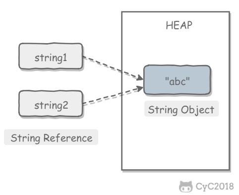

<!-- GFM-TOC -->
* [一、數據類型](#一數據類型)
    * [基本類型](#基本類型)
    * [包裝類型](#包裝類型)
    * [緩存池](#緩存池)
* [二、String](#二string)
    * [概覽](#概覽)
    * [不可變的好處](#不可變的好處)
    * [String, StringBuffer and StringBuilder](#string,-stringbuffer-and-stringbuilder)
    * [String Pool](#string-pool)
    * [new String("abc")](#new-string"abc")
* [三、運算](#三運算)
    * [參數傳遞](#參數傳遞)
    * [float 與 double](#float-與-double)
    * [隱式類型轉換](#隱式類型轉換)
    * [switch](#switch)
* [四、繼承](#四繼承)
    * [訪問權限](#訪問權限)
    * [抽象類與接口](#抽象類與接口)
    * [super](#super)
    * [重寫與重載](#重寫與重載)
* [五、Object 通用方法](#五object-通用方法)
    * [概覽](#概覽)
    * [equals()](#equals)
    * [hashCode()](#hashcode)
    * [toString()](#tostring)
    * [clone()](#clone)
* [六、關鍵字](#六關鍵字)
    * [final](#final)
    * [static](#static)
* [七、反射](#七反射)
* [八、異常](#八異常)
* [九、泛型](#九泛型)
* [十、註解](#十註解)
* [十一、特性](#十一特性)
    * [Java 各版本的新特性](#java-各版本的新特性)
    * [Java 與 C++ 的區別](#java-與-c-的區別)
    * [JRE or JDK](#jre-or-jdk)
* [參考資料](#參考資料)
<!-- GFM-TOC -->


# 一、數據類型

## 基本類型

- byte/8
- char/16
- short/16
- int/32
- float/32
- long/64
- double/64
- boolean/\~

boolean 只有兩個值：true、false，可以使用 1 bit 來存儲，但是具體大小沒有明確規定。JVM 會在編譯時期將 boolean 類型的數據轉換為 int，使用 1 來表示 true，0 表示 false。JVM 支持 boolean 數組，但是是通過讀寫 byte 數組來實現的。

- [Primitive Data Types](https://docs.oracle.com/javase/tutorial/java/nutsandbolts/datatypes.html)
- [The Java® Virtual Machine Specification](https://docs.oracle.com/javase/specs/jvms/se8/jvms8.pdf)

## 包裝類型

基本類型都有對應的包裝類型，基本類型與其對應的包裝類型之間的賦值使用自動裝箱與拆箱完成。

```java
Integer x = 2;     // 裝箱  調用了 Integer.valueOf(2);
int y = x;         // 拆箱  調用了 Integer.intValue(x);
```

## 緩存池

new Integer(123) 與 Integer.valueOf(123) 的區別在於：

- new Integer(123) 每次都會新建一個對象；
- Integer.valueOf(123) 會使用緩存池中的對象，多次調用會取得同一個對象的引用。

```java
Integer x = new Integer(123);
Integer y = new Integer(123);
System.out.println(x == y);    // false

Integer x = 123;     //調用了Integer.valueOf(123);
Integer y = 123;  //如果數值在[-128,127]之間，便返回指向緩衝池中已經存在的對象的引用；否則創建一個新的Integer對象。
System.out.println(x==y);     //true

Integer z = Integer.valueOf(123);
Integer k = Integer.valueOf(123);
System.out.println(z == k);   // true
```

valueOf() 方法的實現比較簡單，就是先判斷值是否在緩存池中，如果在的話就直接返回緩存池的內容。

```java
public static Integer valueOf(int i) {
    if (i >= IntegerCache.low && i <= IntegerCache.high)
        return IntegerCache.cache[i + (-IntegerCache.low)];
    return new Integer(i);
}
```

在 Java 8 中，Integer 緩存池的大小默認為 -128\~127。

```java
static final int low = -128;
static final int high;
static final Integer cache[];

static {
    // high value may be configured by property
    int h = 127;
    String integerCacheHighPropValue =
        sun.misc.VM.getSavedProperty("java.lang.Integer.IntegerCache.high");
    if (integerCacheHighPropValue != null) {
        try {
            int i = parseInt(integerCacheHighPropValue);
            i = Math.max(i, 127);
            // Maximum array size is Integer.MAX_VALUE
            h = Math.min(i, Integer.MAX_VALUE - (-low) -1);
        } catch( NumberFormatException nfe) {
            // If the property cannot be parsed into an int, ignore it.
        }
    }
    high = h;

    cache = new Integer[(high - low) + 1];
    int j = low;
    for(int k = 0; k < cache.length; k++)
        cache[k] = new Integer(j++);

    // range [-128, 127] must be interned (JLS7 5.1.7)
    assert IntegerCache.high >= 127;
}
```

編譯器會在自動裝箱過程調用 valueOf() 方法，因此多個值相同且值在緩存池範圍內的 Integer 實例使用自動裝箱來創建，那麼就會引用相同的對象。

```java
Integer m = 123;
Integer n = 123;
System.out.println(m == n); // true
```

基本類型對應的緩衝池如下：

- boolean values true and false
- all byte values
- short values between -128 and 127
- int values between -128 and 127
- char in the range \u0000 to \u007F

在使用這些基本類型對應的包裝類型時，如果該數值範圍在緩衝池範圍內，就可以直接使用緩衝池中的對象。

在 jdk 1.8 所有的數值類緩衝池中，Integer 的緩衝池 IntegerCache 很特殊，這個緩衝池的下界是 - 128，上界默認是 127，但是這個上界是可調的，在啟動 jvm 的時候，通過 -XX:AutoBoxCacheMax=&lt;size&gt; 來指定這個緩衝池的大小，該選項在 JVM 初始化的時候會設定一個名為 java.lang.IntegerCache.high 系統屬性，然後 IntegerCache 初始化的時候就會讀取該系統屬性來決定上界。

[StackOverflow : Differences between new Integer(123), Integer.valueOf(123) and just 123
](https://stackoverflow.com/questions/9030817/differences-between-new-integer123-integer-valueof123-and-just-123)

# 二、String

## 概覽

String 被聲明為 final，因此它不可被繼承。(Integer等包裝類也不能被繼承)

在 Java 8 中，String 內部使用 char 數組存儲數據。

```java
public final class String
    implements java.io.Serializable, Comparable<String>, CharSequence {
    /** The value is used for character storage. */
    private final char value[];
}
```

在 Java 9 之後，String 類的實現改用 byte 數組存儲字符串，同時使用 `coder` 來標識使用了哪種編碼。

```java
public final class String
    implements java.io.Serializable, Comparable<String>, CharSequence {
    /** The value is used for character storage. */
    private final byte[] value;

    /** The identifier of the encoding used to encode the bytes in {@code value}. */
    private final byte coder;
}
```

value 數組被聲明為 final，這意味著 value 數組初始化之後就不能再引用其它數組。並且 String 內部沒有改變 value 數組的方法，因此可以保證 String 不可變。

## 不可變的好處

**1. 可以緩存 hash 值** 

因為 String 的 hash 值經常被使用，例如 String 用做 HashMap 的 key。不可變的特性可以使得 hash 值也不可變，因此只需要進行一次計算。

**2. String Pool 的需要** 

如果一個 String 對象已經被創建過了，那麼就會從 String Pool 中取得引用。只有 String 是不可變的，才可能使用 String Pool。

<div align="center">  </div><br>

**3. 安全性** 

String 經常作為參數，String 不可變性可以保證參數不可變。例如在作為網絡連接參數的情況下如果 String 是可變的，那麼在網絡連接過程中，String 被改變，改變 String 對象的那一方以為現在連接的是其它主機，而實際情況卻不一定是。

**4. 線程安全** 

String 不可變性天生具備線程安全，可以在多個線程中安全地使用。

[Program Creek : Why String is immutable in Java?](https://www.programcreek.com/2013/04/why-string-is-immutable-in-java/)

## String, StringBuffer and StringBuilder

**1. 可變性** 

- String 不可變
- StringBuffer 和 StringBuilder 可變

**2. 線程安全** 

- String 不可變，因此是線程安全的
- StringBuilder 不是線程安全的
- StringBuffer 是線程安全的，內部使用 synchronized 進行同步

[StackOverflow : String, StringBuffer, and StringBuilder](https://stackoverflow.com/questions/2971315/string-stringbuffer-and-stringbuilder)

## String Pool

字符串常量池（String Pool）保存著所有字符串字面量（literal strings），這些字面量在編譯時期就確定。不僅如此，還可以使用 String 的 intern() 方法在運行過程中將字符串添加到 String Pool 中。

當一個字符串調用 intern() 方法時，如果 String Pool 中已經存在一個字符串和該字符串值相等（使用 equals() 方法進行確定），那麼就會返回 String Pool 中字符串的引用；否則，就會在 String Pool 中添加一個新的字符串，並返回這個新字符串的引用。

下面示例中，s1 和 s2 採用 new String() 的方式新建了兩個不同字符串，而 s3 和 s4 是通過 s1.intern() 方法取得一個字符串引用。intern() 首先把 s1 引用的字符串放到 String Pool 中，然後返回這個字符串引用。因此 s3 和 s4 引用的是同一個字符串。

```java
String s1 = new String("aaa");
String s2 = new String("aaa");
System.out.println(s1 == s2);           // false
String s3 = s1.intern();
String s4 = s1.intern();
System.out.println(s3 == s4);           // true
```

如果是採用 "bbb" 這種字面量的形式創建字符串，會自動地將字符串放入 String Pool 中。

```java
String s5 = "bbb";
String s6 = "bbb";
System.out.println(s5 == s6);  // true
```

在 Java 7 之前，String Pool 被放在運行時常量池中，它屬於永久代。而在 Java 7，String Pool 被移到堆中。這是因為永久代的空間有限，在大量使用字符串的場景下會導致 OutOfMemoryError 錯誤。

- [StackOverflow : What is String interning?](https://stackoverflow.com/questions/10578984/what-is-string-interning)
- [深入解析 String#intern](https://tech.meituan.com/in_depth_understanding_string_intern.html)

## new String("abc")

使用這種方式一共會創建兩個字符串對象（前提是 String Pool 中還沒有 "abc" 字符串對象）。

- "abc" 屬於字符串字面量，因此編譯時期會在 String Pool 中創建一個字符串對象，指向這個 "abc" 字符串字面量；
- 而使用 new 的方式會在堆中創建一個字符串對象。

創建一個測試類，其 main 方法中使用這種方式來創建字符串對象。

```java
public class NewStringTest {
    public static void main(String[] args) {
        String s = new String("abc");
    }
}
```

使用 javap -verbose 進行反編譯，得到以下內容：

```java
// ...
Constant pool:
// ...
   #2 = Class              #18            // java/lang/String
   #3 = String             #19            // abc
// ...
  #18 = Utf8               java/lang/String
  #19 = Utf8               abc
// ...

  public static void main(java.lang.String[]);
    descriptor: ([Ljava/lang/String;)V
    flags: ACC_PUBLIC, ACC_STATIC
    Code:
      stack=3, locals=2, args_size=1
         0: new           #2                  // class java/lang/String
         3: dup
         4: ldc           #3                  // String abc
         6: invokespecial #4                  // Method java/lang/String."<init>":(Ljava/lang/String;)V
         9: astore_1
// ...
```

在 Constant Pool 中，#19 存儲這字符串字面量 "abc"，#3 是 String Pool 的字符串對象，它指向 #19 這個字符串字面量。在 main 方法中，0: 行使用 new #2 在堆中創建一個字符串對象，並且使用 ldc #3 將 String Pool 中的字符串對象作為 String 構造函數的參數。

以下是 String 構造函數的源碼，可以看到，在將一個字符串對象作為另一個字符串對象的構造函數參數時，並不會完全複製 value 數組內容，而是都會指向同一個 value 數組。

```java
public String(String original) {
    this.value = original.value;
    this.hash = original.hash;
}
```

# 三、運算

## 參數傳遞

Java 的參數是以值傳遞的形式傳入方法中，而不是引用傳遞。

以下代碼中 Dog dog 的 dog 是一個指針，存儲的是對象的地址。在將一個參數傳入一個方法時，本質上是將對象的地址以值的方式傳遞到形參中。因此在方法中使指針引用其它對象，那麼這兩個指針此時指向的是完全不同的對象，在一方改變其所指向對象的內容時對另一方沒有影響。

```java
public class Dog {

    String name;

    Dog(String name) {
        this.name = name;
    }

    String getName() {
        return this.name;
    }

    void setName(String name) {
        this.name = name;
    }

    String getObjectAddress() {
        return super.toString();
    }
}
```

```java
public class PassByValueExample {
    public static void main(String[] args) {
        Dog dog = new Dog("A");
        System.out.println(dog.getObjectAddress()); // Dog@4554617c
        func(dog);
        System.out.println(dog.getObjectAddress()); // Dog@4554617c
        System.out.println(dog.getName());          // A
    }

    private static void func(Dog dog) {
        System.out.println(dog.getObjectAddress()); // Dog@4554617c
        dog = new Dog("B");
        System.out.println(dog.getObjectAddress()); // Dog@74a14482
        System.out.println(dog.getName());          // B
    }
}
```

如果在方法中改變對象的字段值會改變原對象該字段值，因為改變的是同一個地址指向的內容。

```java
class PassByValueExample {
    public static void main(String[] args) {
        Dog dog = new Dog("A");
        func(dog);
        System.out.println(dog.getName());          // B
    }

    private static void func(Dog dog) {
        dog.setName("B");
    }
}
```

[StackOverflow: Is Java “pass-by-reference” or “pass-by-value”?](https://stackoverflow.com/questions/40480/is-java-pass-by-reference-or-pass-by-value)

## float 與 double

Java 不能隱式執行向下轉型，因為這會使得精度降低。

1.1 字面量屬於 double 類型，不能直接將 1.1 直接賦值給 float 變量，因為這是向下轉型。

```java
// float f = 1.1;
```

1.1f 字面量才是 float 類型。

```java
float f = 1.1f;
```

## 隱式類型轉換

因為字面量 1 是 int 類型，它比 short 類型精度要高，因此不能隱式地將 int 類型下轉型為 short 類型。

```java
short s1 = 1;
// s1 = s1 + 1;
```

但是使用 += 或者 ++ 運算符可以執行隱式類型轉換。

```java
s1 += 1;
// s1++;
```

上面的語句相當於將 s1 + 1 的計算結果進行了向下轉型：

```java
s1 = (short) (s1 + 1);
```

[StackOverflow : Why don't Java's +=, -=, *=, /= compound assignment operators require casting?](https://stackoverflow.com/questions/8710619/why-dont-javas-compound-assignment-operators-require-casting)

## switch

從 Java 7 開始，可以在 switch 條件判斷語句中使用 String 對象。

```java
String s = "a";
switch (s) {
    case "a":
        System.out.println("aaa");
        break;
    case "b":
        System.out.println("bbb");
        break;
}
```

switch 不支持 long，是因為 switch 的設計初衷是對那些只有少數的幾個值進行等值判斷，如果值過於複雜，那麼還是用 if 比較合適。

```java
// long x = 111;
// switch (x) { // Incompatible types. Found: 'long', required: 'char, byte, short, int, Character, Byte, Short, Integer, String, or an enum'
//     case 111:
//         System.out.println(111);
//         break;
//     case 222:
//         System.out.println(222);
//         break;
// }
```

[StackOverflow : Why can't your switch statement data type be long, Java?](https://stackoverflow.com/questions/2676210/why-cant-your-switch-statement-data-type-be-long-java)

# 四、繼承

## 訪問權限

Java 中有三個訪問權限修飾符：private、protected 以及 public，如果不加訪問修飾符，表示包級可見。

可以對類或類中的成員（字段以及方法）加上訪問修飾符。

- 類可見表示其它類可以用這個類創建實例對象。
- 成員可見表示其它類可以用這個類的實例對象訪問到該成員；

protected 用於修飾成員，表示在繼承體系中成員對於子類可見，但是這個訪問修飾符對於類沒有意義。

設計良好的模塊會隱藏所有的實現細節，把它的 API 與它的實現清晰地隔離開來。模塊之間只通過它們的 API 進行通信，一個模塊不需要知道其他模塊的內部工作情況，這個概念被稱為信息隱藏或封裝。因此訪問權限應當儘可能地使每個類或者成員不被外界訪問。

如果子類的方法重寫了父類的方法，那麼子類中該方法的訪問級別不允許低於父類的訪問級別。這是為了確保可以使用父類實例的地方都可以使用子類實例，也就是確保滿足里氏替換原則。

字段決不能是公有的，因為這麼做的話就失去了對這個字段修改行為的控制，客戶端可以對其隨意修改。例如下面的例子中，AccessExample 擁有 id 公有字段，如果在某個時刻，我們想要使用 int 存儲 id 字段，那麼就需要修改所有的客戶端代碼。

```java
public class AccessExample {
    public String id;
}
```

可以使用公有的 getter 和 setter 方法來替換公有字段，這樣的話就可以控制對字段的修改行為。

```java
public class AccessExample {

    private int id;

    public String getId() {
        return id + "";
    }

    public void setId(String id) {
        this.id = Integer.valueOf(id);
    }
}
```

但是也有例外，如果是包級私有的類或者私有的嵌套類，那麼直接暴露成員不會有特別大的影響。

```java
public class AccessWithInnerClassExample {

    private class InnerClass {
        int x;
    }

    private InnerClass innerClass;

    public AccessWithInnerClassExample() {
        innerClass = new InnerClass();
    }

    public int getValue() {
        return innerClass.x;  // 直接訪問
    }
}
```

## 抽象類與接口

**1. 抽象類** 

抽象類和抽象方法都使用 abstract 關鍵字進行聲明。如果一個類中包含抽象方法，那麼這個類必須聲明為抽象類。

抽象類和普通類最大的區別是，抽象類不能被實例化，需要繼承抽象類才能實例化其子類。

```java
public abstract class AbstractClassExample {

    protected int x;
    private int y;

    public abstract void func1();

    public void func2() {
        System.out.println("func2");
    }
}
```

```java
public class AbstractExtendClassExample extends AbstractClassExample {
    @Override
    public void func1() {
        System.out.println("func1");
    }
}
```

```java
// AbstractClassExample ac1 = new AbstractClassExample(); // 'AbstractClassExample' is abstract; cannot be instantiated
AbstractClassExample ac2 = new AbstractExtendClassExample();
ac2.func1();
```

**2. 接口** 

接口是抽象類的延伸，在 Java 8 之前，它可以看成是一個完全抽象的類，也就是說它不能有任何的方法實現。

從 Java 8 開始，接口也可以擁有默認的方法實現，這是因為不支持默認方法的接口的維護成本太高了。在 Java 8 之前，如果一個接口想要添加新的方法，那麼要修改所有實現了該接口的類。

接口的成員（字段 + 方法）默認都是 public 的，並且不允許定義為 private 或者 protected。

接口的字段默認都是 static 和 final 的。

```java
public interface InterfaceExample {

    void func1();

    default void func2(){
        System.out.println("func2");
    }

    int x = 123;
    // int y;               // Variable 'y' might not have been initialized
    public int z = 0;       // Modifier 'public' is redundant for interface fields
    // private int k = 0;   // Modifier 'private' not allowed here
    // protected int l = 0; // Modifier 'protected' not allowed here
    // private void fun3(); // Modifier 'private' not allowed here
}
```

```java
public class InterfaceImplementExample implements InterfaceExample {
    @Override
    public void func1() {
        System.out.println("func1");
    }
}
```

```java
// InterfaceExample ie1 = new InterfaceExample(); // 'InterfaceExample' is abstract; cannot be instantiated
InterfaceExample ie2 = new InterfaceImplementExample();
ie2.func1();
System.out.println(InterfaceExample.x);
```

**3. 比較** 

- 從設計層面上看，抽象類提供了一種 IS-A 關係，那麼就必須滿足裡式替換原則，即子類對象必須能夠替換掉所有父類對象。而接口更像是一種 LIKE-A 關係，它只是提供一種方法實現契約，並不要求接口和實現接口的類具有 IS-A 關係。
- 從使用上來看，一個類可以實現多個接口，但是不能繼承多個抽象類。
- 接口的字段只能是 static 和 final 類型的，而抽象類的字段沒有這種限制。
- 接口的成員只能是 public 的，而抽象類的成員可以有多種訪問權限。

**4. 使用選擇** 

使用接口：

- 需要讓不相關的類都實現一個方法，例如不相關的類都可以實現 Compareable 接口中的 compareTo() 方法；
- 需要使用多重繼承。

使用抽象類：

- 需要在幾個相關的類中共享代碼。
- 需要能控制繼承來的成員的訪問權限，而不是都為 public。
- 需要繼承非靜態和非常量字段。

在很多情況下，接口優先於抽象類。因為接口沒有抽象類嚴格的類層次結構要求，可以靈活地為一個類添加行為。並且從 Java 8 開始，接口也可以有默認的方法實現，使得修改接口的成本也變的很低。

- [Abstract Methods and Classes](https://docs.oracle.com/javase/tutorial/java/IandI/abstract.html)
- [深入理解 abstract class 和 interface](https://www.ibm.com/developerworks/cn/java/l-javainterface-abstract/)
- [When to Use Abstract Class and Interface](https://dzone.com/articles/when-to-use-abstract-class-and-intreface)


## super

- 訪問父類的構造函數：可以使用 super() 函數訪問父類的構造函數，從而委託父類完成一些初始化的工作。
- 訪問父類的成員：如果子類重寫了父類的某個方法，可以通過使用 super 關鍵字來引用父類的方法實現。

```java
public class SuperExample {

    protected int x;
    protected int y;

    public SuperExample(int x, int y) {
        this.x = x;
        this.y = y;
    }

    public void func() {
        System.out.println("SuperExample.func()");
    }
}
```

```java
public class SuperExtendExample extends SuperExample {

    private int z;

    public SuperExtendExample(int x, int y, int z) {
        super(x, y);
        this.z = z;
    }

    @Override
    public void func() {
        super.func();
        System.out.println("SuperExtendExample.func()");
    }
}
```

```java
SuperExample e = new SuperExtendExample(1, 2, 3);
e.func();
```

```html
SuperExample.func()
SuperExtendExample.func()
```

[Using the Keyword super](https://docs.oracle.com/javase/tutorial/java/IandI/super.html)

## 重寫與重載

**1. 重寫（Override）** 

存在於繼承體系中，指子類實現了一個與父類在方法聲明上完全相同的一個方法。

為了滿足裡式替換原則，重寫有以下三個限制：

- 子類方法的訪問權限必須大於等於父類方法；
- 子類方法的返回類型必須是父類方法返回類型或為其子類型。
- 子類方法拋出的異常類型必須是父類拋出異常類型或為其子類型。

使用 @Override 註解，可以讓編譯器幫忙檢查是否滿足上面的三個限制條件。

下面的示例中，SubClass 為 SuperClass 的子類，SubClass 重寫了 SuperClass 的 func() 方法。其中：

- 子類方法訪問權限為 public，大於父類的 protected。
- 子類的返回類型為 ArrayList<Integer>，是父類返回類型 List<Integer> 的子類。
- 子類拋出的異常類型為 Exception，是父類拋出異常 Throwable 的子類。
- 子類重寫方法使用 @Override 註解，從而讓編譯器自動檢查是否滿足限制條件。

```java
class SuperClass {
    protected List<Integer> func() throws Throwable {
        return new ArrayList<>();
    }
}

class SubClass extends SuperClass {
    @Override
    public ArrayList<Integer> func() throws Exception {
        return new ArrayList<>();
    }
}
```

在調用一個方法時，先從本類中查找看是否有對應的方法，如果沒有查找到再到父類中查看，看是否有繼承來的方法。否則就要對參數進行轉型，轉成父類之後看是否有對應的方法。總的來說，方法調用的優先級為：

- this.func(this)
- super.func(this)
- this.func(super)
- super.func(super)


```java
/*
    A
    |
    B
    |
    C
    |
    D
 */


class A {

    public void show(A obj) {
        System.out.println("A.show(A)");
    }

    public void show(C obj) {
        System.out.println("A.show(C)");
    }
}

class B extends A {

    @Override
    public void show(A obj) {
        System.out.println("B.show(A)");
    }
}

class C extends B {
}

class D extends C {
}
```

```java
public static void main(String[] args) {

    A a = new A();
    B b = new B();
    C c = new C();
    D d = new D();

    // 在 A 中存在 show(A obj)，直接調用
    a.show(a); // A.show(A)
    // 在 A 中不存在 show(B obj)，將 B 轉型成其父類 A
    a.show(b); // A.show(A)
    // 在 B 中存在從 A 繼承來的 show(C obj)，直接調用
    b.show(c); // A.show(C)
    // 在 B 中不存在 show(D obj)，但是存在從 A 繼承來的 show(C obj)，將 D 轉型成其父類 C
    b.show(d); // A.show(C)

    // 引用的還是 B 對象，所以 ba 和 b 的調用結果一樣
    A ba = new B();
    ba.show(c); // A.show(C)
    ba.show(d); // A.show(C)
}
```

**2. 重載（Overload）** 

存在於同一個類中，指一個方法與已經存在的方法名稱上相同，但是參數類型、個數、順序至少有一個不同。

應該注意的是，返回值不同，其它都相同不算是重載。

# 五、Object 通用方法

## 概覽

```java

public native int hashCode()

public boolean equals(Object obj)

protected native Object clone() throws CloneNotSupportedException

public String toString()

public final native Class<?> getClass()

protected void finalize() throws Throwable {}

public final native void notify()

public final native void notifyAll()

public final native void wait(long timeout) throws InterruptedException

public final void wait(long timeout, int nanos) throws InterruptedException

public final void wait() throws InterruptedException
```

## equals()

**1. 等價關係** 

Ⅰ 自反性

```java
x.equals(x); // true
```

Ⅱ 對稱性

```java
x.equals(y) == y.equals(x); // true
```

Ⅲ 傳遞性

```java
if (x.equals(y) && y.equals(z))
    x.equals(z); // true;
```

Ⅳ 一致性

多次調用 equals() 方法結果不變

```java
x.equals(y) == x.equals(y); // true
```

Ⅴ 與 null 的比較

對任何不是 null 的對象 x 調用 x.equals(null) 結果都為 false

```java
x.equals(null); // false;
```

**2. 等價與相等** 

- 對於基本類型，== 判斷兩個值是否相等，基本類型沒有 equals() 方法。
- 對於引用類型，== 判斷兩個變量是否引用同一個對象，而 equals() 判斷引用的對象是否等價。

```java
Integer x = new Integer(1);
Integer y = new Integer(1);
System.out.println(x.equals(y)); // true
System.out.println(x == y);      // false
```

**3. 實現** 

- 檢查是否為同一個對象的引用，如果是直接返回 true；
- 檢查是否是同一個類型，如果不是，直接返回 false；
- 將 Object 對象進行轉型；
- 判斷每個關鍵域是否相等。

```java
public class EqualExample {

    private int x;
    private int y;
    private int z;

    public EqualExample(int x, int y, int z) {
        this.x = x;
        this.y = y;
        this.z = z;
    }

    @Override
    public boolean equals(Object o) {
        if (this == o) return true;
        if (o == null || getClass() != o.getClass()) return false;

        EqualExample that = (EqualExample) o;

        if (x != that.x) return false;
        if (y != that.y) return false;
        return z == that.z;
    }
}
```

## hashCode()

hashCode() 返回散列值，而 equals() 是用來判斷兩個對象是否等價。等價的兩個對象散列值一定相同，但是散列值相同的兩個對象不一定等價。

在覆蓋 equals() 方法時應當總是覆蓋 hashCode() 方法，保證等價的兩個對象散列值也相等。

下面的代碼中，新建了兩個等價的對象，並將它們添加到 HashSet 中。我們希望將這兩個對象當成一樣的，只在集合中添加一個對象，但是因為 EqualExample 沒有實現 hashCode() 方法，因此這兩個對象的散列值是不同的，最終導致集合添加了兩個等價的對象。

```java
EqualExample e1 = new EqualExample(1, 1, 1);
EqualExample e2 = new EqualExample(1, 1, 1);
System.out.println(e1.equals(e2)); // true
HashSet<EqualExample> set = new HashSet<>();
set.add(e1);
set.add(e2);
System.out.println(set.size());   // 2
```

理想的散列函數應當具有均勻性，即不相等的對象應當均勻分佈到所有可能的散列值上。這就要求了散列函數要把所有域的值都考慮進來。可以將每個域都當成 R 進制的某一位，然後組成一個 R 進制的整數。R 一般取 31，因為它是一個奇素數，如果是偶數的話，當出現乘法溢出，信息就會丟失，因為與 2 相乘相當於向左移一位。

一個數與 31 相乘可以轉換成移位和減法：`31*x == (x<<5)-x`，編譯器會自動進行這個優化。

```java
@Override
public int hashCode() {
    int result = 17;
    result = 31 * result + x;
    result = 31 * result + y;
    result = 31 * result + z;
    return result;
}
```

## toString()

默認返回 ToStringExample@4554617c 這種形式，其中 @ 後面的數值為散列碼的無符號十六進制表示。

```java
public class ToStringExample {

    private int number;

    public ToStringExample(int number) {
        this.number = number;
    }
}
```

```java
ToStringExample example = new ToStringExample(123);
System.out.println(example.toString());
```

```html
ToStringExample@4554617c
```

## clone()

**1. cloneable** 

clone() 是 Object 的 protected 方法，它不是 public，一個類不顯式去重寫 clone()，其它類就不能直接去調用該類實例的 clone() 方法。

```java
public class CloneExample {
    private int a;
    private int b;
}
```

```java
CloneExample e1 = new CloneExample();
// CloneExample e2 = e1.clone(); // 'clone()' has protected access in 'java.lang.Object'
```

重寫 clone() 得到以下實現：

```java
public class CloneExample {
    private int a;
    private int b;

    @Override
    public CloneExample clone() throws CloneNotSupportedException {
        return (CloneExample)super.clone();
    }
}
```

```java
CloneExample e1 = new CloneExample();
try {
    CloneExample e2 = e1.clone();
} catch (CloneNotSupportedException e) {
    e.printStackTrace();
}
```

```html
java.lang.CloneNotSupportedException: CloneExample
```

以上拋出了 CloneNotSupportedException，這是因為 CloneExample 沒有實現 Cloneable 接口。

應該注意的是，clone() 方法並不是 Cloneable 接口的方法，而是 Object 的一個 protected 方法。Cloneable 接口只是規定，如果一個類沒有實現 Cloneable 接口又調用了 clone() 方法，就會拋出 CloneNotSupportedException。

```java
public class CloneExample implements Cloneable {
    private int a;
    private int b;

    @Override
    public Object clone() throws CloneNotSupportedException {
        return super.clone();
    }
}
```

**2. 淺拷貝** 

拷貝對象和原始對象的引用類型引用同一個對象。

```java
public class ShallowCloneExample implements Cloneable {

    private int[] arr;

    public ShallowCloneExample() {
        arr = new int[10];
        for (int i = 0; i < arr.length; i++) {
            arr[i] = i;
        }
    }

    public void set(int index, int value) {
        arr[index] = value;
    }

    public int get(int index) {
        return arr[index];
    }

    @Override
    protected ShallowCloneExample clone() throws CloneNotSupportedException {
        return (ShallowCloneExample) super.clone();
    }
}
```

```java
ShallowCloneExample e1 = new ShallowCloneExample();
ShallowCloneExample e2 = null;
try {
    e2 = e1.clone();
} catch (CloneNotSupportedException e) {
    e.printStackTrace();
}
e1.set(2, 222);
System.out.println(e2.get(2)); // 222
```

**3. 深拷貝** 

拷貝對象和原始對象的引用類型引用不同對象。

```java
public class DeepCloneExample implements Cloneable {

    private int[] arr;

    public DeepCloneExample() {
        arr = new int[10];
        for (int i = 0; i < arr.length; i++) {
            arr[i] = i;
        }
    }

    public void set(int index, int value) {
        arr[index] = value;
    }

    public int get(int index) {
        return arr[index];
    }

    @Override
    protected DeepCloneExample clone() throws CloneNotSupportedException {
        DeepCloneExample result = (DeepCloneExample) super.clone();
        result.arr = new int[arr.length];
        for (int i = 0; i < arr.length; i++) {
            result.arr[i] = arr[i];
        }
        return result;
    }
}
```

```java
DeepCloneExample e1 = new DeepCloneExample();
DeepCloneExample e2 = null;
try {
    e2 = e1.clone();
} catch (CloneNotSupportedException e) {
    e.printStackTrace();
}
e1.set(2, 222);
System.out.println(e2.get(2)); // 2
```

**4. clone() 的替代方案** 

使用 clone() 方法來拷貝一個對象即複雜又有風險，它會拋出異常，並且還需要類型轉換。Effective Java 書上講到，最好不要去使用 clone()，可以使用拷貝構造函數或者拷貝工廠來拷貝一個對象。

```java
public class CloneConstructorExample {

    private int[] arr;

    public CloneConstructorExample() {
        arr = new int[10];
        for (int i = 0; i < arr.length; i++) {
            arr[i] = i;
        }
    }

    public CloneConstructorExample(CloneConstructorExample original) {
        arr = new int[original.arr.length];
        for (int i = 0; i < original.arr.length; i++) {
            arr[i] = original.arr[i];
        }
    }

    public void set(int index, int value) {
        arr[index] = value;
    }

    public int get(int index) {
        return arr[index];
    }
}
```

```java
CloneConstructorExample e1 = new CloneConstructorExample();
CloneConstructorExample e2 = new CloneConstructorExample(e1);
e1.set(2, 222);
System.out.println(e2.get(2)); // 2
```

# 六、關鍵字

## final

**1. 數據** 

聲明數據為常量，可以是編譯時常量，也可以是在運行時被初始化後不能被改變的常量。

- 對於基本類型，final 使數值不變；
- 對於引用類型，final 使引用不變，也就不能引用其它對象，但是被引用的對象本身是可以修改的。

```java
final int x = 1;
// x = 2;  // cannot assign value to final variable 'x'
final A y = new A();
y.a = 1;
```

**2. 方法** 

聲明方法不能被子類重寫。

private 方法隱式地被指定為 final，如果在子類中定義的方法和基類中的一個 private 方法簽名相同，此時子類的方法不是重寫基類方法，而是在子類中定義了一個新的方法。

**3. 類** 

聲明類不允許被繼承。

## static

**1. 靜態變量** 

- 靜態變量：又稱為類變量，也就是說這個變量屬於類的，類所有的實例都共享靜態變量，可以直接通過類名來訪問它。靜態變量在內存中只存在一份。
- 實例變量：每創建一個實例就會產生一個實例變量，它與該實例同生共死。

```java
public class A {

    private int x;         // 實例變量
    private static int y;  // 靜態變量

    public static void main(String[] args) {
        // int x = A.x;  // Non-static field 'x' cannot be referenced from a static context
        A a = new A();
        int x = a.x;
        int y = A.y;
    }
}
```

**2. 靜態方法** 

靜態方法在類加載的時候就存在了，它不依賴於任何實例。所以靜態方法必須有實現，也就是說它不能是抽象方法。

```java
public abstract class A {
    public static void func1(){
    }
    // public abstract static void func2();  // Illegal combination of modifiers: 'abstract' and 'static'
}
```

只能訪問所屬類的靜態字段和靜態方法，方法中不能有 this 和 super 關鍵字。

```java
public class A {

    private static int x;
    private int y;

    public static void func1(){
        int a = x;
        // int b = y;  // Non-static field 'y' cannot be referenced from a static context
        // int b = this.y;     // 'A.this' cannot be referenced from a static context
    }
}
```

**3. 靜態語句塊** 

靜態語句塊在類初始化時運行一次。

```java
public class A {
    static {
        System.out.println("123");
    }

    public static void main(String[] args) {
        A a1 = new A();
        A a2 = new A();
    }
}
```

```html
123
```

**4. 靜態內部類** 

非靜態內部類依賴於外部類的實例，而靜態內部類不需要。

```java
public class OuterClass {

    class InnerClass {
    }

    static class StaticInnerClass {
    }

    public static void main(String[] args) {
        // InnerClass innerClass = new InnerClass(); // 'OuterClass.this' cannot be referenced from a static context
        OuterClass outerClass = new OuterClass();
        InnerClass innerClass = outerClass.new InnerClass();
        StaticInnerClass staticInnerClass = new StaticInnerClass();
    }
}
```

靜態內部類不能訪問外部類的非靜態的變量和方法。

**5. 靜態導包** 

在使用靜態變量和方法時不用再指明 ClassName，從而簡化代碼，但可讀性大大降低。

```java
import static com.xxx.ClassName.*
```

**6. 初始化順序** 

靜態變量和靜態語句塊優先於實例變量和普通語句塊，靜態變量和靜態語句塊的初始化順序取決於它們在代碼中的順序。

```java
public static String staticField = "靜態變量";
```

```java
static {
    System.out.println("靜態語句塊");
}
```

```java
public String field = "實例變量";
```

```java
{
    System.out.println("普通語句塊");
}
```

最後才是構造函數的初始化。

```java
public InitialOrderTest() {
    System.out.println("構造函數");
}
```

存在繼承的情況下，初始化順序為：

- 父類（靜態變量、靜態語句塊）
- 子類（靜態變量、靜態語句塊）
- 父類（實例變量、普通語句塊）
- 父類（構造函數）
- 子類（實例變量、普通語句塊）
- 子類（構造函數）


# 七、反射

每個類都有一個  **Class**  對象，包含了與類有關的信息。當編譯一個新類時，會產生一個同名的 .class 文件，該文件內容保存著 Class 對象。

類加載相當於 Class 對象的加載，類在第一次使用時才動態加載到 JVM 中。也可以使用 `Class.forName("com.mysql.jdbc.Driver")` 這種方式來控制類的加載，該方法會返回一個 Class 對象。

反射可以提供運行時的類信息，並且這個類可以在運行時才加載進來，甚至在編譯時期該類的 .class 不存在也可以加載進來。

Class 和 java.lang.reflect 一起對反射提供了支持，java.lang.reflect 類庫主要包含了以下三個類：

-  **Field** ：可以使用 get() 和 set() 方法讀取和修改 Field 對象關聯的字段；
-  **Method** ：可以使用 invoke() 方法調用與 Method 對象關聯的方法；
-  **Constructor** ：可以用 Constructor 的 newInstance() 創建新的對象。

**反射的優點：** 

*    **可擴展性**  ：應用程序可以利用全限定名創建可擴展對象的實例，來使用來自外部的用戶自定義類。
*    **類瀏覽器和可視化開發環境**  ：一個類瀏覽器需要可以枚舉類的成員。可視化開發環境（如 IDE）可以從利用反射中可用的類型信息中受益，以幫助程序員編寫正確的代碼。
*    **調試器和測試工具**  ： 調試器需要能夠檢查一個類裡的私有成員。測試工具可以利用反射來自動地調用類裡定義的可被發現的 API 定義，以確保一組測試中有較高的代碼覆蓋率。

**反射的缺點：** 

儘管反射非常強大，但也不能濫用。如果一個功能可以不用反射完成，那麼最好就不用。在我們使用反射技術時，下面幾條內容應該牢記於心。

*    **性能開銷**  ：反射涉及了動態類型的解析，所以 JVM 無法對這些代碼進行優化。因此，反射操作的效率要比那些非反射操作低得多。我們應該避免在經常被執行的代碼或對性能要求很高的程序中使用反射。

*    **安全限制**  ：使用反射技術要求程序必須在一個沒有安全限制的環境中運行。如果一個程序必須在有安全限制的環境中運行，如 Applet，那麼這就是個問題了。

*    **內部暴露**  ：由於反射允許代碼執行一些在正常情況下不被允許的操作（比如訪問私有的屬性和方法），所以使用反射可能會導致意料之外的副作用，這可能導致代碼功能失調並破壞可移植性。反射代碼破壞了抽象性，因此當平臺發生改變的時候，代碼的行為就有可能也隨著變化。


- [Trail: The Reflection API](https://docs.oracle.com/javase/tutorial/reflect/index.html)
- [深入解析 Java 反射（1）- 基礎](http://www.sczyh30.com/posts/Java/java-reflection-1/)

# 八、異常

Throwable 可以用來表示任何可以作為異常拋出的類，分為兩種： **Error**  和 **Exception**。其中 Error 用來表示 JVM 無法處理的錯誤，Exception 分為兩種：

-  **受檢異常** ：需要用 try...catch... 語句捕獲並進行處理，並且可以從異常中恢復；
-  **非受檢異常** ：是程序運行時錯誤，例如除 0 會引發 Arithmetic Exception，此時程序崩潰並且無法恢復。

<div align="center">  </div><br>

- [Java 入門之異常處理](https://www.tianmaying.com/tutorial/Java-Exception)
- [Java 異常的面試問題及答案 -Part 1](http://www.importnew.com/7383.html)

# 九、泛型

```java
public class Box<T> {
    // T stands for "Type"
    private T t;
    public void set(T t) { this.t = t; }
    public T get() { return t; }
}
```

- [Java 泛型詳解](http://www.importnew.com/24029.html)
- [10 道 Java 泛型面試題](https://cloud.tencent.com/developer/article/1033693)

# 十、註解

Java 註解是附加在代碼中的一些元信息，用於一些工具在編譯、運行時進行解析和使用，起到說明、配置的功能。註解不會也不能影響代碼的實際邏輯，僅僅起到輔助性的作用。

[註解 Annotation 實現原理與自定義註解例子](https://www.cnblogs.com/acm-bingzi/p/javaAnnotation.html)

# 十一、特性

## Java 各版本的新特性

**New highlights in Java SE 8** 

1. Lambda Expressions
2. Pipelines and Streams
3. Date and Time API
4. Default Methods
5. Type Annotations
6. Nashhorn JavaScript Engine
7. Concurrent Accumulators
8. Parallel operations
9. PermGen Error Removed

**New highlights in Java SE 7** 

1. Strings in Switch Statement
2. Type Inference for Generic Instance Creation
3. Multiple Exception Handling
4. Support for Dynamic Languages
5. Try with Resources
6. Java nio Package
7. Binary Literals, Underscore in literals
8. Diamond Syntax

- [Difference between Java 1.8 and Java 1.7?](http://www.selfgrowth.com/articles/difference-between-java-18-and-java-17)
- [Java 8 特性](http://www.importnew.com/19345.html)

## Java 與 C++ 的區別

- Java 是純粹的面嚮對象語言，所有的對象都繼承自 java.lang.Object，C++ 為了兼容 C 即支持面向對象也支持面向過程。
- Java 通過虛擬機從而實現跨平臺特性，但是 C++ 依賴於特定的平臺。
- Java 沒有指針，它的引用可以理解為安全指針，而 C++ 具有和 C 一樣的指針。
- Java 支持自動垃圾回收，而 C++ 需要手動回收。
- Java 不支持多重繼承，只能通過實現多個接口來達到相同目的，而 C++ 支持多重繼承。
- Java 不支持操作符重載，雖然可以對兩個 String 對象執行加法運算，但是這是語言內置支持的操作，不屬於操作符重載，而 C++ 可以。
- Java 的 goto 是保留字，但是不可用，C++ 可以使用 goto。
- Java 不支持條件編譯，C++ 通過 #ifdef #ifndef 等預處理命令從而實現條件編譯。

[What are the main differences between Java and C++?](http://cs-fundamentals.com/tech-interview/java/differences-between-java-and-cpp.php)

## JRE or JDK

- JRE is the JVM program, Java application need to run on JRE.
- JDK is a superset of JRE, JRE + tools for developing java programs. e.g, it provides the compiler "javac"

# 參考資料

- Eckel B. Java 編程思想[M]. 機械工業出版社, 2002.
- Bloch J. Effective java[M]. Addison-Wesley Professional, 2017.


# 微信公眾號


更多精彩內容將發佈在微信公眾號 CyC2018 上，你也可以在公眾號後臺和我交流學習和求職相關的問題。另外，公眾號提供了該項目的 PDF 等離線閱讀版本，後臺回覆 "下載" 即可領取。公眾號也提供了一份技術面試複習大綱，不僅系統整理了面試知識點，而且標註了各個知識點的重要程度，從而幫你理清多而雜的面試知識點，後臺回覆 "大綱" 即可領取。我基本是按照這個大綱來進行復習的，對我拿到了 BAT 頭條等 Offer 起到很大的幫助。你們完全可以和我一樣根據大綱上列的知識點來進行復習，就不用看很多不重要的內容，也可以知道哪些內容很重要從而多安排一些複習時間。


<br><div align="center"></img></div>
