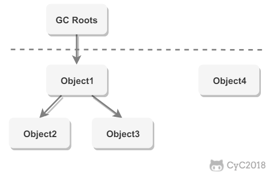
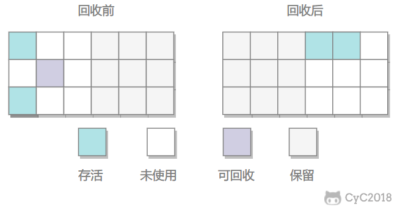
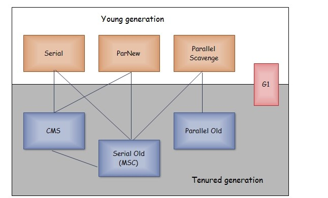
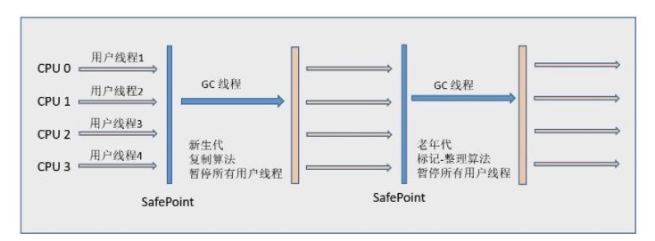
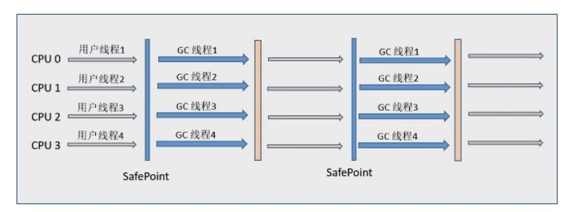
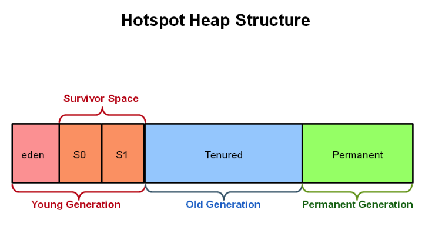
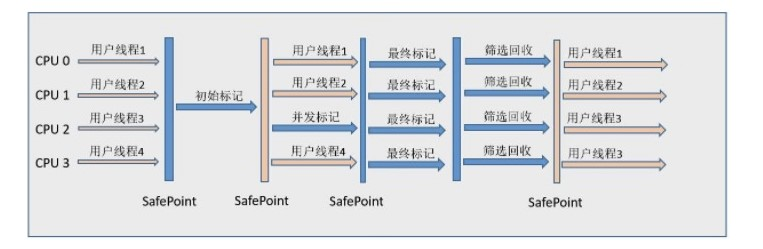
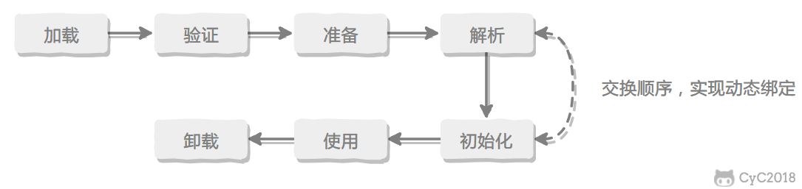

<!-- GFM-TOC -->
* [一、運行時數據區域](#一運行時數據區域)
    * [程序計數器](#程序計數器)
    * [Java 虛擬機棧](#java-虛擬機棧)
    * [本地方法棧](#本地方法棧)
    * [堆](#堆)
    * [方法區](#方法區)
    * [運行時常量池](#運行時常量池)
    * [直接內存](#直接內存)
* [二、垃圾收集](#二垃圾收集)
    * [判斷一個對象是否可被回收](#判斷一個對象是否可被回收)
    * [引用類型](#引用類型)
    * [垃圾收集算法](#垃圾收集算法)
    * [垃圾收集器](#垃圾收集器)
* [三、內存分配與回收策略](#三內存分配與回收策略)
    * [Minor GC 和 Full GC](#minor-gc-和-full-gc)
    * [內存分配策略](#內存分配策略)
    * [Full GC 的觸發條件](#full-gc-的觸發條件)
* [四、類加載機制](#四類加載機制)
    * [類的生命週期](#類的生命週期)
    * [類加載過程](#類加載過程)
    * [類初始化時機](#類初始化時機)
    * [類與類加載器](#類與類加載器)
    * [類加載器分類](#類加載器分類)
    * [雙親委派模型](#雙親委派模型)
    * [自定義類加載器實現](#自定義類加載器實現)
* [參考資料](#參考資料)
<!-- GFM-TOC -->


本文大部分內容參考  **周志明《深入理解 Java 虛擬機》** ，想要深入學習的話請看原書。

# 一、運行時數據區域

<div align="center">  </div><br>

## 程序計數器

記錄正在執行的虛擬機字節碼指令的地址（如果正在執行的是本地方法則為空）。

## Java 虛擬機棧

每個 Java 方法在執行的同時會創建一個棧幀用於存儲局部變量表、操作數棧、常量池引用等信息。從方法調用直至執行完成的過程，對應著一個棧幀在 Java 虛擬機棧中入棧和出棧的過程。

<div align="center">  </div><br>

可以通過 -Xss 這個虛擬機參數來指定每個線程的 Java 虛擬機棧內存大小，在 JDK 1.4 中默認為 256K，而在 JDK 1.5+ 默認為 1M：

```java
java -Xss2M HackTheJava
```

該區域可能拋出以下異常：

- 當線程請求的棧深度超過最大值，會拋出 StackOverflowError 異常；
- 棧進行動態擴展時如果無法申請到足夠內存，會拋出 OutOfMemoryError 異常。

## 本地方法棧

本地方法棧與 Java 虛擬機棧類似，它們之間的區別只不過是本地方法棧為本地方法服務。

本地方法一般是用其它語言（C、C++ 或彙編語言等）編寫的，並且被編譯為基於本機硬件和操作系統的程序，對待這些方法需要特別處理。

<div align="center">  </div><br>

## 堆

所有對象都在這裡分配內存，是垃圾收集的主要區域（"GC 堆"）。

現代的垃圾收集器基本都是採用分代收集算法，其主要的思想是針對不同類型的對象採取不同的垃圾回收算法。可以將堆分成兩塊：

- 新生代（Young Generation）
- 老年代（Old Generation）

堆不需要連續內存，並且可以動態增加其內存，增加失敗會拋出 OutOfMemoryError 異常。

可以通過 -Xms 和 -Xmx 這兩個虛擬機參數來指定一個程序的堆內存大小，第一個參數設置初始值，第二個參數設置最大值。

```java
java -Xms1M -Xmx2M HackTheJava
```

## 方法區

用於存放已被加載的類信息、常量、靜態變量、即時編譯器編譯後的代碼等數據。

和堆一樣不需要連續的內存，並且可以動態擴展，動態擴展失敗一樣會拋出 OutOfMemoryError 異常。

對這塊區域進行垃圾回收的主要目標是對常量池的回收和對類的卸載，但是一般比較難實現。

HotSpot 虛擬機把它當成永久代來進行垃圾回收。但很難確定永久代的大小，因為它受到很多因素影響，並且每次 Full GC 之後永久代的大小都會改變，所以經常會拋出 OutOfMemoryError 異常。為了更容易管理方法區，從 JDK 1.8 開始，移除永久代，並把方法區移至元空間，它位於本地內存中，而不是虛擬機內存中。

方法區是一個 JVM 規範，永久代與元空間都是其一種實現方式。在 JDK 1.8 之後，原來永久代的數據被分到了堆和元空間中。元空間存儲類的元信息，靜態變量和常量池等放入堆中。

## 運行時常量池

運行時常量池是方法區的一部分。

Class 文件中的常量池（編譯器生成的字面量和符號引用）會在類加載後被放入這個區域。

除了在編譯期生成的常量，還允許動態生成，例如 String 類的 intern()。

## 直接內存

在 JDK 1.4 中新引入了 NIO 類，它可以使用 Native 函數庫直接分配堆外內存，然後通過 Java 堆裡的 DirectByteBuffer 對象作為這塊內存的引用進行操作。這樣能在一些場景中顯著提高性能，因為避免了在堆內存和堆外內存來回拷貝數據。

# 二、垃圾收集

垃圾收集主要是針對堆和方法區進行。程序計數器、虛擬機棧和本地方法棧這三個區域屬於線程私有的，只存在於線程的生命週期內，線程結束之後就會消失，因此不需要對這三個區域進行垃圾回收。

## 判斷一個對象是否可被回收

### 1. 引用計數算法

為對象添加一個引用計數器，當對象增加一個引用時計數器加 1，引用失效時計數器減 1。引用計數為 0 的對象可被回收。

在兩個對象出現循環引用的情況下，此時引用計數器永遠不為 0，導致無法對它們進行回收。正是因為循環引用的存在，因此 Java 虛擬機不使用引用計數算法。

```java
public class Test {

    public Object instance = null;

    public static void main(String[] args) {
        Test a = new Test();
        Test b = new Test();
        a.instance = b;
        b.instance = a;
        a = null;
        b = null;
        doSomething();
    }
}
```

在上述代碼中，a 與 b 引用的對象實例互相持有了對象的引用，因此當我們把對 a 對象與 b 對象的引用去除之後，由於兩個對象還存在互相之間的引用，導致兩個 Test 對象無法被回收。

### 2. 可達性分析算法

以 GC Roots 為起始點進行搜索，可達的對象都是存活的，不可達的對象可被回收。

Java 虛擬機使用該算法來判斷對象是否可被回收，GC Roots 一般包含以下內容：

- 虛擬機棧中局部變量表中引用的對象
- 本地方法棧中 JNI 中引用的對象
- 方法區中類靜態屬性引用的對象
- 方法區中的常量引用的對象

<div align="center">  </div><br>


### 3. 方法區的回收

因為方法區主要存放永久代對象，而永久代對象的回收率比新生代低很多，所以在方法區上進行回收性價比不高。

主要是對常量池的回收和對類的卸載。

為了避免內存溢出，在大量使用反射和動態代理的場景都需要虛擬機具備類卸載功能。

類的卸載條件很多，需要滿足以下三個條件，並且滿足了條件也不一定會被卸載：

- 該類所有的實例都已經被回收，此時堆中不存在該類的任何實例。
- 加載該類的 ClassLoader 已經被回收。
- 該類對應的 Class 對象沒有在任何地方被引用，也就無法在任何地方通過反射訪問該類方法。

### 4. finalize()

類似 C++ 的析構函數，用於關閉外部資源。但是 try-finally 等方式可以做得更好，並且該方法運行代價很高，不確定性大，無法保證各個對象的調用順序，因此最好不要使用。

當一個對象可被回收時，如果需要執行該對象的 finalize() 方法，那麼就有可能在該方法中讓對象重新被引用，從而實現自救。自救只能進行一次，如果回收的對象之前調用了 finalize() 方法自救，後面回收時不會再調用該方法。

## 引用類型

無論是通過引用計數算法判斷對象的引用數量，還是通過可達性分析算法判斷對象是否可達，判定對象是否可被回收都與引用有關。

Java 提供了四種強度不同的引用類型。

### 1. 強引用

被強引用關聯的對象不會被回收。

使用 new 一個新對象的方式來創建強引用。

```java
Object obj = new Object();
```

### 2. 軟引用

被軟引用關聯的對象只有在內存不夠的情況下才會被回收。

使用 SoftReference 類來創建軟引用。

```java
Object obj = new Object();
SoftReference<Object> sf = new SoftReference<Object>(obj);
obj = null;  // 使對象只被軟引用關聯
```

### 3. 弱引用

被弱引用關聯的對象一定會被回收，也就是說它只能存活到下一次垃圾回收發生之前。

使用 WeakReference 類來創建弱引用。

```java
Object obj = new Object();
WeakReference<Object> wf = new WeakReference<Object>(obj);
obj = null;
```

### 4. 虛引用

又稱為幽靈引用或者幻影引用，一個對象是否有虛引用的存在，不會對其生存時間造成影響，也無法通過虛引用得到一個對象。

為一個對象設置虛引用的唯一目的是能在這個對象被回收時收到一個系統通知。

使用 PhantomReference 來創建虛引用。

```java
Object obj = new Object();
PhantomReference<Object> pf = new PhantomReference<Object>(obj, null);
obj = null;
```

## 垃圾收集算法

### 1. 標記 - 清除

<div align="center">  </div><br>

在標記階段，程序會檢查每個對象是否為活動對象，如果是活動對象，則程序會在對象頭部打上標記。

在清除階段，會進行對象回收並取消標誌位，另外，還會判斷回收後的分塊與前一個空閒分塊是否連續，若連續，會合並這兩個分塊。回收對象就是把對象作為分塊，連接到被稱為 “空閒鏈表” 的單向鏈表，之後進行分配時只需要遍歷這個空閒鏈表，就可以找到分塊。

在分配時，程序會搜索空閒鏈表尋找空間大於等於新對象大小 size 的塊 block。如果它找到的塊等於 size，會直接返回這個分塊；如果找到的塊大於 size，會將塊分割成大小為 size 與 (block - size) 的兩部分，返回大小為 size 的分塊，並把大小為 (block - size) 的塊返回給空閒鏈表。

不足：

- 標記和清除過程效率都不高；
- 會產生大量不連續的內存碎片，導致無法給大對象分配內存。

### 2. 標記 - 整理

<div align="center">  </div><br>

讓所有存活的對象都向一端移動，然後直接清理掉端邊界以外的內存。

優點:

- 不會產生內存碎片

不足:

- 需要移動大量對象，處理效率比較低。

### 3. 複製

<div align="center">  </div><br>

將內存劃分為大小相等的兩塊，每次只使用其中一塊，當這一塊內存用完了就將還存活的對象複製到另一塊上面，然後再把使用過的內存空間進行一次清理。

主要不足是隻使用了內存的一半。

現在的商業虛擬機都採用這種收集算法回收新生代，但是並不是劃分為大小相等的兩塊，而是一塊較大的 Eden 空間和兩塊較小的 Survivor 空間，每次使用 Eden 和其中一塊 Survivor。在回收時，將 Eden 和 Survivor 中還存活著的對象全部複製到另一塊 Survivor 上，最後清理 Eden 和使用過的那一塊 Survivor。

HotSpot 虛擬機的 Eden 和 Survivor 大小比例默認為 8:1，保證了內存的利用率達到 90%。如果每次回收有多於 10% 的對象存活，那麼一塊 Survivor 就不夠用了，此時需要依賴於老年代進行空間分配擔保，也就是借用老年代的空間存儲放不下的對象。

### 4. 分代收集

現在的商業虛擬機採用分代收集算法，它根據對象存活週期將內存劃分為幾塊，不同塊採用適當的收集算法。

一般將堆分為新生代和老年代。

- 新生代使用：複製算法
- 老年代使用：標記 - 清除 或者 標記 - 整理 算法

## 垃圾收集器

<div align="center">  </div><br>

以上是 HotSpot 虛擬機中的 7 個垃圾收集器，連線表示垃圾收集器可以配合使用。

- 單線程與多線程：單線程指的是垃圾收集器只使用一個線程，而多線程使用多個線程；
- 串行與並行：串行指的是垃圾收集器與用戶程序交替執行，這意味著在執行垃圾收集的時候需要停頓用戶程序；並行指的是垃圾收集器和用戶程序同時執行。除了 CMS 和 G1 之外，其它垃圾收集器都是以串行的方式執行。

### 1. Serial 收集器

<div align="center">  </div><br>

Serial 翻譯為串行，也就是說它以串行的方式執行。

它是單線程的收集器，只會使用一個線程進行垃圾收集工作。

它的優點是簡單高效，在單個 CPU 環境下，由於沒有線程交互的開銷，因此擁有最高的單線程收集效率。

它是 Client 場景下的默認新生代收集器，因為在該場景下內存一般來說不會很大。它收集一兩百兆垃圾的停頓時間可以控制在一百多毫秒以內，只要不是太頻繁，這點停頓時間是可以接受的。

### 2. ParNew 收集器

<div align="center">  </div><br>

它是 Serial 收集器的多線程版本。

它是 Server 場景下默認的新生代收集器，除了性能原因外，主要是因為除了 Serial 收集器，只有它能與 CMS 收集器配合使用。

### 3. Parallel Scavenge 收集器

與 ParNew 一樣是多線程收集器。

其它收集器目標是儘可能縮短垃圾收集時用戶線程的停頓時間，而它的目標是達到一個可控制的吞吐量，因此它被稱為“吞吐量優先”收集器。這裡的吞吐量指 CPU 用於運行用戶程序的時間佔總時間的比值。

停頓時間越短就越適合需要與用戶交互的程序，良好的響應速度能提升用戶體驗。而高吞吐量則可以高效率地利用 CPU 時間，儘快完成程序的運算任務，適合在後臺運算而不需要太多交互的任務。

縮短停頓時間是以犧牲吞吐量和新生代空間來換取的：新生代空間變小，垃圾回收變得頻繁，導致吞吐量下降。

可以通過一個開關參數打開 GC 自適應的調節策略（GC Ergonomics），就不需要手工指定新生代的大小（-Xmn）、Eden 和 Survivor 區的比例、晉升老年代對象年齡等細節參數了。虛擬機會根據當前系統的運行情況收集性能監控信息，動態調整這些參數以提供最合適的停頓時間或者最大的吞吐量。

### 4. Serial Old 收集器

<div align="center">  </div><br>

是 Serial 收集器的老年代版本，也是給 Client 場景下的虛擬機使用。如果用在 Server 場景下，它有兩大用途：

- 在 JDK 1.5 以及之前版本（Parallel Old 誕生以前）中與 Parallel Scavenge 收集器搭配使用。
- 作為 CMS 收集器的後備預案，在併發收集發生 Concurrent Mode Failure 時使用。

### 5. Parallel Old 收集器

<div align="center">  </div><br>

是 Parallel Scavenge 收集器的老年代版本。

在注重吞吐量以及 CPU 資源敏感的場合，都可以優先考慮 Parallel Scavenge 加 Parallel Old 收集器。

### 6. CMS 收集器

<div align="center">  </div><br>

CMS（Concurrent Mark Sweep），Mark Sweep 指的是標記 - 清除算法。

分為以下四個流程：

- 初始標記：僅僅只是標記一下 GC Roots 能直接關聯到的對象，速度很快，需要停頓。
- 併發標記：進行 GC Roots Tracing 的過程，它在整個回收過程中耗時最長，不需要停頓。
- 重新標記：為了修正併發標記期間因用戶程序繼續運作而導致標記產生變動的那一部分對象的標記記錄，需要停頓。
- 併發清除：不需要停頓。

在整個過程中耗時最長的併發標記和併發清除過程中，收集器線程都可以與用戶線程一起工作，不需要進行停頓。

具有以下缺點：

- 吞吐量低：低停頓時間是以犧牲吞吐量為代價的，導致 CPU 利用率不夠高。
- 無法處理浮動垃圾，可能出現 Concurrent Mode Failure。浮動垃圾是指併發清除階段由於用戶線程繼續運行而產生的垃圾，這部分垃圾只能到下一次 GC 時才能進行回收。由於浮動垃圾的存在，因此需要預留出一部分內存，意味著 CMS 收集不能像其它收集器那樣等待老年代快滿的時候再回收。如果預留的內存不夠存放浮動垃圾，就會出現 Concurrent Mode Failure，這時虛擬機將臨時啟用 Serial Old 來替代 CMS。
- 標記 - 清除算法導致的空間碎片，往往出現老年代空間剩餘，但無法找到足夠大連續空間來分配當前對象，不得不提前觸發一次 Full GC。

### 7. G1 收集器

G1（Garbage-First），它是一款面向服務端應用的垃圾收集器，在多 CPU 和大內存的場景下有很好的性能。HotSpot 開發團隊賦予它的使命是未來可以替換掉 CMS 收集器。

堆被分為新生代和老年代，其它收集器進行收集的範圍都是整個新生代或者老年代，而 G1 可以直接對新生代和老年代一起回收。

<div align="center">  </div><br>

G1 把堆劃分成多個大小相等的獨立區域（Region），新生代和老年代不再物理隔離。

<div align="center">  </div><br>

通過引入 Region 的概念，從而將原來的一整塊內存空間劃分成多個的小空間，使得每個小空間可以單獨進行垃圾回收。這種劃分方法帶來了很大的靈活性，使得可預測的停頓時間模型成為可能。通過記錄每個 Region 垃圾回收時間以及回收所獲得的空間（這兩個值是通過過去回收的經驗獲得），並維護一個優先列表，每次根據允許的收集時間，優先回收價值最大的 Region。

每個 Region 都有一個 Remembered Set，用來記錄該 Region 對象的引用對象所在的 Region。通過使用 Remembered Set，在做可達性分析的時候就可以避免全堆掃描。

<div align="center">  </div><br>

如果不計算維護 Remembered Set 的操作，G1 收集器的運作大致可劃分為以下幾個步驟：

- 初始標記
- 併發標記
- 最終標記：為了修正在併發標記期間因用戶程序繼續運作而導致標記產生變動的那一部分標記記錄，虛擬機將這段時間對象變化記錄在線程的 Remembered Set Logs 裡面，最終標記階段需要把 Remembered Set Logs 的數據合併到 Remembered Set 中。這階段需要停頓線程，但是可並行執行。
- 篩選回收：首先對各個 Region 中的回收價值和成本進行排序，根據用戶所期望的 GC 停頓時間來制定回收計劃。此階段其實也可以做到與用戶程序一起併發執行，但是因為只回收一部分 Region，時間是用戶可控制的，而且停頓用戶線程將大幅度提高收集效率。

具備如下特點：

- 空間整合：整體來看是基於“標記 - 整理”算法實現的收集器，從局部（兩個 Region 之間）上來看是基於“複製”算法實現的，這意味著運行期間不會產生內存空間碎片。
- 可預測的停頓：能讓使用者明確指定在一個長度為 M 毫秒的時間片段內，消耗在 GC 上的時間不得超過 N 毫秒。

# 三、內存分配與回收策略

## Minor GC 和 Full GC

- Minor GC：回收新生代，因為新生代對象存活時間很短，因此 Minor GC 會頻繁執行，執行的速度一般也會比較快。

- Full GC：回收老年代和新生代，老年代對象其存活時間長，因此 Full GC 很少執行，執行速度會比 Minor GC 慢很多。

## 內存分配策略

### 1. 對象優先在 Eden 分配

大多數情況下，對象在新生代 Eden 上分配，當 Eden 空間不夠時，發起 Minor GC。

### 2. 大對象直接進入老年代

大對象是指需要連續內存空間的對象，最典型的大對象是那種很長的字符串以及數組。

經常出現大對象會提前觸發垃圾收集以獲取足夠的連續空間分配給大對象。

-XX:PretenureSizeThreshold，大於此值的對象直接在老年代分配，避免在 Eden 和 Survivor 之間的大量內存複製。

### 3. 長期存活的對象進入老年代

為對象定義年齡計數器，對象在 Eden 出生並經過 Minor GC 依然存活，將移動到 Survivor 中，年齡就增加 1 歲，增加到一定年齡則移動到老年代中。

-XX:MaxTenuringThreshold 用來定義年齡的閾值。

### 4. 動態對象年齡判定

虛擬機並不是永遠要求對象的年齡必須達到 MaxTenuringThreshold 才能晉升老年代，如果在 Survivor 中相同年齡所有對象大小的總和大於 Survivor 空間的一半，則年齡大於或等於該年齡的對象可以直接進入老年代，無需等到 MaxTenuringThreshold 中要求的年齡。

### 5. 空間分配擔保

在發生 Minor GC 之前，虛擬機先檢查老年代最大可用的連續空間是否大於新生代所有對象總空間，如果條件成立的話，那麼 Minor GC 可以確認是安全的。

如果不成立的話虛擬機會查看 HandlePromotionFailure 的值是否允許擔保失敗，如果允許那麼就會繼續檢查老年代最大可用的連續空間是否大於歷次晉升到老年代對象的平均大小，如果大於，將嘗試著進行一次 Minor GC；如果小於，或者 HandlePromotionFailure 的值不允許冒險，那麼就要進行一次 Full GC。

## Full GC 的觸發條件

對於 Minor GC，其觸發條件非常簡單，當 Eden 空間滿時，就將觸發一次 Minor GC。而 Full GC 則相對複雜，有以下條件：

### 1. 調用 System.gc()

只是建議虛擬機執行 Full GC，但是虛擬機不一定真正去執行。不建議使用這種方式，而是讓虛擬機管理內存。

### 2. 老年代空間不足

老年代空間不足的常見場景為前文所講的大對象直接進入老年代、長期存活的對象進入老年代等。

為了避免以上原因引起的 Full GC，應當儘量不要創建過大的對象以及數組。除此之外，可以通過 -Xmn 虛擬機參數調大新生代的大小，讓對象儘量在新生代被回收掉，不進入老年代。還可以通過 -XX:MaxTenuringThreshold 調大對象進入老年代的年齡，讓對象在新生代多存活一段時間。

### 3. 空間分配擔保失敗

使用複製算法的 Minor GC 需要老年代的內存空間作擔保，如果擔保失敗會執行一次 Full GC。具體內容請參考上面的第 5 小節。

### 4. JDK 1.7 及以前的永久代空間不足

在 JDK 1.7 及以前，HotSpot 虛擬機中的方法區是用永久代實現的，永久代中存放的為一些 Class 的信息、常量、靜態變量等數據。

當系統中要加載的類、反射的類和調用的方法較多時，永久代可能會被佔滿，在未配置為採用 CMS GC 的情況下也會執行 Full GC。如果經過 Full GC 仍然回收不了，那麼虛擬機會拋出 java.lang.OutOfMemoryError。

為避免以上原因引起的 Full GC，可採用的方法為增大永久代空間或轉為使用 CMS GC。

### 5. Concurrent Mode Failure

執行 CMS GC 的過程中同時有對象要放入老年代，而此時老年代空間不足（可能是 GC 過程中浮動垃圾過多導致暫時性的空間不足），便會報 Concurrent Mode Failure 錯誤，並觸發 Full GC。

# 四、類加載機制

類是在運行期間第一次使用時動態加載的，而不是一次性加載所有類。因為如果一次性加載，那麼會佔用很多的內存。

## 類的生命週期

<div align="center">  </div><br>

包括以下 7 個階段：

-  **加載（Loading）** 
-  **驗證（Verification）** 
-  **準備（Preparation）** 
-  **解析（Resolution）** 
-  **初始化（Initialization）** 
- 使用（Using）
- 卸載（Unloading）

## 類加載過程

包含了加載、驗證、準備、解析和初始化這 5 個階段。

### 1. 加載

加載是類加載的一個階段，注意不要混淆。

加載過程完成以下三件事：

- 通過類的完全限定名稱獲取定義該類的二進制字節流。
- 將該字節流表示的靜態存儲結構轉換為方法區的運行時存儲結構。
- 在內存中生成一個代表該類的 Class 對象，作為方法區中該類各種數據的訪問入口。


其中二進制字節流可以從以下方式中獲取：

- 從 ZIP 包讀取，成為 JAR、EAR、WAR 格式的基礎。
- 從網絡中獲取，最典型的應用是 Applet。
- 運行時計算生成，例如動態代理技術，在 java.lang.reflect.Proxy 使用 ProxyGenerator.generateProxyClass 的代理類的二進制字節流。
- 由其他文件生成，例如由 JSP 文件生成對應的 Class 類。

### 2. 驗證

確保 Class 文件的字節流中包含的信息符合當前虛擬機的要求，並且不會危害虛擬機自身的安全。

### 3. 準備

類變量是被 static 修飾的變量，準備階段為類變量分配內存並設置初始值，使用的是方法區的內存。

實例變量不會在這階段分配內存，它會在對象實例化時隨著對象一起被分配在堆中。應該注意到，實例化不是類加載的一個過程，類加載發生在所有實例化操作之前，並且類加載只進行一次，實例化可以進行多次。

初始值一般為 0 值，例如下面的類變量 value 被初始化為 0 而不是 123。

```java
public static int value = 123;
```

如果類變量是常量，那麼它將初始化為表達式所定義的值而不是 0。例如下面的常量 value 被初始化為 123 而不是 0。

```java
public static final int value = 123;
```

### 4. 解析

將常量池的符號引用替換為直接引用的過程。

其中解析過程在某些情況下可以在初始化階段之後再開始，這是為了支持 Java 的動態綁定。

<div data="補充為什麼可以支持動態綁定 --> <--"></div>

### 5. 初始化

<div data="modify -->"></div>

初始化階段才真正開始執行類中定義的 Java 程序代碼。初始化階段是虛擬機執行類構造器 &lt;clinit>() 方法的過程。在準備階段，類變量已經賦過一次系統要求的初始值，而在初始化階段，根據程序員通過程序制定的主觀計劃去初始化類變量和其它資源。

&lt;clinit>() 是由編譯器自動收集類中所有類變量的賦值動作和靜態語句塊中的語句合併產生的，編譯器收集的順序由語句在源文件中出現的順序決定。特別注意的是，靜態語句塊只能訪問到定義在它之前的類變量，定義在它之後的類變量只能賦值，不能訪問。例如以下代碼：

```java
public class Test {
    static {
        i = 0;                // 給變量賦值可以正常編譯通過
        System.out.print(i);  // 這句編譯器會提示“非法向前引用”
    }
    static int i = 1;
}
```

由於父類的 &lt;clinit>() 方法先執行，也就意味著父類中定義的靜態語句塊的執行要優先於子類。例如以下代碼：

```java
static class Parent {
    public static int A = 1;
    static {
        A = 2;
    }
}

static class Sub extends Parent {
    public static int B = A;
}

public static void main(String[] args) {
     System.out.println(Sub.B);  // 2
}
```

接口中不可以使用靜態語句塊，但仍然有類變量初始化的賦值操作，因此接口與類一樣都會生成 &lt;clinit>() 方法。但接口與類不同的是，執行接口的 &lt;clinit>() 方法不需要先執行父接口的 &lt;clinit>() 方法。只有當父接口中定義的變量使用時，父接口才會初始化。另外，接口的實現類在初始化時也一樣不會執行接口的 &lt;clinit>() 方法。

虛擬機會保證一個類的 &lt;clinit>() 方法在多線程環境下被正確的加鎖和同步，如果多個線程同時初始化一個類，只會有一個線程執行這個類的 &lt;clinit>() 方法，其它線程都會阻塞等待，直到活動線程執行 &lt;clinit>() 方法完畢。如果在一個類的 &lt;clinit>() 方法中有耗時的操作，就可能造成多個線程阻塞，在實際過程中此種阻塞很隱蔽。

## 類初始化時機

### 1. 主動引用

虛擬機規範中並沒有強制約束何時進行加載，但是規範嚴格規定了有且只有下列五種情況必須對類進行初始化（加載、驗證、準備都會隨之發生）：

- 遇到 new、getstatic、putstatic、invokestatic 這四條字節碼指令時，如果類沒有進行過初始化，則必須先觸發其初始化。最常見的生成這 4 條指令的場景是：使用 new 關鍵字實例化對象的時候；讀取或設置一個類的靜態字段（被 final 修飾、已在編譯期把結果放入常量池的靜態字段除外）的時候；以及調用一個類的靜態方法的時候。

- 使用 java.lang.reflect 包的方法對類進行反射調用的時候，如果類沒有進行初始化，則需要先觸發其初始化。

- 當初始化一個類的時候，如果發現其父類還沒有進行過初始化，則需要先觸發其父類的初始化。

- 當虛擬機啟動時，用戶需要指定一個要執行的主類（包含 main() 方法的那個類），虛擬機會先初始化這個主類；

- 當使用 JDK 1.7 的動態語言支持時，如果一個 java.lang.invoke.MethodHandle 實例最後的解析結果為 REF_getStatic, REF_putStatic, REF_invokeStatic 的方法句柄，並且這個方法句柄所對應的類沒有進行過初始化，則需要先觸發其初始化；

### 2. 被動引用

以上 5 種場景中的行為稱為對一個類進行主動引用。除此之外，所有引用類的方式都不會觸發初始化，稱為被動引用。被動引用的常見例子包括：

- 通過子類引用父類的靜態字段，不會導致子類初始化。

```java
System.out.println(SubClass.value);  // value 字段在 SuperClass 中定義
```

- 通過數組定義來引用類，不會觸發此類的初始化。該過程會對數組類進行初始化，數組類是一個由虛擬機自動生成的、直接繼承自 Object 的子類，其中包含了數組的屬性和方法。

```java
SuperClass[] sca = new SuperClass[10];
```

- 常量在編譯階段會存入調用類的常量池中，本質上並沒有直接引用到定義常量的類，因此不會觸發定義常量的類的初始化。

```java
System.out.println(ConstClass.HELLOWORLD);
```

## 類與類加載器

兩個類相等，需要類本身相等，並且使用同一個類加載器進行加載。這是因為每一個類加載器都擁有一個獨立的類名稱空間。

這裡的相等，包括類的 Class 對象的 equals() 方法、isAssignableFrom() 方法、isInstance() 方法的返回結果為 true，也包括使用 instanceof 關鍵字做對象所屬關係判定結果為 true。

## 類加載器分類

從 Java 虛擬機的角度來講，只存在以下兩種不同的類加載器：

- 啟動類加載器（Bootstrap ClassLoader），使用 C++ 實現，是虛擬機自身的一部分；

- 所有其它類的加載器，使用 Java 實現，獨立於虛擬機，繼承自抽象類 java.lang.ClassLoader。

從 Java 開發人員的角度看，類加載器可以劃分得更細緻一些：

- 啟動類加載器（Bootstrap ClassLoader）此類加載器負責將存放在 &lt;JRE_HOME>\lib 目錄中的，或者被 -Xbootclasspath 參數所指定的路徑中的，並且是虛擬機識別的（僅按照文件名識別，如 rt.jar，名字不符合的類庫即使放在 lib 目錄中也不會被加載）類庫加載到虛擬機內存中。啟動類加載器無法被 Java 程序直接引用，用戶在編寫自定義類加載器時，如果需要把加載請求委派給啟動類加載器，直接使用 null 代替即可。

- 擴展類加載器（Extension ClassLoader）這個類加載器是由 ExtClassLoader（sun.misc.Launcher$ExtClassLoader）實現的。它負責將 &lt;JAVA_HOME>/lib/ext 或者被 java.ext.dir 系統變量所指定路徑中的所有類庫加載到內存中，開發者可以直接使用擴展類加載器。

- 應用程序類加載器（Application ClassLoader）這個類加載器是由 AppClassLoader（sun.misc.Launcher$AppClassLoader）實現的。由於這個類加載器是 ClassLoader 中的 getSystemClassLoader() 方法的返回值，因此一般稱為系統類加載器。它負責加載用戶類路徑（ClassPath）上所指定的類庫，開發者可以直接使用這個類加載器，如果應用程序中沒有自定義過自己的類加載器，一般情況下這個就是程序中默認的類加載器。

<div data="modify <--"></div>

## 雙親委派模型

應用程序是由三種類加載器互相配合從而實現類加載，除此之外還可以加入自己定義的類加載器。

下圖展示了類加載器之間的層次關係，稱為雙親委派模型（Parents Delegation Model）。該模型要求除了頂層的啟動類加載器外，其它的類加載器都要有自己的父類加載器。這裡的父子關係一般通過組合關係（Composition）來實現，而不是繼承關係（Inheritance）。

<div align="center">  </div><br>

### 1. 工作過程

一個類加載器首先將類加載請求轉發到父類加載器，只有當父類加載器無法完成時才嘗試自己加載。

### 2. 好處

使得 Java 類隨著它的類加載器一起具有一種帶有優先級的層次關係，從而使得基礎類得到統一。

例如 java.lang.Object 存放在 rt.jar 中，如果編寫另外一個 java.lang.Object 並放到 ClassPath 中，程序可以編譯通過。由於雙親委派模型的存在，所以在 rt.jar 中的 Object 比在 ClassPath 中的 Object 優先級更高，這是因為 rt.jar 中的 Object 使用的是啟動類加載器，而 ClassPath 中的 Object 使用的是應用程序類加載器。rt.jar 中的 Object 優先級更高，那麼程序中所有的 Object 都是這個 Object。

### 3. 實現

以下是抽象類 java.lang.ClassLoader 的代碼片段，其中的 loadClass() 方法運行過程如下：先檢查類是否已經加載過，如果沒有則讓父類加載器去加載。當父類加載器加載失敗時拋出 ClassNotFoundException，此時嘗試自己去加載。

```java
public abstract class ClassLoader {
    // The parent class loader for delegation
    private final ClassLoader parent;

    public Class<?> loadClass(String name) throws ClassNotFoundException {
        return loadClass(name, false);
    }

    protected Class<?> loadClass(String name, boolean resolve) throws ClassNotFoundException {
        synchronized (getClassLoadingLock(name)) {
            // First, check if the class has already been loaded
            Class<?> c = findLoadedClass(name);
            if (c == null) {
                try {
                    if (parent != null) {
                        c = parent.loadClass(name, false);
                    } else {
                        c = findBootstrapClassOrNull(name);
                    }
                } catch (ClassNotFoundException e) {
                    // ClassNotFoundException thrown if class not found
                    // from the non-null parent class loader
                }

                if (c == null) {
                    // If still not found, then invoke findClass in order
                    // to find the class.
                    c = findClass(name);
                }
            }
            if (resolve) {
                resolveClass(c);
            }
            return c;
        }
    }

    protected Class<?> findClass(String name) throws ClassNotFoundException {
        throw new ClassNotFoundException(name);
    }
}
```

## 自定義類加載器實現

以下代碼中的 FileSystemClassLoader 是自定義類加載器，繼承自 java.lang.ClassLoader，用於加載文件系統上的類。它首先根據類的全名在文件系統上查找類的字節代碼文件（.class 文件），然後讀取該文件內容，最後通過 defineClass() 方法來把這些字節代碼轉換成 java.lang.Class 類的實例。

java.lang.ClassLoader 的 loadClass() 實現了雙親委派模型的邏輯，自定義類加載器一般不去重寫它，但是需要重寫 findClass() 方法。

```java
public class FileSystemClassLoader extends ClassLoader {

    private String rootDir;

    public FileSystemClassLoader(String rootDir) {
        this.rootDir = rootDir;
    }

    protected Class<?> findClass(String name) throws ClassNotFoundException {
        byte[] classData = getClassData(name);
        if (classData == null) {
            throw new ClassNotFoundException();
        } else {
            return defineClass(name, classData, 0, classData.length);
        }
    }

    private byte[] getClassData(String className) {
        String path = classNameToPath(className);
        try {
            InputStream ins = new FileInputStream(path);
            ByteArrayOutputStream baos = new ByteArrayOutputStream();
            int bufferSize = 4096;
            byte[] buffer = new byte[bufferSize];
            int bytesNumRead;
            while ((bytesNumRead = ins.read(buffer)) != -1) {
                baos.write(buffer, 0, bytesNumRead);
            }
            return baos.toByteArray();
        } catch (IOException e) {
            e.printStackTrace();
        }
        return null;
    }

    private String classNameToPath(String className) {
        return rootDir + File.separatorChar
                + className.replace('.', File.separatorChar) + ".class";
    }
}
```

# 參考資料

- 周志明. 深入理解 Java 虛擬機 [M]. 機械工業出版社, 2011.
- [Chapter 2. The Structure of the Java Virtual Machine](https://docs.oracle.com/javase/specs/jvms/se8/html/jvms-2.html#jvms-2.5.4)
- [Jvm memory](https://www.slideshare.net/benewu/jvm-memory)
[Getting Started with the G1 Garbage Collector](http://www.oracle.com/webfolder/technetwork/tutorials/obe/java/G1GettingStarted/index.html)
- [JNI Part1: Java Native Interface Introduction and “Hello World” application](http://electrofriends.com/articles/jni/jni-part1-java-native-interface/)
- [Memory Architecture Of JVM(Runtime Data Areas)](https://hackthejava.wordpress.com/2015/01/09/memory-architecture-by-jvmruntime-data-areas/)
- [JVM Run-Time Data Areas](https://www.programcreek.com/2013/04/jvm-run-time-data-areas/)
- [Android on x86: Java Native Interface and the Android Native Development Kit](http://www.drdobbs.com/architecture-and-design/android-on-x86-java-native-interface-and/240166271)
- [深入理解 JVM(2)——GC 算法與內存分配策略](https://crowhawk.github.io/2017/08/10/jvm_2/)
- [深入理解 JVM(3)——7 種垃圾收集器](https://crowhawk.github.io/2017/08/15/jvm_3/)
- [JVM Internals](http://blog.jamesdbloom.com/JVMInternals.html)
- [深入探討 Java 類加載器](https://www.ibm.com/developerworks/cn/java/j-lo-classloader/index.html#code6)
- [Guide to WeakHashMap in Java](http://www.baeldung.com/java-weakhashmap)
- [Tomcat example source code file (ConcurrentCache.java)](https://alvinalexander.com/java/jwarehouse/apache-tomcat-6.0.16/java/org/apache/el/util/ConcurrentCache.java.shtml)


# 微信公眾號


更多精彩內容將發佈在微信公眾號 CyC2018 上，你也可以在公眾號後臺和我交流學習和求職相關的問題。另外，公眾號提供了該項目的 PDF 等離線閱讀版本，後臺回覆 "下載" 即可領取。公眾號也提供了一份技術面試複習大綱，不僅系統整理了面試知識點，而且標註了各個知識點的重要程度，從而幫你理清多而雜的面試知識點，後臺回覆 "大綱" 即可領取。我基本是按照這個大綱來進行復習的，對我拿到了 BAT 頭條等 Offer 起到很大的幫助。你們完全可以和我一樣根據大綱上列的知識點來進行復習，就不用看很多不重要的內容，也可以知道哪些內容很重要從而多安排一些複習時間。


<br><div align="center"></img></div>
