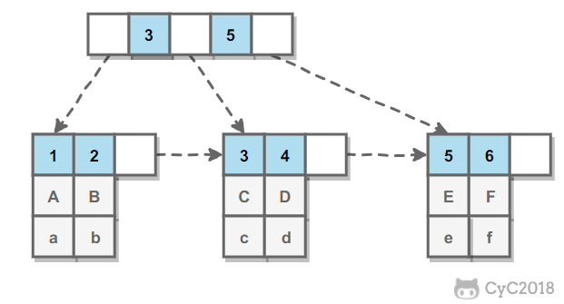

<!-- GFM-TOC -->
* [一、索引](#一索引)
    * [B+ Tree 原理](#b-tree-原理)
    * [MySQL 索引](#mysql-索引)
    * [索引優化](#索引優化)
    * [索引的優點](#索引的優點)
    * [索引的使用條件](#索引的使用條件)
* [二、查詢性能優化](#二查詢性能優化)
    * [使用 Explain 進行分析](#使用-explain-進行分析)
    * [優化數據訪問](#優化數據訪問)
    * [重構查詢方式](#重構查詢方式)
* [三、存儲引擎](#三存儲引擎)
    * [InnoDB](#innodb)
    * [MyISAM](#myisam)
    * [比較](#比較)
* [四、數據類型](#四數據類型)
    * [整型](#整型)
    * [浮點數](#浮點數)
    * [字符串](#字符串)
    * [時間和日期](#時間和日期)
* [五、切分](#五切分)
    * [水平切分](#水平切分)
    * [垂直切分](#垂直切分)
    * [Sharding 策略](#sharding-策略)
    * [Sharding 存在的問題](#sharding-存在的問題)
* [六、複製](#六複製)
    * [主從複製](#主從複製)
    * [讀寫分離](#讀寫分離)
* [參考資料](#參考資料)
<!-- GFM-TOC -->


# 一、索引

## B+ Tree 原理

### 1. 數據結構

B Tree 指的是 Balance Tree，也就是平衡樹。平衡樹是一顆查找樹，並且所有葉子節點位於同一層。

B+ Tree 是基於 B Tree 和葉子節點順序訪問指針進行實現，它具有 B Tree 的平衡性，並且通過順序訪問指針來提高區間查詢的性能。

在 B+ Tree 中，一個節點中的 key 從左到右非遞減排列，如果某個指針的左右相鄰 key 分別是 key<sub>i</sub> 和 key<sub>i+1</sub>，且不為 null，則該指針指向節點的所有 key 大於等於 key<sub>i</sub> 且小於等於 key<sub>i+1</sub>。

<div align="center">  </div><br>

### 2. 操作

進行查找操作時，首先在根節點進行二分查找，找到一個 key 所在的指針，然後遞歸地在指針所指向的節點進行查找。直到查找到葉子節點，然後在葉子節點上進行二分查找，找出 key 所對應的 data。

插入刪除操作會破壞平衡樹的平衡性，因此在插入刪除操作之後，需要對樹進行一個分裂、合併、旋轉等操作來維護平衡性。

### 3. 與紅黑樹的比較

紅黑樹等平衡樹也可以用來實現索引，但是文件系統及數據庫系統普遍採用 B+ Tree 作為索引結構，主要有以下兩個原因：

（一）更少的查找次數

平衡樹查找操作的時間複雜度和樹高 h 相關，O(h)=O(log<sub>d</sub>N)，其中 d 為每個節點的出度。

紅黑樹的出度為 2，而 B+ Tree 的出度一般都非常大，所以紅黑樹的樹高 h 很明顯比 B+ Tree 大非常多，查找的次數也就更多。

（二）利用磁盤預讀特性

為了減少磁盤 I/O 操作，磁盤往往不是嚴格按需讀取，而是每次都會預讀。預讀過程中，磁盤進行順序讀取，順序讀取不需要進行磁盤尋道，並且只需要很短的磁盤旋轉時間，速度會非常快。

操作系統一般將內存和磁盤分割成固定大小的塊，每一塊稱為一頁，內存與磁盤以頁為單位交換數據。數據庫系統將索引的一個節點的大小設置為頁的大小，使得一次 I/O 就能完全載入一個節點。並且可以利用預讀特性，相鄰的節點也能夠被預先載入。

## MySQL 索引

索引是在存儲引擎層實現的，而不是在服務器層實現的，所以不同存儲引擎具有不同的索引類型和實現。

### 1. B+Tree 索引

是大多數 MySQL 存儲引擎的默認索引類型。

因為不再需要進行全表掃描，只需要對樹進行搜索即可，所以查找速度快很多。

因為 B+ Tree 的有序性，所以除了用於查找，還可以用於排序和分組。

可以指定多個列作為索引列，多個索引列共同組成鍵。

適用於全鍵值、鍵值範圍和鍵前綴查找，其中鍵前綴查找只適用於最左前綴查找。如果不是按照索引列的順序進行查找，則無法使用索引。

InnoDB 的 B+Tree 索引分為主索引和輔助索引。主索引的葉子節點 data 域記錄著完整的數據記錄，這種索引方式被稱為聚簇索引。因為無法把數據行存放在兩個不同的地方，所以一個表只能有一個聚簇索引。

<div align="center">  </div><br>

輔助索引的葉子節點的 data 域記錄著主鍵的值，因此在使用輔助索引進行查找時，需要先查找到主鍵值，然後再到主索引中進行查找。

<div align="center">  </div><br>

### 2. 哈希索引

哈希索引能以 O(1) 時間進行查找，但是失去了有序性：

- 無法用於排序與分組；
- 只支持精確查找，無法用於部分查找和範圍查找。

InnoDB 存儲引擎有一個特殊的功能叫“自適應哈希索引”，當某個索引值被使用的非常頻繁時，會在 B+Tree 索引之上再創建一個哈希索引，這樣就讓 B+Tree 索引具有哈希索引的一些優點，比如快速的哈希查找。

### 3. 全文索引

MyISAM 存儲引擎支持全文索引，用於查找文本中的關鍵詞，而不是直接比較是否相等。

查找條件使用 MATCH AGAINST，而不是普通的 WHERE。

全文索引使用倒排索引實現，它記錄著關鍵詞到其所在文檔的映射。

InnoDB 存儲引擎在 MySQL 5.6.4 版本中也開始支持全文索引。

### 4. 空間數據索引

MyISAM 存儲引擎支持空間數據索引（R-Tree），可以用於地理數據存儲。空間數據索引會從所有維度來索引數據，可以有效地使用任意維度來進行組合查詢。

必須使用 GIS 相關的函數來維護數據。

## 索引優化

### 1. 獨立的列

在進行查詢時，索引列不能是表達式的一部分，也不能是函數的參數，否則無法使用索引。

例如下面的查詢不能使用 actor_id 列的索引：

```sql
SELECT actor_id FROM sakila.actor WHERE actor_id + 1 = 5;
```

### 2. 多列索引

在需要使用多個列作為條件進行查詢時，使用多列索引比使用多個單列索引性能更好。例如下面的語句中，最好把 actor_id 和 film_id 設置為多列索引。

```sql
SELECT film_id, actor_ id FROM sakila.film_actor
WHERE actor_id = 1 AND film_id = 1;
```

### 3. 索引列的順序

讓選擇性最強的索引列放在前面。

索引的選擇性是指：不重複的索引值和記錄總數的比值。最大值為 1，此時每個記錄都有唯一的索引與其對應。選擇性越高，每個記錄的區分度越高，查詢效率也越高。

例如下面顯示的結果中 customer_id 的選擇性比 staff_id 更高，因此最好把 customer_id 列放在多列索引的前面。

```sql
SELECT COUNT(DISTINCT staff_id)/COUNT(*) AS staff_id_selectivity,
COUNT(DISTINCT customer_id)/COUNT(*) AS customer_id_selectivity,
COUNT(*)
FROM payment;
```

```html
   staff_id_selectivity: 0.0001
customer_id_selectivity: 0.0373
               COUNT(*): 16049
```

### 4. 前綴索引

對於 BLOB、TEXT 和 VARCHAR 類型的列，必須使用前綴索引，只索引開始的部分字符。

前綴長度的選取需要根據索引選擇性來確定。

### 5. 覆蓋索引

索引包含所有需要查詢的字段的值。

具有以下優點：

- 索引通常遠小於數據行的大小，只讀取索引能大大減少數據訪問量。
- 一些存儲引擎（例如 MyISAM）在內存中只緩存索引，而數據依賴於操作系統來緩存。因此，只訪問索引可以不使用系統調用（通常比較費時）。
- 對於 InnoDB 引擎，若輔助索引能夠覆蓋查詢，則無需訪問主索引。

## 索引的優點

- 大大減少了服務器需要掃描的數據行數。

- 幫助服務器避免進行排序和分組，以及避免創建臨時表（B+Tree 索引是有序的，可以用於 ORDER BY 和 GROUP BY 操作。臨時表主要是在排序和分組過程中創建，不需要排序和分組，也就不需要創建臨時表）。

- 將隨機 I/O 變為順序 I/O（B+Tree 索引是有序的，會將相鄰的數據都存儲在一起）。

## 索引的使用條件

- 對於非常小的表、大部分情況下簡單的全表掃描比建立索引更高效；

- 對於中到大型的表，索引就非常有效；

- 但是對於特大型的表，建立和維護索引的代價將會隨之增長。這種情況下，需要用到一種技術可以直接區分出需要查詢的一組數據，而不是一條記錄一條記錄地匹配，例如可以使用分區技術。

# 二、查詢性能優化

## 使用 Explain 進行分析

Explain 用來分析 SELECT 查詢語句，開發人員可以通過分析 Explain 結果來優化查詢語句。

比較重要的字段有：

- select_type : 查詢類型，有簡單查詢、聯合查詢、子查詢等
- key : 使用的索引
- rows : 掃描的行數

## 優化數據訪問

### 1. 減少請求的數據量

- 只返回必要的列：最好不要使用 SELECT * 語句。
- 只返回必要的行：使用 LIMIT 語句來限制返回的數據。
- 緩存重複查詢的數據：使用緩存可以避免在數據庫中進行查詢，特別在要查詢的數據經常被重複查詢時，緩存帶來的查詢性能提升將會是非常明顯的。

### 2. 減少服務器端掃描的行數

最有效的方式是使用索引來覆蓋查詢。

## 重構查詢方式

### 1. 切分大查詢

一個大查詢如果一次性執行的話，可能一次鎖住很多數據、佔滿整個事務日誌、耗盡系統資源、阻塞很多小的但重要的查詢。

```sql
DELETE FROM messages WHERE create < DATE_SUB(NOW(), INTERVAL 3 MONTH);
```

```sql
rows_affected = 0
do {
    rows_affected = do_query(
    "DELETE FROM messages WHERE create  < DATE_SUB(NOW(), INTERVAL 3 MONTH) LIMIT 10000")
} while rows_affected > 0
```

### 2. 分解大連接查詢

將一個大連接查詢分解成對每一個表進行一次單表查詢，然後在應用程序中進行關聯，這樣做的好處有：

- 讓緩存更高效。對於連接查詢，如果其中一個表發生變化，那麼整個查詢緩存就無法使用。而分解後的多個查詢，即使其中一個表發生變化，對其它表的查詢緩存依然可以使用。
- 分解成多個單表查詢，這些單表查詢的緩存結果更可能被其它查詢使用到，從而減少冗餘記錄的查詢。
- 減少鎖競爭；
- 在應用層進行連接，可以更容易對數據庫進行拆分，從而更容易做到高性能和可伸縮。
- 查詢本身效率也可能會有所提升。例如下面的例子中，使用 IN() 代替連接查詢，可以讓 MySQL 按照 ID 順序進行查詢，這可能比隨機的連接要更高效。

```sql
SELECT * FROM tab
JOIN tag_post ON tag_post.tag_id=tag.id
JOIN post ON tag_post.post_id=post.id
WHERE tag.tag='mysql';
```

```sql
SELECT * FROM tag WHERE tag='mysql';
SELECT * FROM tag_post WHERE tag_id=1234;
SELECT * FROM post WHERE post.id IN (123,456,567,9098,8904);
```

# 三、存儲引擎

## InnoDB

是 MySQL 默認的事務型存儲引擎，只有在需要它不支持的特性時，才考慮使用其它存儲引擎。

實現了四個標準的隔離級別，默認級別是可重複讀（REPEATABLE READ）。在可重複讀隔離級別下，通過多版本併發控制（MVCC）+ Next-Key Locking 防止幻影讀。

主索引是聚簇索引，在索引中保存了數據，從而避免直接讀取磁盤，因此對查詢性能有很大的提升。

內部做了很多優化，包括從磁盤讀取數據時採用的可預測性讀、能夠加快讀操作並且自動創建的自適應哈希索引、能夠加速插入操作的插入緩衝區等。

支持真正的在線熱備份。其它存儲引擎不支持在線熱備份，要獲取一致性視圖需要停止對所有表的寫入，而在讀寫混合場景中，停止寫入可能也意味著停止讀取。

## MyISAM

設計簡單，數據以緊密格式存儲。對於只讀數據，或者表比較小、可以容忍修復操作，則依然可以使用它。

提供了大量的特性，包括壓縮表、空間數據索引等。

不支持事務。

不支持行級鎖，只能對整張表加鎖，讀取時會對需要讀到的所有表加共享鎖，寫入時則對錶加排它鎖。但在表有讀取操作的同時，也可以往表中插入新的記錄，這被稱為併發插入（CONCURRENT INSERT）。

可以手工或者自動執行檢查和修復操作，但是和事務恢復以及崩潰恢復不同，可能導致一些數據丟失，而且修復操作是非常慢的。

如果指定了 DELAY_KEY_WRITE 選項，在每次修改執行完成時，不會立即將修改的索引數據寫入磁盤，而是會寫到內存中的鍵緩衝區，只有在清理鍵緩衝區或者關閉表的時候才會將對應的索引塊寫入磁盤。這種方式可以極大的提升寫入性能，但是在數據庫或者主機崩潰時會造成索引損壞，需要執行修復操作。

## 比較

- 事務：InnoDB 是事務型的，可以使用 Commit 和 Rollback 語句。

- 併發：MyISAM 只支持表級鎖，而 InnoDB 還支持行級鎖。

- 外鍵：InnoDB 支持外鍵。

- 備份：InnoDB 支持在線熱備份。

- 崩潰恢復：MyISAM 崩潰後發生損壞的概率比 InnoDB 高很多，而且恢復的速度也更慢。

- 其它特性：MyISAM 支持壓縮表和空間數據索引。

# 四、數據類型

## 整型

TINYINT, SMALLINT, MEDIUMINT, INT, BIGINT 分別使用 8, 16, 24, 32, 64 位存儲空間，一般情況下越小的列越好。

INT(11) 中的數字只是規定了交互工具顯示字符的個數，對於存儲和計算來說是沒有意義的。

## 浮點數

FLOAT 和 DOUBLE 為浮點類型，DECIMAL 為高精度小數類型。CPU 原生支持浮點運算，但是不支持 DECIMAl 類型的計算，因此 DECIMAL 的計算比浮點類型需要更高的代價。

FLOAT、DOUBLE 和 DECIMAL 都可以指定列寬，例如 DECIMAL(18, 9) 表示總共 18 位，取 9 位存儲小數部分，剩下 9 位存儲整數部分。

## 字符串

主要有 CHAR 和 VARCHAR 兩種類型，一種是定長的，一種是變長的。

VARCHAR 這種變長類型能夠節省空間，因為只需要存儲必要的內容。但是在執行 UPDATE 時可能會使行變得比原來長，當超出一個頁所能容納的大小時，就要執行額外的操作。MyISAM 會將行拆成不同的片段存儲，而 InnoDB 則需要分裂頁來使行放進頁內。

在進行存儲和檢索時，會保留 VARCHAR 末尾的空格，而會刪除 CHAR 末尾的空格。

## 時間和日期

MySQL 提供了兩種相似的日期時間類型：DATETIME 和 TIMESTAMP。

### 1. DATETIME

能夠保存從 1000 年到 9999 年的日期和時間，精度為秒，使用 8 字節的存儲空間。

它與時區無關。

默認情況下，MySQL 以一種可排序的、無歧義的格式顯示 DATETIME 值，例如“2008-01-16 22<span>:</span>37<span>:</span>08”，這是 ANSI 標準定義的日期和時間表示方法。

### 2. TIMESTAMP

和 UNIX 時間戳相同，保存從 1970 年 1 月 1 日午夜（格林威治時間）以來的秒數，使用 4 個字節，只能表示從 1970 年到 2038 年。

它和時區有關，也就是說一個時間戳在不同的時區所代表的具體時間是不同的。

MySQL 提供了 FROM_UNIXTIME() 函數把 UNIX 時間戳轉換為日期，並提供了 UNIX_TIMESTAMP() 函數把日期轉換為 UNIX 時間戳。

默認情況下，如果插入時沒有指定 TIMESTAMP 列的值，會將這個值設置為當前時間。

應該儘量使用 TIMESTAMP，因為它比 DATETIME 空間效率更高。

# 五、切分

## 水平切分

水平切分又稱為 Sharding，它是將同一個表中的記錄拆分到多個結構相同的表中。

當一個表的數據不斷增多時，Sharding 是必然的選擇，它可以將數據分佈到集群的不同節點上，從而緩存單個數據庫的壓力。

<div align="center">  </div><br>

## 垂直切分

垂直切分是將一張表按列切分成多個表，通常是按照列的關係密集程度進行切分，也可以利用垂直切分將經常被使用的列和不經常被使用的列切分到不同的表中。

在數據庫的層面使用垂直切分將按數據庫中表的密集程度部署到不同的庫中，例如將原來的電商數據庫垂直切分成商品數據庫、用戶數據庫等。

<div align="center">  </div><br>

## Sharding 策略

- 哈希取模：hash(key) % N；
- 範圍：可以是 ID 範圍也可以是時間範圍；
- 映射表：使用單獨的一個數據庫來存儲映射關係。

## Sharding 存在的問題

### 1. 事務問題

使用分佈式事務來解決，比如 XA 接口。

### 2. 連接

可以將原來的連接分解成多個單表查詢，然後在用戶程序中進行連接。

### 3. ID 唯一性

- 使用全局唯一 ID（GUID）
- 為每個分片指定一個 ID 範圍
- 分佈式 ID 生成器 (如 Twitter 的 Snowflake 算法)

# 六、複製

## 主從複製

主要涉及三個線程：binlog 線程、I/O 線程和 SQL 線程。

-  **binlog 線程** ：負責將主服務器上的數據更改寫入二進制日誌（Binary log）中。
-  **I/O 線程** ：負責從主服務器上讀取二進制日誌，並寫入從服務器的中繼日誌（Relay log）。
-  **SQL 線程** ：負責讀取中繼日誌，解析出主服務器已經執行的數據更改並在從服務器中重放（Replay）。

<div align="center">  </div><br>

## 讀寫分離

主服務器處理寫操作以及實時性要求比較高的讀操作，而從服務器處理讀操作。

讀寫分離能提高性能的原因在於：

- 主從服務器負責各自的讀和寫，極大程度緩解了鎖的爭用；
- 從服務器可以使用 MyISAM，提升查詢性能以及節約系統開銷；
- 增加冗餘，提高可用性。

讀寫分離常用代理方式來實現，代理服務器接收應用層傳來的讀寫請求，然後決定轉發到哪個服務器。

<div align="center">  </div><br>

# 參考資料

- BaronScbwartz, PeterZaitsev, VadimTkacbenko, 等. 高性能 MySQL[M]. 電子工業出版社, 2013.
- 姜承堯. MySQL 技術內幕: InnoDB 存儲引擎 [M]. 機械工業出版社, 2011.
- [20+ 條 MySQL 性能優化的最佳經驗](https://www.jfox.info/20-tiao-mysql-xing-nen-you-hua-de-zui-jia-jing-yan.html)
- [服務端指南 數據存儲篇 | MySQL（09） 分庫與分錶帶來的分佈式困境與應對之策](http://blog.720ui.com/2017/mysql_core_09_multi_db_table2/ "服務端指南 數據存儲篇 | MySQL（09） 分庫與分錶帶來的分佈式困境與應對之策")
- [How to create unique row ID in sharded databases?](https://stackoverflow.com/questions/788829/how-to-create-unique-row-id-in-sharded-databases)
- [SQL Azure Federation – Introduction](http://geekswithblogs.net/shaunxu/archive/2012/01/07/sql-azure-federation-ndash-introduction.aspx "Title of this entry.")
- [MySQL 索引背後的數據結構及算法原理](http://blog.codinglabs.org/articles/theory-of-mysql-index.html)
- [MySQL 性能優化神器 Explain 使用分析](https://segmentfault.com/a/1190000008131735)
- [How Sharding Works](https://medium.com/@jeeyoungk/how-sharding-works-b4dec46b3f6)
- [大眾點評訂單系統分庫分表實踐](https://tech.meituan.com/dianping_order_db_sharding.html)
- [B + 樹](https://zh.wikipedia.org/wiki/B%2B%E6%A0%91)


# 微信公眾號


更多精彩內容將發佈在微信公眾號 CyC2018 上，你也可以在公眾號後臺和我交流學習和求職相關的問題。另外，公眾號提供了該項目的 PDF 等離線閱讀版本，後臺回覆 "下載" 即可領取。公眾號也提供了一份技術面試複習大綱，不僅系統整理了面試知識點，而且標註了各個知識點的重要程度，從而幫你理清多而雜的面試知識點，後臺回覆 "大綱" 即可領取。我基本是按照這個大綱來進行復習的，對我拿到了 BAT 頭條等 Offer 起到很大的幫助。你們完全可以和我一樣根據大綱上列的知識點來進行復習，就不用看很多不重要的內容，也可以知道哪些內容很重要從而多安排一些複習時間。


<br><div align="center"></img></div>
