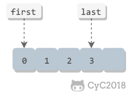
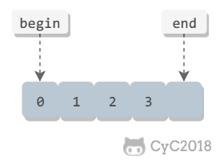

<!-- GFM-TOC -->
* [一、可讀性的重要性](#一可讀性的重要性)
* [二、用名字表達代碼含義](#二用名字表達代碼含義)
* [三、名字不能帶來歧義](#三名字不能帶來歧義)
* [四、良好的代碼風格](#四良好的代碼風格)
* [五、為何編寫註釋](#五為何編寫註釋)
* [六、如何編寫註釋](#六如何編寫註釋)
* [七、提高控制流的可讀性](#七提高控制流的可讀性)
* [八、拆分長表達式](#八拆分長表達式)
* [九、變量與可讀性](#九變量與可讀性)
* [十、抽取函數](#十抽取函數)
* [十一、一次只做一件事](#十一一次只做一件事)
* [十二、用自然語言表述代碼](#十二用自然語言表述代碼)
* [十三、減少代碼量](#十三減少代碼量)
* [參考資料](#參考資料)
<!-- GFM-TOC -->


# 一、可讀性的重要性

編程有很大一部分時間是在閱讀代碼，不僅要閱讀自己的代碼，而且要閱讀別人的代碼。因此，可讀性良好的代碼能夠大大提高編程效率。

可讀性良好的代碼往往會讓代碼架構更好，因為程序員更願意去修改這部分代碼，而且也更容易修改。

只有在核心領域為了效率才可以放棄可讀性，否則可讀性是第一位。

# 二、用名字表達代碼含義

一些比較有表達力的單詞：

|  單詞 |  可替代單詞 |
| :---: | --- |
| send | deliver、dispatch、announce、distribute、route  |
| find  |  search、extract、locate、recover |
| start| launch、create、begin、open|
| make | create、set up、build、generate、compose、add、new |

使用 i、j、k 作為循環迭代器的名字過於簡單，user_i、member_i 這種名字會更有表達力。因為循環層次越多，代碼越難理解，有表達力的迭代器名字可讀性會更高。

為名字添加形容詞等信息能讓名字更具有表達力，但是名字也會變長。名字長短的準則是：作用域越大，名字越長。因此只有在短作用域才能使用一些簡單名字。

# 三、名字不能帶來歧義

起完名字要思考一下別人會對這個名字有何解讀，會不會誤解了原本想表達的含義。

布爾相關的命名加上 is、can、should、has 等前綴。

- 用 min、max 表示數量範圍；
- 用 first、last 表示訪問空間的包含範圍；

<div align="center">  </div><br>

- begin、end 表示訪問空間的排除範圍，即 end 不包含尾部。

<div align="center">  </div><br>

# 四、良好的代碼風格

適當的空行和縮進。

排列整齊的註釋：

```java
int a = 1;   // 註釋
int b = 11;  // 註釋
int c = 111; // 註釋
```

語句順序不能隨意，比如與 html 表單相關聯的變量的賦值應該和表單在 html 中的順序一致。

# 五、為何編寫註釋

閱讀代碼首先會注意到註釋，如果註釋沒太大作用，那麼就會浪費代碼閱讀的時間。那些能直接看出含義的代碼不需要寫註釋，特別是不需要為每個方法都加上註釋，比如那些簡單的 getter 和 setter 方法，為這些方法寫註釋反而讓代碼可讀性更差。

不能因為有註釋就隨便起個名字，而是爭取起個好名字而不寫註釋。

可以用註釋來記錄採用當前解決辦法的思考過程，從而讓讀者更容易理解代碼。

註釋用來提醒一些特殊情況。

用 TODO 等做標記：

| 標記 | 用法 |
|---|---|
|TODO| 待做 |
|FIXME| 待修復 |
|HACK| 粗糙的解決方案 |
|XXX| 危險！這裡有重要的問題 |

# 六、如何編寫註釋

儘量簡潔明瞭：

```java
// The first String is student's name
// The Second Integer is student's score
Map<String, Integer> scoreMap = new HashMap<>();
```

```java
// Student's name -> Student's score
Map<String, Integer> scoreMap = new HashMap<>();
```

添加測試用例來說明：

```java
// ...
// Example: add(1, 2), return 3
int add(int x, int y) {
    return x + y;
}
```

使用專業名詞來縮短概念上的解釋，比如用設計模式名來說明代碼。

# 七、提高控制流的可讀性

條件表達式中，左側是變量，右側是常數。比如下面第一個語句正確：

```java
if (len < 10)
if (10 > len)
```

只有在邏輯簡單的情況下使用 ? : 三目運算符來使代碼更緊湊，否則應該拆分成 if / else；

do / while 的條件放在後面，不夠簡單明瞭，並且會有一些迷惑的地方，最好使用 while 來代替。

如果只有一個 goto 目標，那麼 goto 尚且還能接受，但是過於複雜的 goto 會讓代碼可讀性特別差，應該避免使用 goto。

在嵌套的循環中，用一些 return 語句往往能減少嵌套的層數。

# 八、拆分長表達式

長表達式的可讀性很差，可以引入一些解釋變量從而拆分表達式：

```python
if line.split(':')[0].strip() == "root":
    ...
```
```python
username = line.split(':')[0].strip()
if username == "root":
    ...
```

使用摩根定理簡化一些邏輯表達式：

```java
if (!a && !b) {
    ...
}
```
```java
if (!(a || b)) {
    ...
}
```

# 九、變量與可讀性

**去除控制流變量** 。在循環中通過使用 break 或者 return 可以減少控制流變量的使用。

```java
boolean done = false;
while (/* condition */ && !done) {
    ...
    if ( ... ) {
        done = true;
        continue;
    }
}
```

```java
while(/* condition */) {
    ...
    if ( ... ) {
        break;
    }
}
```

**減小變量作用域** 。作用域越小，越容易定位到變量所有使用的地方。

JavaScript 可以用閉包減小作用域。以下代碼中 submit_form 是函數變量，submitted 變量控制函數不會被提交兩次。第一個實現中 submitted 是全局變量，第二個實現把 submitted 放到匿名函數中，從而限制了起作用域範圍。

```js
submitted = false;
var submit_form = function(form_name) {
    if (submitted) {
        return;
    }
    submitted = true;
};
```

```js
var submit_form = (function() {
    var submitted = false;
    return function(form_name) {
        if(submitted) {
            return;
        }
        submitted = true;
    }
}());  // () 使得外層匿名函數立即執行
```

JavaScript 中沒有用 var 聲明的變量都是全局變量，而全局變量很容易造成迷惑，因此應當總是用 var 來聲明變量。

變量定義的位置應當離它使用的位置最近。

**實例解析** 

在一個網頁中有以下文本輸入字段：

```html
<input type = "text" id = "input1" value = "a">
<input type = "text" id = "input2" value = "b">
<input type = "text" id = "input3" value = "">
<input type = "text" id = "input4" value = "d">
```

現在要接受一個字符串並把它放到第一個空的 input 字段中，初始實現如下：

```js
var setFirstEmptyInput = function(new_alue) {
    var found = false;
    var i = 1;
    var elem = document.getElementById('input' + i);
    while (elem != null) {
        if (elem.value === '') {
            found = true;
            break;
        }
        i++;
        elem = document.getElementById('input' + i);
    }
    if (found) elem.value = new_value;
    return elem;
}
```

以上實現有以下問題：

- found 可以去除；
- elem 作用域過大；
- 可以用 for 循環代替 while 循環；

```js
var setFirstEmptyInput = function(new_value) {
    for (var i = 1; true; i++) {
        var elem = document.getElementById('input' + i);
        if (elem === null) {
            return null;
        }
        if (elem.value === '') {
            elem.value = new_value;
            return elem;
        }
    }
};
```

# 十、抽取函數

工程學就是把大問題拆分成小問題再把這些問題的解決方案放回一起。

首先應該明確一個函數的高層次目標，然後對於不是直接為了這個目標工作的代碼，抽取出來放到獨立的函數中。

介紹性的代碼：

```java
int findClostElement(int[] arr) {
    int clostIdx;
    int clostDist = Interger.MAX_VALUE;
    for (int i = 0; i < arr.length; i++) {
        int x = ...;
        int y = ...;
        int z = ...;
        int value = x * y * z;
        int dist = Math.sqrt(Math.pow(value, 2), Math.pow(arr[i], 2));
        if (dist < clostDist) {
            clostIdx = i;
            clostDist = value;
        }
    }
    return clostIdx;
}
```

以上代碼中循環部分主要計算距離，這部分不屬於代碼高層次目標，高層次目標是尋找最小距離的值，因此可以把這部分代替提取到獨立的函數中。這樣做也帶來一個額外的好處有：可以單獨進行測試、可以快速找到程序錯誤並修改。

```java
public int findClostElement(int[] arr) {
    int clostIdx;
    int clostDist = Interger.MAX_VALUE;
    for (int i = 0; i < arr.length; i++) {
        int dist = computDist(arr, i);
        if (dist < clostDist) {
            clostIdx = i;
            clostDist = value;
        }
    }
    return clostIdx;
}
```

並不是函數抽取的越多越好，如果抽取過多，在閱讀代碼的時候可能需要不斷跳來跳去。只有在當前函數不需要去了解某一塊代碼細節而能夠表達其內容時，把這塊代碼抽取成子函數才是好的。

函數抽取也用於減小代碼的冗餘。

# 十一、一次只做一件事

只做一件事的代碼很容易讓人知道其要做的事；

基本流程：列出代碼所做的所有任務；把每個任務拆分到不同的函數，或者不同的段落。

# 十二、用自然語言表述代碼

先用自然語言書寫代碼邏輯，也就是偽代碼，然後再寫代碼，這樣代碼邏輯會更清晰。

# 十三、減少代碼量

不要過度設計，編碼過程會有很多變化，過度設計的內容到最後往往是無用的。

多用標準庫實現。

# 參考資料

- Dustin, Boswell, Trevor, 等. 編寫可讀代碼的藝術 [M]. 機械工業出版社, 2012.


# 微信公眾號


更多精彩內容將發佈在微信公眾號 CyC2018 上，你也可以在公眾號後臺和我交流學習和求職相關的問題。另外，公眾號提供了該項目的 PDF 等離線閱讀版本，後臺回覆 "下載" 即可領取。公眾號也提供了一份技術面試複習大綱，不僅系統整理了面試知識點，而且標註了各個知識點的重要程度，從而幫你理清多而雜的面試知識點，後臺回覆 "大綱" 即可領取。我基本是按照這個大綱來進行復習的，對我拿到了 BAT 頭條等 Offer 起到很大的幫助。你們完全可以和我一樣根據大綱上列的知識點來進行復習，就不用看很多不重要的內容，也可以知道哪些內容很重要從而多安排一些複習時間。


<br><div align="center"></img></div>
