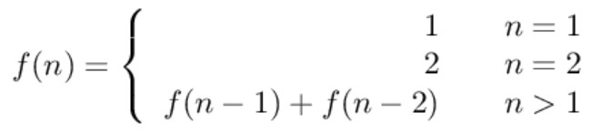
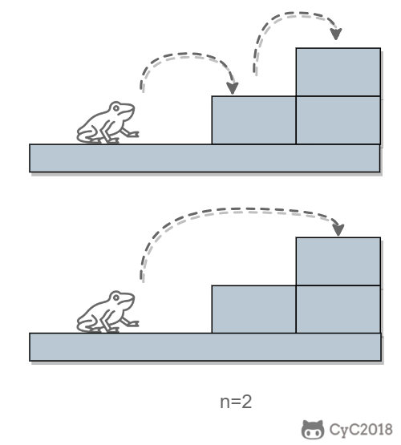
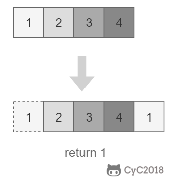
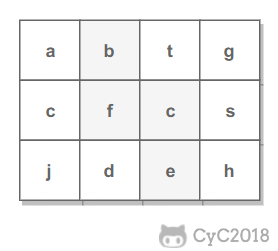

<!-- GFM-TOC -->
* [10.1 斐波那契數列](#101-斐波那契數列)
* [10.2 矩形覆蓋](#102-矩形覆蓋)
* [10.3 跳臺階](#103-跳臺階)
* [10.4 變態跳臺階](#104-變態跳臺階)
* [11. 旋轉數組的最小數字](#11-旋轉數組的最小數字)
* [12. 矩陣中的路徑](#12-矩陣中的路徑)
* [13. 機器人的運動範圍](#13-機器人的運動範圍)
* [14. 剪繩子](#14-剪繩子)
* [15. 二進制中 1 的個數](#15-二進制中-1-的個數)
* [16. 數值的整數次方](#16-數值的整數次方)
* [17. 打印從 1 到最大的 n 位數](#17-打印從-1-到最大的-n-位數)
* [18.1 在 O(1) 時間內刪除鏈表節點](#181-在-o1-時間內刪除鏈表節點)
* [18.2 刪除鏈表中重複的結點](#182-刪除鏈表中重複的結點)
* [19. 正則表達式匹配](#19-正則表達式匹配)
<!-- GFM-TOC -->


# 10.1 斐波那契數列

[NowCoder](https://www.nowcoder.com/practice/c6c7742f5ba7442aada113136ddea0c3?tpId=13&tqId=11160&tPage=1&rp=1&ru=/ta/coding-interviews&qru=/ta/coding-interviews/question-ranking)

## 題目描述

求斐波那契數列的第 n 項，n <= 39。

<!--<div align="center">1}\end{array}\right." class="mathjax-pic"/></div> <br> -->

<div align="center">  </div><br>

## 解題思路

如果使用遞歸求解，會重複計算一些子問題。例如，計算 f(4) 需要計算 f(3) 和 f(2)，計算 f(3) 需要計算 f(2) 和 f(1)，可以看到 f(2) 被重複計算了。

<div align="center">  </div><br>

遞歸是將一個問題劃分成多個子問題求解，動態規劃也是如此，但是動態規劃會把子問題的解緩存起來，從而避免重複求解子問題。

```java
public int Fibonacci(int n) {
    if (n <= 1)
        return n;
    int[] fib = new int[n + 1];
    fib[1] = 1;
    for (int i = 2; i <= n; i++)
        fib[i] = fib[i - 1] + fib[i - 2];
    return fib[n];
}
```

考慮到第 i 項只與第 i-1 和第 i-2 項有關，因此只需要存儲前兩項的值就能求解第 i 項，從而將空間複雜度由 O(N) 降低為 O(1)。

```java
public int Fibonacci(int n) {
    if (n <= 1)
        return n;
    int pre2 = 0, pre1 = 1;
    int fib = 0;
    for (int i = 2; i <= n; i++) {
        fib = pre2 + pre1;
        pre2 = pre1;
        pre1 = fib;
    }
    return fib;
}
```

由於待求解的 n 小於 40，因此可以將前 40 項的結果先進行計算，之後就能以 O(1) 時間複雜度得到第 n 項的值。

```java
public class Solution {

    private int[] fib = new int[40];

    public Solution() {
        fib[1] = 1;
        for (int i = 2; i < fib.length; i++)
            fib[i] = fib[i - 1] + fib[i - 2];
    }

    public int Fibonacci(int n) {
        return fib[n];
    }
}
```

# 10.2 矩形覆蓋

[NowCoder](https://www.nowcoder.com/practice/72a5a919508a4251859fb2cfb987a0e6?tpId=13&tqId=11163&tPage=1&rp=1&ru=/ta/coding-interviews&qru=/ta/coding-interviews/question-ranking)

## 題目描述

我們可以用 2\*1 的小矩形橫著或者豎著去覆蓋更大的矩形。請問用 n 個 2\*1 的小矩形無重疊地覆蓋一個 2\*n 的大矩形，總共有多少種方法？

<div align="center">  </div><br>

## 解題思路

當 n 為 1 時，只有一種覆蓋方法：

<div align="center">  </div><br>

當 n 為 2 時，有兩種覆蓋方法：

<div align="center">  </div><br>

要覆蓋 2\*n 的大矩形，可以先覆蓋 2\*1 的矩形，再覆蓋 2\*(n-1) 的矩形；或者先覆蓋 2\*2 的矩形，再覆蓋 2\*(n-2) 的矩形。而覆蓋 2\*(n-1) 和 2\*(n-2) 的矩形可以看成子問題。該問題的遞推公式如下：

<!-- <div align="center">1}\end{array}\right." class="mathjax-pic"/></div> <br> -->

<div align="center">  </div><br>

```java
public int RectCover(int n) {
    if (n <= 2)
        return n;
    int pre2 = 1, pre1 = 2;
    int result = 0;
    for (int i = 3; i <= n; i++) {
        result = pre2 + pre1;
        pre2 = pre1;
        pre1 = result;
    }
    return result;
}
```

# 10.3 跳臺階

[NowCoder](https://www.nowcoder.com/practice/8c82a5b80378478f9484d87d1c5f12a4?tpId=13&tqId=11161&tPage=1&rp=1&ru=/ta/coding-interviews&qru=/ta/coding-interviews/question-ranking)

## 題目描述

一隻青蛙一次可以跳上 1 級臺階，也可以跳上 2 級。求該青蛙跳上一個 n 級的臺階總共有多少種跳法。

<div align="center">  </div><br>

## 解題思路

當 n = 1 時，只有一種跳法：

<div align="center">  </div><br>

當 n = 2 時，有兩種跳法：

<div align="center">  </div><br>

跳 n 階臺階，可以先跳 1 階臺階，再跳 n-1 階臺階；或者先跳 2 階臺階，再跳 n-2 階臺階。而 n-1 和 n-2 階臺階的跳法可以看成子問題，該問題的遞推公式為：

<div align="center">  </div><br>

```java
public int JumpFloor(int n) {
    if (n <= 2)
        return n;
    int pre2 = 1, pre1 = 2;
    int result = 1;
    for (int i = 2; i < n; i++) {
        result = pre2 + pre1;
        pre2 = pre1;
        pre1 = result;
    }
    return result;
}
```

# 10.4 變態跳臺階

[NowCoder](https://www.nowcoder.com/practice/22243d016f6b47f2a6928b4313c85387?tpId=13&tqId=11162&tPage=1&rp=1&ru=/ta/coding-interviews&qru=/ta/coding-interviews/question-ranking)

## 題目描述

一隻青蛙一次可以跳上 1 級臺階，也可以跳上 2 級... 它也可以跳上 n 級。求該青蛙跳上一個 n 級的臺階總共有多少種跳法。

<div align="center">  </div><br>

## 解題思路

### 動態規劃

```java
public int JumpFloorII(int target) {
    int[] dp = new int[target];
    Arrays.fill(dp, 1);
    for (int i = 1; i < target; i++)
        for (int j = 0; j < i; j++)
            dp[i] += dp[j];
    return dp[target - 1];
}
```

### 數學推導

跳上 n-1 級臺階，可以從 n-2 級跳 1 級上去，也可以從 n-3 級跳 2 級上去...，那麼

```
f(n-1) = f(n-2) + f(n-3) + ... + f(0)
```

同樣，跳上 n 級臺階，可以從 n-1 級跳 1 級上去，也可以從 n-2 級跳 2 級上去... ，那麼

```
f(n) = f(n-1) + f(n-2) + ... + f(0)
```

綜上可得

```
f(n) - f(n-1) = f(n-1)
```

即

```
f(n) = 2*f(n-1)
```

所以 f(n) 是一個等比數列

```source-java
public int JumpFloorII(int target) {
    return (int) Math.pow(2, target - 1);
}
```


# 11. 旋轉數組的最小數字

[NowCoder](https://www.nowcoder.com/practice/9f3231a991af4f55b95579b44b7a01ba?tpId=13&tqId=11159&tPage=1&rp=1&ru=/ta/coding-interviews&qru=/ta/coding-interviews/question-ranking)

## 題目描述

把一個數組最開始的若干個元素搬到數組的末尾，我們稱之為數組的旋轉。輸入一個非遞減排序的數組的一個旋轉，輸出旋轉數組的最小元素。

<div align="center">  </div><br>

## 解題思路

將旋轉數組對半分可以得到一個包含最小元素的新旋轉數組，以及一個非遞減排序的數組。新的旋轉數組的數組元素是原數組的一半，從而將問題規模減少了一半，這種折半性質的算法的時間複雜度為 O(logN)（為了方便，這裡將 log<sub>2</sub>N 寫為 logN）。

<div align="center">  </div><br>

此時問題的關鍵在於確定對半分得到的兩個數組哪一個是旋轉數組，哪一個是非遞減數組。我們很容易知道非遞減數組的第一個元素一定小於等於最後一個元素。

通過修改二分查找算法進行求解（l 代表 low，m 代表 mid，h 代表 high）：

- 當 nums[m] <= nums[h] 時，表示 [m, h] 區間內的數組是非遞減數組，[l, m] 區間內的數組是旋轉數組，此時令 h = m；
- 否則 [m + 1, h] 區間內的數組是旋轉數組，令 l = m + 1。

```java
public int minNumberInRotateArray(int[] nums) {
    if (nums.length == 0)
        return 0;
    int l = 0, h = nums.length - 1;
    while (l < h) {
        int m = l + (h - l) / 2;
        if (nums[m] <= nums[h])
            h = m;
        else
            l = m + 1;
    }
    return nums[l];
}
```

如果數組元素允許重複，會出現一個特殊的情況：nums[l] == nums[m] == nums[h]，此時無法確定解在哪個區間，需要切換到順序查找。例如對於數組 {1,1,1,0,1}，l、m 和 h 指向的數都為 1，此時無法知道最小數字 0 在哪個區間。

```java
public int minNumberInRotateArray(int[] nums) {
    if (nums.length == 0)
        return 0;
    int l = 0, h = nums.length - 1;
    while (l < h) {
        int m = l + (h - l) / 2;
        if (nums[l] == nums[m] && nums[m] == nums[h])
            return minNumber(nums, l, h);
        else if (nums[m] <= nums[h])
            h = m;
        else
            l = m + 1;
    }
    return nums[l];
}

private int minNumber(int[] nums, int l, int h) {
    for (int i = l; i < h; i++)
        if (nums[i] > nums[i + 1])
            return nums[i + 1];
    return nums[l];
}
```

# 12. 矩陣中的路徑

[NowCoder](https://www.nowcoder.com/practice/c61c6999eecb4b8f88a98f66b273a3cc?tpId=13&tqId=11218&tPage=1&rp=1&ru=/ta/coding-interviews&qru=/ta/coding-interviews/question-ranking)

## 題目描述

判斷在一個矩陣中是否存在一條包含某字符串所有字符的路徑。路徑可以從矩陣中的任意一個格子開始，每一步可以在矩陣中向上下左右移動一個格子。如果一條路徑經過了矩陣中的某一個格子，則該路徑不能再進入該格子。

例如下面的矩陣包含了一條 bfce 路徑。

<div align="center">  </div><br>

## 解題思路

使用回溯法（backtracking）進行求解，它是一種暴力搜索方法，通過搜索所有可能的結果來求解問題。回溯法在一次搜索結束時需要進行回溯（回退），將這一次搜索過程中設置的狀態進行清除，從而開始一次新的搜索過程。例如下圖示例中，從 f 開始，下一步有 4 種搜索可能，如果先搜索 b，需要將 b 標記為已經使用，防止重複使用。在這一次搜索結束之後，需要將 b 的已經使用狀態清除，並搜索 c。

<div align="center">  </div><br>

本題的輸入是數組而不是矩陣（二維數組），因此需要先將數組轉換成矩陣。

```java
private final static int[][] next = {{0, -1}, {0, 1}, {-1, 0}, {1, 0}};
private int rows;
private int cols;

public boolean hasPath(char[] array, int rows, int cols, char[] str) {
    if (rows == 0 || cols == 0) return false;
    this.rows = rows;
    this.cols = cols;
    boolean[][] marked = new boolean[rows][cols];
    char[][] matrix = buildMatrix(array);
    for (int i = 0; i < rows; i++)
        for (int j = 0; j < cols; j++)
            if (backtracking(matrix, str, marked, 0, i, j))
                return true;

    return false;
}

private boolean backtracking(char[][] matrix, char[] str,
                             boolean[][] marked, int pathLen, int r, int c) {

    if (pathLen == str.length) return true;
    if (r < 0 || r >= rows || c < 0 || c >= cols
            || matrix[r][c] != str[pathLen] || marked[r][c]) {

        return false;
    }
    marked[r][c] = true;
    for (int[] n : next)
        if (backtracking(matrix, str, marked, pathLen + 1, r + n[0], c + n[1]))
            return true;
    marked[r][c] = false;
    return false;
}

private char[][] buildMatrix(char[] array) {
    char[][] matrix = new char[rows][cols];
    for (int r = 0, idx = 0; r < rows; r++)
        for (int c = 0; c < cols; c++)
            matrix[r][c] = array[idx++];
    return matrix;
}
```

# 13. 機器人的運動範圍

[NowCoder](https://www.nowcoder.com/practice/6e5207314b5241fb83f2329e89fdecc8?tpId=13&tqId=11219&tPage=1&rp=1&ru=/ta/coding-interviews&qru=/ta/coding-interviews/question-ranking)

## 題目描述

地上有一個 m 行和 n 列的方格。一個機器人從座標 (0, 0) 的格子開始移動，每一次只能向左右上下四個方向移動一格，但是不能進入行座標和列座標的數位之和大於 k 的格子。

例如，當 k 為 18 時，機器人能夠進入方格 (35,37)，因為 3+5+3+7=18。但是，它不能進入方格 (35,38)，因為 3+5+3+8=19。請問該機器人能夠達到多少個格子？

## 解題思路

使用深度優先搜索（Depth First Search，DFS）方法進行求解。回溯是深度優先搜索的一種特例，它在一次搜索過程中需要設置一些本次搜索過程的局部狀態，並在本次搜索結束之後清除狀態。而普通的深度優先搜索並不需要使用這些局部狀態，雖然還是有可能設置一些全局狀態。

```java
private static final int[][] next = {{0, -1}, {0, 1}, {-1, 0}, {1, 0}};
private int cnt = 0;
private int rows;
private int cols;
private int threshold;
private int[][] digitSum;

public int movingCount(int threshold, int rows, int cols) {
    this.rows = rows;
    this.cols = cols;
    this.threshold = threshold;
    initDigitSum();
    boolean[][] marked = new boolean[rows][cols];
    dfs(marked, 0, 0);
    return cnt;
}

private void dfs(boolean[][] marked, int r, int c) {
    if (r < 0 || r >= rows || c < 0 || c >= cols || marked[r][c])
        return;
    marked[r][c] = true;
    if (this.digitSum[r][c] > this.threshold)
        return;
    cnt++;
    for (int[] n : next)
        dfs(marked, r + n[0], c + n[1]);
}

private void initDigitSum() {
    int[] digitSumOne = new int[Math.max(rows, cols)];
    for (int i = 0; i < digitSumOne.length; i++) {
        int n = i;
        while (n > 0) {
            digitSumOne[i] += n % 10;
            n /= 10;
        }
    }
    this.digitSum = new int[rows][cols];
    for (int i = 0; i < this.rows; i++)
        for (int j = 0; j < this.cols; j++)
            this.digitSum[i][j] = digitSumOne[i] + digitSumOne[j];
}
```

# 14. 剪繩子

[Leetcode](https://leetcode.com/problems/integer-break/description/)

## 題目描述

把一根繩子剪成多段，並且使得每段的長度乘積最大。

```html
n = 2
return 1 (2 = 1 + 1)

n = 10
return 36 (10 = 3 + 3 + 4)
```

## 解題思路

### 貪心

儘可能多剪長度為 3 的繩子，並且不允許有長度為 1 的繩子出現。如果出現了，就從已經切好長度為 3 的繩子中拿出一段與長度為 1 的繩子重新組合，把它們切成兩段長度為 2 的繩子。

證明：當 n >= 5 時，3(n - 3) - n = 2n - 9 > 0，且 2(n - 2) - n = n - 4 > 0。因此在 n >= 5 的情況下，將繩子剪成一段為 2 或者 3，得到的乘積會更大。又因為 3(n - 3) - 2(n - 2) = n - 5 >= 0，所以剪成一段長度為 3 比長度為 2 得到的乘積更大。

```java
public int integerBreak(int n) {
    if (n < 2)
        return 0;
    if (n == 2)
        return 1;
    if (n == 3)
        return 2;
    int timesOf3 = n / 3;
    if (n - timesOf3 * 3 == 1)
        timesOf3--;
    int timesOf2 = (n - timesOf3 * 3) / 2;
    return (int) (Math.pow(3, timesOf3)) * (int) (Math.pow(2, timesOf2));
}
```

### 動態規劃

```java
public int integerBreak(int n) {
    int[] dp = new int[n + 1];
    dp[1] = 1;
    for (int i = 2; i <= n; i++)
        for (int j = 1; j < i; j++)
            dp[i] = Math.max(dp[i], Math.max(j * (i - j), dp[j] * (i - j)));
    return dp[n];
}
```

# 15. 二進制中 1 的個數

[NowCoder](https://www.nowcoder.com/practice/8ee967e43c2c4ec193b040ea7fbb10b8?tpId=13&tqId=11164&tPage=1&rp=1&ru=/ta/coding-interviews&qru=/ta/coding-interviews/question-ranking)

## 題目描述

輸入一個整數，輸出該數二進制表示中 1 的個數。

### n&(n-1)

該位運算去除 n 的位級表示中最低的那一位。

```
n       : 10110100
n-1     : 10110011
n&(n-1) : 10110000
```

時間複雜度：O(M)，其中 M 表示 1 的個數。


```java
public int NumberOf1(int n) {
    int cnt = 0;
    while (n != 0) {
        cnt++;
        n &= (n - 1);
    }
    return cnt;
}
```


### Integer.bitCount()

```java
public int NumberOf1(int n) {
    return Integer.bitCount(n);
}
```

# 16. 數值的整數次方

[NowCoder](https://www.nowcoder.com/practice/1a834e5e3e1a4b7ba251417554e07c00?tpId=13&tqId=11165&tPage=1&rp=1&ru=/ta/coding-interviews&qru=/ta/coding-interviews/question-ranking)

## 題目描述

給定一個 double 類型的浮點數 base 和 int 類型的整數 exponent，求 base 的 exponent 次方。

## 解題思路

下面的討論中 x 代表 base，n 代表 exponent。

<!--<div align="center"></div> <br>-->

<div align="center">  </div><br>


因為 (x\*x)<sup>n/2</sup> 可以通過遞歸求解，並且每次遞歸 n 都減小一半，因此整個算法的時間複雜度為 O(logN)。

```java
public double Power(double base, int exponent) {
    if (exponent == 0)
        return 1;
    if (exponent == 1)
        return base;
    boolean isNegative = false;
    if (exponent < 0) {
        exponent = -exponent;
        isNegative = true;
    }
    double pow = Power(base * base, exponent / 2);
    if (exponent % 2 != 0)
        pow = pow * base;
    return isNegative ? 1 / pow : pow;
}
```

# 17. 打印從 1 到最大的 n 位數

## 題目描述

輸入數字 n，按順序打印出從 1 到最大的 n 位十進制數。比如輸入 3，則打印出 1、2、3 一直到最大的 3 位數即 999。

## 解題思路

由於 n 可能會非常大，因此不能直接用 int 表示數字，而是用 char 數組進行存儲。

使用回溯法得到所有的數。

```java
public void print1ToMaxOfNDigits(int n) {
    if (n <= 0)
        return;
    char[] number = new char[n];
    print1ToMaxOfNDigits(number, 0);
}

private void print1ToMaxOfNDigits(char[] number, int digit) {
    if (digit == number.length) {
        printNumber(number);
        return;
    }
    for (int i = 0; i < 10; i++) {
        number[digit] = (char) (i + '0');
        print1ToMaxOfNDigits(number, digit + 1);
    }
}

private void printNumber(char[] number) {
    int index = 0;
    while (index < number.length && number[index] == '0')
        index++;
    while (index < number.length)
        System.out.print(number[index++]);
    System.out.println();
}
```

# 18.1 在 O(1) 時間內刪除鏈表節點

## 解題思路

① 如果該節點不是尾節點，那麼可以直接將下一個節點的值賦給該節點，然後令該節點指向下下個節點，再刪除下一個節點，時間複雜度為 O(1)。

<div align="center">  </div><br>

② 否則，就需要先遍歷鏈表，找到節點的前一個節點，然後讓前一個節點指向 null，時間複雜度為 O(N)。

<div align="center">  </div><br>

綜上，如果進行 N 次操作，那麼大約需要操作節點的次數為 N-1+N=2N-1，其中 N-1 表示 N-1 個不是尾節點的每個節點以 O(1) 的時間複雜度操作節點的總次數，N 表示 1 個尾節點以 O(N) 的時間複雜度操作節點的總次數。(2N-1)/N \~ 2，因此該算法的平均時間複雜度為 O(1)。

```java
public ListNode deleteNode(ListNode head, ListNode tobeDelete) {
    if (head == null || tobeDelete == null)
        return null;
    if (tobeDelete.next != null) {
        // 要刪除的節點不是尾節點
        ListNode next = tobeDelete.next;
        tobeDelete.val = next.val;
        tobeDelete.next = next.next;
    } else {
        if (head == tobeDelete)
             // 只有一個節點
            head = null;
        else {
            ListNode cur = head;
            while (cur.next != tobeDelete)
                cur = cur.next;
            cur.next = null;
        }
    }
    return head;
}
```

# 18.2 刪除鏈表中重複的結點

[NowCoder](https://www.nowcoder.com/practice/fc533c45b73a41b0b44ccba763f866ef?tpId=13&tqId=11209&tPage=1&rp=1&ru=/ta/coding-interviews&qru=/ta/coding-interviews/question-ranking)

## 題目描述

<div align="center">  </div><br>

## 解題描述

```java
public ListNode deleteDuplication(ListNode pHead) {
    if (pHead == null || pHead.next == null)
        return pHead;
    ListNode next = pHead.next;
    if (pHead.val == next.val) {
        while (next != null && pHead.val == next.val)
            next = next.next;
        return deleteDuplication(next);
    } else {
        pHead.next = deleteDuplication(pHead.next);
        return pHead;
    }
}
```

# 19. 正則表達式匹配

[NowCoder](https://www.nowcoder.com/practice/45327ae22b7b413ea21df13ee7d6429c?tpId=13&tqId=11205&tPage=1&rp=1&ru=/ta/coding-interviews&qru=/ta/coding-interviews/question-ranking)

## 題目描述

請實現一個函數用來匹配包括 '.' 和 '\*' 的正則表達式。模式中的字符 '.' 表示任意一個字符，而 '\*' 表示它前面的字符可以出現任意次（包含 0 次）。

在本題中，匹配是指字符串的所有字符匹配整個模式。例如，字符串 "aaa" 與模式 "a.a" 和 "ab\*ac\*a" 匹配，但是與 "aa.a" 和 "ab\*a" 均不匹配。

## 解題思路

應該注意到，'.' 是用來當做一個任意字符，而 '\*' 是用來重複前面的字符。這兩個的作用不同，不能把 '.' 的作用和 '\*' 進行類比，從而把它當成重複前面字符一次。

```java
public boolean match(char[] str, char[] pattern) {

    int m = str.length, n = pattern.length;
    boolean[][] dp = new boolean[m + 1][n + 1];

    dp[0][0] = true;
    for (int i = 1; i <= n; i++)
        if (pattern[i - 1] == '*')
            dp[0][i] = dp[0][i - 2];

    for (int i = 1; i <= m; i++)
        for (int j = 1; j <= n; j++)
            if (str[i - 1] == pattern[j - 1] || pattern[j - 1] == '.')
                dp[i][j] = dp[i - 1][j - 1];
            else if (pattern[j - 1] == '*')
                if (pattern[j - 2] == str[i - 1] || pattern[j - 2] == '.') {
                    dp[i][j] |= dp[i][j - 1]; // a* counts as single a
                    dp[i][j] |= dp[i - 1][j]; // a* counts as multiple a
                    dp[i][j] |= dp[i][j - 2]; // a* counts as empty
                } else
                    dp[i][j] = dp[i][j - 2];   // a* only counts as empty

    return dp[m][n];
}
```


# 微信公眾號


更多精彩內容將發佈在微信公眾號 CyC2018 上，你也可以在公眾號後臺和我交流學習和求職相關的問題。另外，公眾號提供了該項目的 PDF 等離線閱讀版本，後臺回覆 "下載" 即可領取。公眾號也提供了一份技術面試複習大綱，不僅系統整理了面試知識點，而且標註了各個知識點的重要程度，從而幫你理清多而雜的面試知識點，後臺回覆 "大綱" 即可領取。我基本是按照這個大綱來進行復習的，對我拿到了 BAT 頭條等 Offer 起到很大的幫助。你們完全可以和我一樣根據大綱上列的知識點來進行復習，就不用看很多不重要的內容，也可以知道哪些內容很重要從而多安排一些複習時間。


<br><div align="center"></img></div>
