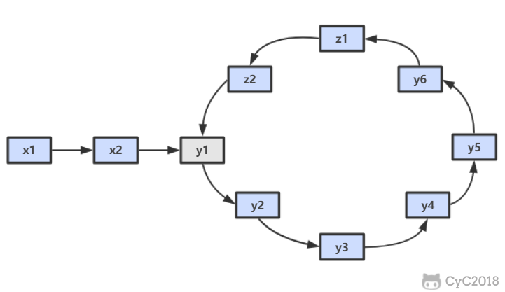
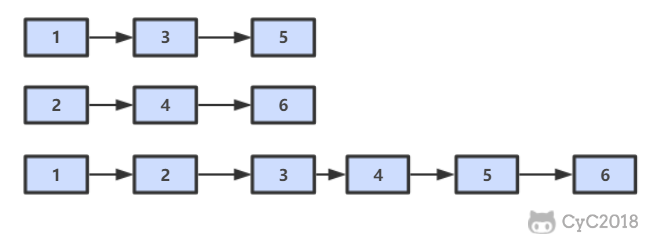
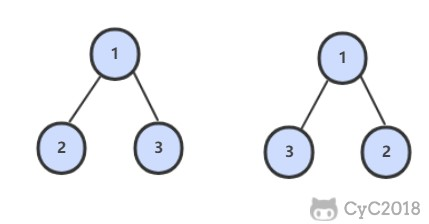

<!-- GFM-TOC -->
* [20. 表示數值的字符串](#20-表示數值的字符串)
* [21. 調整數組順序使奇數位於偶數前面](#21-調整數組順序使奇數位於偶數前面)
* [22. 鏈表中倒數第 K 個結點](#22-鏈表中倒數第-k-個結點)
* [23. 鏈表中環的入口結點](#23-鏈表中環的入口結點)
* [24. 反轉鏈表](#24-反轉鏈表)
* [25. 合併兩個排序的鏈表](#25-合併兩個排序的鏈表)
* [26. 樹的子結構](#26-樹的子結構)
* [27. 二叉樹的鏡像](#27-二叉樹的鏡像)
* [28 對稱的二叉樹](#28-對稱的二叉樹)
* [29. 順時針打印矩陣](#29-順時針打印矩陣)
<!-- GFM-TOC -->


# 20. 表示數值的字符串

[NowCoder](https://www.nowcoder.com/practice/6f8c901d091949a5837e24bb82a731f2?tpId=13&tqId=11206&tPage=1&rp=1&ru=/ta/coding-interviews&qru=/ta/coding-interviews/question-ranking)

## 題目描述

```
true

"+100"
"5e2"
"-123"
"3.1416"
"-1E-16"
```

```
false

"12e"
"1a3.14"
"1.2.3"
"+-5"
"12e+4.3"
```


## 解題思路

使用正則表達式進行匹配。

```html
[]  ： 字符集合
()  ： 分組
?   ： 重複 0 ~ 1 次
+   ： 重複 1 ~ n 次
*   ： 重複 0 ~ n 次
.   ： 任意字符
\\. ： 轉義後的 .
\\d ： 數字
```

```java
public boolean isNumeric(char[] str) {
    if (str == null || str.length == 0)
        return false;
    return new String(str).matches("[+-]?\\d*(\\.\\d+)?([eE][+-]?\\d+)?");
}
```

# 21. 調整數組順序使奇數位於偶數前面

[NowCoder](https://www.nowcoder.com/practice/beb5aa231adc45b2a5dcc5b62c93f593?tpId=13&tqId=11166&tPage=1&rp=1&ru=/ta/coding-interviews&qru=/ta/coding-interviews/question-ranking)

## 題目描述

需要保證奇數和奇數，偶數和偶數之間的相對位置不變，這和書本不太一樣。

<div align="center">  </div><br>

## 解題思路

方法一：創建一個新數組，時間複雜度 O(N)，空間複雜度 O(N)。

```java
public void reOrderArray(int[] nums) {
    // 奇數個數
    int oddCnt = 0;
    for (int x : nums)
        if (!isEven(x))
            oddCnt++;
    int[] copy = nums.clone();
    int i = 0, j = oddCnt;
    for (int num : copy) {
        if (num % 2 == 1)
            nums[i++] = num;
        else
            nums[j++] = num;
    }
}

private boolean isEven(int x) {
    return x % 2 == 0;
}
```

方法二：使用冒泡思想，每次都當前偶數上浮到當前最右邊。時間複雜度 O(N<sup>2</sup>)，空間複雜度 O(1)，時間換空間。

```java
public void reOrderArray(int[] nums) {
    int N = nums.length;
    for (int i = N - 1; i > 0; i--) {
        for (int j = 0; j < i; j++) {
            if (isEven(nums[j]) && !isEven(nums[j + 1])) {
                swap(nums, j, j + 1);
            }
        }
    }
}

private boolean isEven(int x) {
    return x % 2 == 0;
}

private void swap(int[] nums, int i, int j) {
    int t = nums[i];
    nums[i] = nums[j];
    nums[j] = t;
}
```

# 22. 鏈表中倒數第 K 個結點

[NowCoder](https://www.nowcoder.com/practice/529d3ae5a407492994ad2a246518148a?tpId=13&tqId=11167&tPage=1&rp=1&ru=/ta/coding-interviews&qru=/ta/coding-interviews/question-ranking)

## 解題思路

設鏈表的長度為 N。設置兩個指針 P1 和 P2，先讓 P1 移動 K 個節點，則還有 N - K 個節點可以移動。此時讓 P1 和 P2 同時移動，可以知道當 P1 移動到鏈表結尾時，P2 移動到第 N - K 個節點處，該位置就是倒數第 K 個節點。

<div align="center">  </div><br>

```java
public ListNode FindKthToTail(ListNode head, int k) {
    if (head == null)
        return null;
    ListNode P1 = head;
    while (P1 != null && k-- > 0)
        P1 = P1.next;
    if (k > 0)
        return null;
    ListNode P2 = head;
    while (P1 != null) {
        P1 = P1.next;
        P2 = P2.next;
    }
    return P2;
}
```

# 23. 鏈表中環的入口結點

[NowCoder](https://www.nowcoder.com/practice/253d2c59ec3e4bc68da16833f79a38e4?tpId=13&tqId=11208&tPage=1&rp=1&ru=/ta/coding-interviews&qru=/ta/coding-interviews/question-ranking)

## 題目描述

一個鏈表中包含環，請找出該鏈表的環的入口結點。要求不能使用額外的空間。

## 解題思路

使用雙指針，一個指針 fast 每次移動兩個節點，一個指針 slow 每次移動一個節點。因為存在環，所以兩個指針必定相遇在環中的某個節點上。假設相遇點在下圖的 z1 位置，此時 fast 移動的節點數為 x+2y+z，slow 為 x+y，由於 fast 速度比 slow 快一倍，因此 x+2y+z=2(x+y)，得到 x=z。

在相遇點，slow 要到環的入口點還需要移動 z 個節點，如果讓 fast 重新從頭開始移動，並且速度變為每次移動一個節點，那麼它到環入口點還需要移動 x 個節點。在上面已經推導出 x=z，因此 fast 和 slow 將在環入口點相遇。

<div align="center">  </div><br>

```java
public ListNode EntryNodeOfLoop(ListNode pHead) {
    if (pHead == null || pHead.next == null)
        return null;
    ListNode slow = pHead, fast = pHead;
    do {
        fast = fast.next.next;
        slow = slow.next;
    } while (slow != fast);
    fast = pHead;
    while (slow != fast) {
        slow = slow.next;
        fast = fast.next;
    }
    return slow;
}
```

# 24. 反轉鏈表

[NowCoder](https://www.nowcoder.com/practice/75e878df47f24fdc9dc3e400ec6058ca?tpId=13&tqId=11168&tPage=1&rp=1&ru=/ta/coding-interviews&qru=/ta/coding-interviews/question-ranking)

## 解題思路

### 遞歸

```java
public ListNode ReverseList(ListNode head) {
    if (head == null || head.next == null)
        return head;
    ListNode next = head.next;
    head.next = null;
    ListNode newHead = ReverseList(next);
    next.next = head;
    return newHead;
}
```

### 迭代

使用頭插法。

```java
public ListNode ReverseList(ListNode head) {
    ListNode newList = new ListNode(-1);
    while (head != null) {
        ListNode next = head.next;
        head.next = newList.next;
        newList.next = head;
        head = next;
    }
    return newList.next;
}
```

# 25. 合併兩個排序的鏈表

[NowCoder](https://www.nowcoder.com/practice/d8b6b4358f774294a89de2a6ac4d9337?tpId=13&tqId=11169&tPage=1&rp=1&ru=/ta/coding-interviews&qru=/ta/coding-interviews/question-ranking)

## 題目描述

<div align="center">  </div><br>

## 解題思路

### 遞歸

```java
public ListNode Merge(ListNode list1, ListNode list2) {
    if (list1 == null)
        return list2;
    if (list2 == null)
        return list1;
    if (list1.val <= list2.val) {
        list1.next = Merge(list1.next, list2);
        return list1;
    } else {
        list2.next = Merge(list1, list2.next);
        return list2;
    }
}
```

### 迭代

```java
public ListNode Merge(ListNode list1, ListNode list2) {
    ListNode head = new ListNode(-1);
    ListNode cur = head;
    while (list1 != null && list2 != null) {
        if (list1.val <= list2.val) {
            cur.next = list1;
            list1 = list1.next;
        } else {
            cur.next = list2;
            list2 = list2.next;
        }
        cur = cur.next;
    }
    if (list1 != null)
        cur.next = list1;
    if (list2 != null)
        cur.next = list2;
    return head.next;
}
```

# 26. 樹的子結構

[NowCoder](https://www.nowcoder.com/practice/6e196c44c7004d15b1610b9afca8bd88?tpId=13&tqId=11170&tPage=1&rp=1&ru=/ta/coding-interviews&qru=/ta/coding-interviews/question-ranking)

## 題目描述

<div align="center">  </div><br>

## 解題思路

```java
public boolean HasSubtree(TreeNode root1, TreeNode root2) {
    if (root1 == null || root2 == null)
        return false;
    return isSubtreeWithRoot(root1, root2) || HasSubtree(root1.left, root2) || HasSubtree(root1.right, root2);
}

private boolean isSubtreeWithRoot(TreeNode root1, TreeNode root2) {
    if (root2 == null)
        return true;
    if (root1 == null)
        return false;
    if (root1.val != root2.val)
        return false;
    return isSubtreeWithRoot(root1.left, root2.left) && isSubtreeWithRoot(root1.right, root2.right);
}
```

# 27. 二叉樹的鏡像

[NowCoder](https://www.nowcoder.com/practice/564f4c26aa584921bc75623e48ca3011?tpId=13&tqId=11171&tPage=1&rp=1&ru=/ta/coding-interviews&qru=/ta/coding-interviews/question-ranking)

## 題目描述

<div align="center">  </div><br>

## 解題思路

```java
public void Mirror(TreeNode root) {
    if (root == null)
        return;
    swap(root);
    Mirror(root.left);
    Mirror(root.right);
}

private void swap(TreeNode root) {
    TreeNode t = root.left;
    root.left = root.right;
    root.right = t;
}
```

# 28 對稱的二叉樹

[NowCoder](https://www.nowcoder.com/practice/ff05d44dfdb04e1d83bdbdab320efbcb?tpId=13&tqId=11211&tPage=1&rp=1&ru=/ta/coding-interviews&qru=/ta/coding-interviews/question-ranking)

## 題目描述

<div align="center">  </div><br>

## 解題思路

```java
boolean isSymmetrical(TreeNode pRoot) {
    if (pRoot == null)
        return true;
    return isSymmetrical(pRoot.left, pRoot.right);
}

boolean isSymmetrical(TreeNode t1, TreeNode t2) {
    if (t1 == null && t2 == null)
        return true;
    if (t1 == null || t2 == null)
        return false;
    if (t1.val != t2.val)
        return false;
    return isSymmetrical(t1.left, t2.right) && isSymmetrical(t1.right, t2.left);
}
```

# 29. 順時針打印矩陣

[NowCoder](https://www.nowcoder.com/practice/9b4c81a02cd34f76be2659fa0d54342a?tpId=13&tqId=11172&tPage=1&rp=1&ru=/ta/coding-interviews&qru=/ta/coding-interviews/question-ranking)

## 題目描述

下圖的矩陣順時針打印結果為：1, 2, 3, 4, 8, 12, 16, 15, 14, 13, 9, 5, 6, 7, 11, 10

<div align="center">  </div><br>

## 解題思路

```java
public ArrayList<Integer> printMatrix(int[][] matrix) {
    ArrayList<Integer> ret = new ArrayList<>();
    int r1 = 0, r2 = matrix.length - 1, c1 = 0, c2 = matrix[0].length - 1;
    while (r1 <= r2 && c1 <= c2) {
        for (int i = c1; i <= c2; i++)
            ret.add(matrix[r1][i]);
        for (int i = r1 + 1; i <= r2; i++)
            ret.add(matrix[i][c2]);
        if (r1 != r2)
            for (int i = c2 - 1; i >= c1; i--)
                ret.add(matrix[r2][i]);
        if (c1 != c2)
            for (int i = r2 - 1; i > r1; i--)
                ret.add(matrix[i][c1]);
        r1++; r2--; c1++; c2--;
    }
    return ret;
}
```


# 微信公眾號


更多精彩內容將發佈在微信公眾號 CyC2018 上，你也可以在公眾號後臺和我交流學習和求職相關的問題。另外，公眾號提供了該項目的 PDF 等離線閱讀版本，後臺回覆 "下載" 即可領取。公眾號也提供了一份技術面試複習大綱，不僅系統整理了面試知識點，而且標註了各個知識點的重要程度，從而幫你理清多而雜的面試知識點，後臺回覆 "大綱" 即可領取。我基本是按照這個大綱來進行復習的，對我拿到了 BAT 頭條等 Offer 起到很大的幫助。你們完全可以和我一樣根據大綱上列的知識點來進行復習，就不用看很多不重要的內容，也可以知道哪些內容很重要從而多安排一些複習時間。


<br><div align="center"></img></div>
