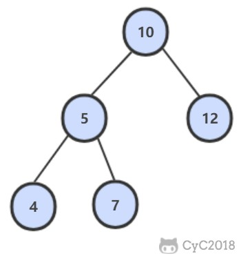

<!-- GFM-TOC -->
* [30. 包含 min 函數的棧](#30-包含-min-函數的棧)
* [31. 棧的壓入、彈出序列](#31-棧的壓入彈出序列)
* [32.1 從上往下打印二叉樹](#321-從上往下打印二叉樹)
* [32.2 把二叉樹打印成多行](#322-把二叉樹打印成多行)
* [32.3 按之字形順序打印二叉樹](#323-按之字形順序打印二叉樹)
* [33. 二叉搜索樹的後序遍歷序列](#33-二叉搜索樹的後序遍歷序列)
* [34. 二叉樹中和為某一值的路徑](#34-二叉樹中和為某一值的路徑)
* [35. 複雜鏈表的複製](#35-複雜鏈表的複製)
* [36. 二叉搜索樹與雙向鏈表](#36-二叉搜索樹與雙向鏈表)
* [37. 序列化二叉樹](#37-序列化二叉樹)
* [38. 字符串的排列](#38-字符串的排列)
* [39. 數組中出現次數超過一半的數字](#39-數組中出現次數超過一半的數字)
<!-- GFM-TOC -->


# 30. 包含 min 函數的棧

[NowCoder](https://www.nowcoder.com/practice/4c776177d2c04c2494f2555c9fcc1e49?tpId=13&tqId=11173&tPage=1&rp=1&ru=/ta/coding-interviews&qru=/ta/coding-interviews/question-ranking)

## 題目描述

定義棧的數據結構，請在該類型中實現一個能夠得到棧最小元素的 min 函數。

## 解題思路

```java
private Stack<Integer> dataStack = new Stack<>();
private Stack<Integer> minStack = new Stack<>();

public void push(int node) {
    dataStack.push(node);
    minStack.push(minStack.isEmpty() ? node : Math.min(minStack.peek(), node));
}

public void pop() {
    dataStack.pop();
    minStack.pop();
}

public int top() {
    return dataStack.peek();
}

public int min() {
    return minStack.peek();
}
```

# 31. 棧的壓入、彈出序列

[NowCoder](https://www.nowcoder.com/practice/d77d11405cc7470d82554cb392585106?tpId=13&tqId=11174&tPage=1&rp=1&ru=/ta/coding-interviews&qru=/ta/coding-interviews/question-ranking)

## 題目描述

輸入兩個整數序列，第一個序列表示棧的壓入順序，請判斷第二個序列是否為該棧的彈出順序。假設壓入棧的所有數字均不相等。

例如序列 1,2,3,4,5 是某棧的壓入順序，序列 4,5,3,2,1 是該壓棧序列對應的一個彈出序列，但 4,3,5,1,2 就不可能是該壓棧序列的彈出序列。

## 解題思路

使用一個棧來模擬壓入彈出操作。

```java
public boolean IsPopOrder(int[] pushSequence, int[] popSequence) {
    int n = pushSequence.length;
    Stack<Integer> stack = new Stack<>();
    for (int pushIndex = 0, popIndex = 0; pushIndex < n; pushIndex++) {
        stack.push(pushSequence[pushIndex]);
        while (popIndex < n && !stack.isEmpty() 
                && stack.peek() == popSequence[popIndex]) {
            stack.pop();
            popIndex++;
        }
    }
    return stack.isEmpty();
}
```

# 32.1 從上往下打印二叉樹

[NowCoder](https://www.nowcoder.com/practice/7fe2212963db4790b57431d9ed259701?tpId=13&tqId=11175&tPage=1&rp=1&ru=/ta/coding-interviews&qru=/ta/coding-interviews/question-ranking)

## 題目描述

從上往下打印出二叉樹的每個節點，同層節點從左至右打印。

例如，以下二叉樹層次遍歷的結果為：1,2,3,4,5,6,7

<div align="center">  </div><br>

## 解題思路

使用隊列來進行層次遍歷。

不需要使用兩個隊列分別存儲當前層的節點和下一層的節點，因為在開始遍歷一層的節點時，當前隊列中的節點數就是當前層的節點數，只要控制遍歷這麼多節點數，就能保證這次遍歷的都是當前層的節點。

```java
public ArrayList<Integer> PrintFromTopToBottom(TreeNode root) {
    Queue<TreeNode> queue = new LinkedList<>();
    ArrayList<Integer> ret = new ArrayList<>();
    queue.add(root);
    while (!queue.isEmpty()) {
        int cnt = queue.size();
        while (cnt-- > 0) {
            TreeNode t = queue.poll();
            if (t == null)
                continue;
            ret.add(t.val);
            queue.add(t.left);
            queue.add(t.right);
        }
    }
    return ret;
}
```

# 32.2 把二叉樹打印成多行

[NowCoder](https://www.nowcoder.com/practice/445c44d982d04483b04a54f298796288?tpId=13&tqId=11213&tPage=1&rp=1&ru=/ta/coding-interviews&qru=/ta/coding-interviews/question-ranking)

## 題目描述

和上題幾乎一樣。

## 解題思路

```java
ArrayList<ArrayList<Integer>> Print(TreeNode pRoot) {
    ArrayList<ArrayList<Integer>> ret = new ArrayList<>();
    Queue<TreeNode> queue = new LinkedList<>();
    queue.add(pRoot);
    while (!queue.isEmpty()) {
        ArrayList<Integer> list = new ArrayList<>();
        int cnt = queue.size();
        while (cnt-- > 0) {
            TreeNode node = queue.poll();
            if (node == null)
                continue;
            list.add(node.val);
            queue.add(node.left);
            queue.add(node.right);
        }
        if (list.size() != 0)
            ret.add(list);
    }
    return ret;
}
```

# 32.3 按之字形順序打印二叉樹

[NowCoder](https://www.nowcoder.com/practice/91b69814117f4e8097390d107d2efbe0?tpId=13&tqId=11212&tPage=1&rp=1&ru=/ta/coding-interviews&qru=/ta/coding-interviews/question-ranking)

## 題目描述

請實現一個函數按照之字形打印二叉樹，即第一行按照從左到右的順序打印，第二層按照從右至左的順序打印，第三行按照從左到右的順序打印，其他行以此類推。

## 解題思路

```java
public ArrayList<ArrayList<Integer>> Print(TreeNode pRoot) {
    ArrayList<ArrayList<Integer>> ret = new ArrayList<>();
    Queue<TreeNode> queue = new LinkedList<>();
    queue.add(pRoot);
    boolean reverse = false;
    while (!queue.isEmpty()) {
        ArrayList<Integer> list = new ArrayList<>();
        int cnt = queue.size();
        while (cnt-- > 0) {
            TreeNode node = queue.poll();
            if (node == null)
                continue;
            list.add(node.val);
            queue.add(node.left);
            queue.add(node.right);
        }
        if (reverse)
            Collections.reverse(list);
        reverse = !reverse;
        if (list.size() != 0)
            ret.add(list);
    }
    return ret;
}
```

# 33. 二叉搜索樹的後序遍歷序列

[NowCoder](https://www.nowcoder.com/practice/a861533d45854474ac791d90e447bafd?tpId=13&tqId=11176&tPage=1&rp=1&ru=/ta/coding-interviews&qru=/ta/coding-interviews/question-ranking)

## 題目描述

輸入一個整數數組，判斷該數組是不是某二叉搜索樹的後序遍歷的結果。假設輸入的數組的任意兩個數字都互不相同。

例如，下圖是後序遍歷序列 1,3,2 所對應的二叉搜索樹。

<div align="center">  </div><br>

## 解題思路

```java
public boolean VerifySquenceOfBST(int[] sequence) {
    if (sequence == null || sequence.length == 0)
        return false;
    return verify(sequence, 0, sequence.length - 1);
}

private boolean verify(int[] sequence, int first, int last) {
    if (last - first <= 1)
        return true;
    int rootVal = sequence[last];
    int cutIndex = first;
    while (cutIndex < last && sequence[cutIndex] <= rootVal)
        cutIndex++;
    for (int i = cutIndex; i < last; i++)
        if (sequence[i] < rootVal)
            return false;
    return verify(sequence, first, cutIndex - 1) && verify(sequence, cutIndex, last - 1);
}
```

# 34. 二叉樹中和為某一值的路徑

[NowCoder](https://www.nowcoder.com/practice/b736e784e3e34731af99065031301bca?tpId=13&tqId=11177&tPage=1&rp=1&ru=/ta/coding-interviews&qru=/ta/coding-interviews/question-ranking)

## 題目描述

輸入一顆二叉樹和一個整數，打印出二叉樹中結點值的和為輸入整數的所有路徑。路徑定義為從樹的根結點開始往下一直到葉結點所經過的結點形成一條路徑。

下圖的二叉樹有兩條和為 22 的路徑：10, 5, 7 和 10, 12

<div align="center">  </div><br>

## 解題思路

```java
private ArrayList<ArrayList<Integer>> ret = new ArrayList<>();

public ArrayList<ArrayList<Integer>> FindPath(TreeNode root, int target) {
    backtracking(root, target, new ArrayList<>());
    return ret;
}

private void backtracking(TreeNode node, int target, ArrayList<Integer> path) {
    if (node == null)
        return;
    path.add(node.val);
    target -= node.val;
    if (target == 0 && node.left == null && node.right == null) {
        ret.add(new ArrayList<>(path));
    } else {
        backtracking(node.left, target, path);
        backtracking(node.right, target, path);
    }
    path.remove(path.size() - 1);
}
```

# 35. 複雜鏈表的複製

[NowCoder](https://www.nowcoder.com/practice/f836b2c43afc4b35ad6adc41ec941dba?tpId=13&tqId=11178&tPage=1&rp=1&ru=/ta/coding-interviews&qru=/ta/coding-interviews/question-ranking)

## 題目描述

輸入一個複雜鏈表（每個節點中有節點值，以及兩個指針，一個指向下一個節點，另一個特殊指針指向任意一個節點），返回結果為複製後複雜鏈表的 head。

```java
public class RandomListNode {
    int label;
    RandomListNode next = null;
    RandomListNode random = null;

    RandomListNode(int label) {
        this.label = label;
    }
}
```

<div align="center">  </div><br>

## 解題思路

第一步，在每個節點的後面插入複製的節點。

<div align="center">  </div><br>

第二步，對複製節點的 random 鏈接進行賦值。

<div align="center">  </div><br>

第三步，拆分。

<div align="center">  </div><br>

```java
public RandomListNode Clone(RandomListNode pHead) {
    if (pHead == null)
        return null;
    // 插入新節點
    RandomListNode cur = pHead;
    while (cur != null) {
        RandomListNode clone = new RandomListNode(cur.label);
        clone.next = cur.next;
        cur.next = clone;
        cur = clone.next;
    }
    // 建立 random 鏈接
    cur = pHead;
    while (cur != null) {
        RandomListNode clone = cur.next;
        if (cur.random != null)
            clone.random = cur.random.next;
        cur = clone.next;
    }
    // 拆分
    cur = pHead;
    RandomListNode pCloneHead = pHead.next;
    while (cur.next != null) {
        RandomListNode next = cur.next;
        cur.next = next.next;
        cur = next;
    }
    return pCloneHead;
}
```

# 36. 二叉搜索樹與雙向鏈表

[NowCoder](https://www.nowcoder.com/practice/947f6eb80d944a84850b0538bf0ec3a5?tpId=13&tqId=11179&tPage=1&rp=1&ru=/ta/coding-interviews&qru=/ta/coding-interviews/question-ranking)

## 題目描述

輸入一棵二叉搜索樹，將該二叉搜索樹轉換成一個排序的雙向鏈表。要求不能創建任何新的結點，只能調整樹中結點指針的指向。

<div align="center">  </div><br>

## 解題思路

```java
private TreeNode pre = null;
private TreeNode head = null;

public TreeNode Convert(TreeNode root) {
    inOrder(root);
    return head;
}

private void inOrder(TreeNode node) {
    if (node == null)
        return;
    inOrder(node.left);
    node.left = pre;
    if (pre != null)
        pre.right = node;
    pre = node;
    if (head == null)
        head = node;
    inOrder(node.right);
}
```

# 37. 序列化二叉樹

[NowCoder](https://www.nowcoder.com/practice/cf7e25aa97c04cc1a68c8f040e71fb84?tpId=13&tqId=11214&tPage=1&rp=1&ru=/ta/coding-interviews&qru=/ta/coding-interviews/question-ranking)

## 題目描述

請實現兩個函數，分別用來序列化和反序列化二叉樹。

## 解題思路

```java
private String deserializeStr;

public String Serialize(TreeNode root) {
    if (root == null)
        return "#";
    return root.val + " " + Serialize(root.left) + " " + Serialize(root.right);
}

public TreeNode Deserialize(String str) {
    deserializeStr = str;
    return Deserialize();
}

private TreeNode Deserialize() {
    if (deserializeStr.length() == 0)
        return null;
    int index = deserializeStr.indexOf(" ");
    String node = index == -1 ? deserializeStr : deserializeStr.substring(0, index);
    deserializeStr = index == -1 ? "" : deserializeStr.substring(index + 1);
    if (node.equals("#"))
        return null;
    int val = Integer.valueOf(node);
    TreeNode t = new TreeNode(val);
    t.left = Deserialize();
    t.right = Deserialize();
    return t;
}
```

# 38. 字符串的排列

[NowCoder](https://www.nowcoder.com/practice/fe6b651b66ae47d7acce78ffdd9a96c7?tpId=13&tqId=11180&tPage=1&rp=1&ru=/ta/coding-interviews&qru=/ta/coding-interviews/question-ranking)

## 題目描述

輸入一個字符串，按字典序打印出該字符串中字符的所有排列。例如輸入字符串 abc，則打印出由字符 a, b, c 所能排列出來的所有字符串 abc, acb, bac, bca, cab 和 cba。

## 解題思路

```java
private ArrayList<String> ret = new ArrayList<>();

public ArrayList<String> Permutation(String str) {
    if (str.length() == 0)
        return ret;
    char[] chars = str.toCharArray();
    Arrays.sort(chars);
    backtracking(chars, new boolean[chars.length], new StringBuilder());
    return ret;
}

private void backtracking(char[] chars, boolean[] hasUsed, StringBuilder s) {
    if (s.length() == chars.length) {
        ret.add(s.toString());
        return;
    }
    for (int i = 0; i < chars.length; i++) {
        if (hasUsed[i])
            continue;
        if (i != 0 && chars[i] == chars[i - 1] && !hasUsed[i - 1]) /* 保證不重複 */
            continue;
        hasUsed[i] = true;
        s.append(chars[i]);
        backtracking(chars, hasUsed, s);
        s.deleteCharAt(s.length() - 1);
        hasUsed[i] = false;
    }
}
```

# 39. 數組中出現次數超過一半的數字

[NowCoder](https://www.nowcoder.com/practice/e8a1b01a2df14cb2b228b30ee6a92163?tpId=13&tqId=11181&tPage=1&rp=1&ru=/ta/coding-interviews&qru=/ta/coding-interviews/question-ranking)

## 解題思路

多數投票問題，可以利用 Boyer-Moore Majority Vote Algorithm 來解決這個問題，使得時間複雜度為 O(N)。

使用 cnt 來統計一個元素出現的次數，當遍歷到的元素和統計元素相等時，令 cnt++，否則令 cnt--。如果前面查找了 i 個元素，且 cnt == 0，說明前 i 個元素沒有 majority，或者有 majority，但是出現的次數少於 i / 2 ，因為如果多於 i / 2 的話 cnt 就一定不會為 0 。此時剩下的 n - i 個元素中，majority 的數目依然多於 (n - i) / 2，因此繼續查找就能找出 majority。

```java
public int MoreThanHalfNum_Solution(int[] nums) {
    int majority = nums[0];
    for (int i = 1, cnt = 1; i < nums.length; i++) {
        cnt = nums[i] == majority ? cnt + 1 : cnt - 1;
        if (cnt == 0) {
            majority = nums[i];
            cnt = 1;
        }
    }
    int cnt = 0;
    for (int val : nums)
        if (val == majority)
            cnt++;
    return cnt > nums.length / 2 ? majority : 0;
}
```


# 微信公眾號


更多精彩內容將發佈在微信公眾號 CyC2018 上，你也可以在公眾號後臺和我交流學習和求職相關的問題。另外，公眾號提供了該項目的 PDF 等離線閱讀版本，後臺回覆 "下載" 即可領取。公眾號也提供了一份技術面試複習大綱，不僅系統整理了面試知識點，而且標註了各個知識點的重要程度，從而幫你理清多而雜的面試知識點，後臺回覆 "大綱" 即可領取。我基本是按照這個大綱來進行復習的，對我拿到了 BAT 頭條等 Offer 起到很大的幫助。你們完全可以和我一樣根據大綱上列的知識點來進行復習，就不用看很多不重要的內容，也可以知道哪些內容很重要從而多安排一些複習時間。


<br><div align="center"></img></div>
