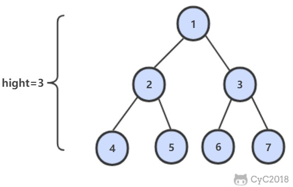

<!-- GFM-TOC -->
* [50. 第一個只出現一次的字符位置](#50-第一個只出現一次的字符位置)
* [51. 數組中的逆序對](#51-數組中的逆序對)
* [52. 兩個鏈表的第一個公共結點](#52-兩個鏈表的第一個公共結點)
* [53. 數字在排序數組中出現的次數](#53-數字在排序數組中出現的次數)
* [54. 二叉查找樹的第 K 個結點](#54-二叉查找樹的第-k-個結點)
* [55.1 二叉樹的深度](#551-二叉樹的深度)
* [55.2 平衡二叉樹](#552-平衡二叉樹)
* [56. 數組中只出現一次的數字](#56-數組中只出現一次的數字)
* [57.1 和為 S 的兩個數字](#571-和為-s-的兩個數字)
* [57.2 和為 S 的連續正數序列](#572-和為-s-的連續正數序列)
* [58.1 翻轉單詞順序列](#581-翻轉單詞順序列)
* [58.2 左旋轉字符串](#582-左旋轉字符串)
* [59. 滑動窗口的最大值](#59-滑動窗口的最大值)
<!-- GFM-TOC -->


# 50. 第一個只出現一次的字符位置

[NowCoder](https://www.nowcoder.com/practice/1c82e8cf713b4bbeb2a5b31cf5b0417c?tpId=13&tqId=11187&tPage=1&rp=1&ru=/ta/coding-interviews&qru=/ta/coding-interviews/question-ranking)

## 題目描述

在一個字符串中找到第一個只出現一次的字符，並返回它的位置。

```
Input: abacc
Output: b
```

## 解題思路

最直觀的解法是使用 HashMap 對出現次數進行統計，但是考慮到要統計的字符範圍有限，因此可以使用整型數組代替 HashMap，從而將空間複雜度由 O(N) 降低為 O(1)。

```java
public int FirstNotRepeatingChar(String str) {
    int[] cnts = new int[256];
    for (int i = 0; i < str.length(); i++)
        cnts[str.charAt(i)]++;
    for (int i = 0; i < str.length(); i++)
        if (cnts[str.charAt(i)] == 1)
            return i;
    return -1;
}
```

以上實現的空間複雜度還不是最優的。考慮到只需要找到只出現一次的字符，那麼需要統計的次數信息只有 0,1,更大，使用兩個比特位就能存儲這些信息。

```java
public int FirstNotRepeatingChar2(String str) {
    BitSet bs1 = new BitSet(256);
    BitSet bs2 = new BitSet(256);
    for (char c : str.toCharArray()) {
        if (!bs1.get(c) && !bs2.get(c))
            bs1.set(c);     // 0 0 -> 0 1
        else if (bs1.get(c) && !bs2.get(c))
            bs2.set(c);     // 0 1 -> 1 1
    }
    for (int i = 0; i < str.length(); i++) {
        char c = str.charAt(i);
        if (bs1.get(c) && !bs2.get(c))  // 0 1
            return i;
    }
    return -1;
}
```

# 51. 數組中的逆序對

[NowCoder](https://www.nowcoder.com/practice/96bd6684e04a44eb80e6a68efc0ec6c5?tpId=13&tqId=11188&tPage=1&rp=1&ru=/ta/coding-interviews&qru=/ta/coding-interviews/question-ranking)

## 題目描述

在數組中的兩個數字，如果前面一個數字大於後面的數字，則這兩個數字組成一個逆序對。輸入一個數組，求出這個數組中的逆序對的總數。

## 解題思路

```java
private long cnt = 0;
private int[] tmp;  // 在這裡聲明輔助數組，而不是在 merge() 遞歸函數中聲明

public int InversePairs(int[] nums) {
    tmp = new int[nums.length];
    mergeSort(nums, 0, nums.length - 1);
    return (int) (cnt % 1000000007);
}

private void mergeSort(int[] nums, int l, int h) {
    if (h - l < 1)
        return;
    int m = l + (h - l) / 2;
    mergeSort(nums, l, m);
    mergeSort(nums, m + 1, h);
    merge(nums, l, m, h);
}

private void merge(int[] nums, int l, int m, int h) {
    int i = l, j = m + 1, k = l;
    while (i <= m || j <= h) {
        if (i > m)
            tmp[k] = nums[j++];
        else if (j > h)
            tmp[k] = nums[i++];
        else if (nums[i] <= nums[j])
            tmp[k] = nums[i++];
        else {
            tmp[k] = nums[j++];
            this.cnt += m - i + 1;  // nums[i] > nums[j]，說明 nums[i...mid] 都大於 nums[j]
        }
        k++;
    }
    for (k = l; k <= h; k++)
        nums[k] = tmp[k];
}
```

# 52. 兩個鏈表的第一個公共結點

[NowCoder](https://www.nowcoder.com/practice/6ab1d9a29e88450685099d45c9e31e46?tpId=13&tqId=11189&tPage=1&rp=1&ru=/ta/coding-interviews&qru=/ta/coding-interviews/question-ranking)

## 題目描述

<div align="center">  </div><br>

## 解題思路

設 A 的長度為 a + c，B 的長度為 b + c，其中 c 為尾部公共部分長度，可知 a + c + b = b + c + a。

當訪問鏈表 A 的指針訪問到鏈表尾部時，令它從鏈表 B 的頭部重新開始訪問鏈表 B；同樣地，當訪問鏈表 B 的指針訪問到鏈表尾部時，令它從鏈表 A 的頭部重新開始訪問鏈表 A。這樣就能控制訪問 A 和 B 兩個鏈表的指針能同時訪問到交點。

```java
public ListNode FindFirstCommonNode(ListNode pHead1, ListNode pHead2) {
    ListNode l1 = pHead1, l2 = pHead2;
    while (l1 != l2) {
        l1 = (l1 == null) ? pHead2 : l1.next;
        l2 = (l2 == null) ? pHead1 : l2.next;
    }
    return l1;
}
```

# 53. 數字在排序數組中出現的次數

[NowCoder](https://www.nowcoder.com/practice/70610bf967994b22bb1c26f9ae901fa2?tpId=13&tqId=11190&tPage=1&rp=1&ru=/ta/coding-interviews&qru=/ta/coding-interviews/question-ranking)

## 題目描述

```html
Input:
nums = 1, 2, 3, 3, 3, 3, 4, 6
K = 3

Output:
4
```

## 解題思路

```java
public int GetNumberOfK(int[] nums, int K) {
    int first = binarySearch(nums, K);
    int last = binarySearch(nums, K + 1);
    return (first == nums.length || nums[first] != K) ? 0 : last - first;
}

private int binarySearch(int[] nums, int K) {
    int l = 0, h = nums.length;
    while (l < h) {
        int m = l + (h - l) / 2;
        if (nums[m] >= K)
            h = m;
        else
            l = m + 1;
    }
    return l;
}
```

# 54. 二叉查找樹的第 K 個結點

[NowCoder](https://www.nowcoder.com/practice/ef068f602dde4d28aab2b210e859150a?tpId=13&tqId=11215&tPage=1&rp=1&ru=/ta/coding-interviews&qru=/ta/coding-interviews/question-ranking)

## 解題思路

利用二叉查找樹中序遍歷有序的特點。

```java
private TreeNode ret;
private int cnt = 0;

public TreeNode KthNode(TreeNode pRoot, int k) {
    inOrder(pRoot, k);
    return ret;
}

private void inOrder(TreeNode root, int k) {
    if (root == null || cnt >= k)
        return;
    inOrder(root.left, k);
    cnt++;
    if (cnt == k)
        ret = root;
    inOrder(root.right, k);
}
```

# 55.1 二叉樹的深度

[NowCoder](https://www.nowcoder.com/practice/435fb86331474282a3499955f0a41e8b?tpId=13&tqId=11191&tPage=1&rp=1&ru=/ta/coding-interviews&qru=/ta/coding-interviews/question-ranking)

## 題目描述

從根結點到葉結點依次經過的結點（含根、葉結點）形成樹的一條路徑，最長路徑的長度為樹的深度。

<div align="center">  </div><br>

## 解題思路

```java
public int TreeDepth(TreeNode root) {
    return root == null ? 0 : 1 + Math.max(TreeDepth(root.left), TreeDepth(root.right));
}
```

# 55.2 平衡二叉樹

[NowCoder](https://www.nowcoder.com/practice/8b3b95850edb4115918ecebdf1b4d222?tpId=13&tqId=11192&tPage=1&rp=1&ru=/ta/coding-interviews&qru=/ta/coding-interviews/question-ranking)

## 題目描述

平衡二叉樹左右子樹高度差不超過 1。

<div align="center">  </div><br>

## 解題思路

```java
private boolean isBalanced = true;

public boolean IsBalanced_Solution(TreeNode root) {
    height(root);
    return isBalanced;
}

private int height(TreeNode root) {
    if (root == null || !isBalanced)
        return 0;
    int left = height(root.left);
    int right = height(root.right);
    if (Math.abs(left - right) > 1)
        isBalanced = false;
    return 1 + Math.max(left, right);
}
```

# 56. 數組中只出現一次的數字

[NowCoder](https://www.nowcoder.com/practice/e02fdb54d7524710a7d664d082bb7811?tpId=13&tqId=11193&tPage=1&rp=1&ru=/ta/coding-interviews&qru=/ta/coding-interviews/question-ranking)

## 題目描述

一個整型數組裡除了兩個數字之外，其他的數字都出現了兩次，找出這兩個數。

## 解題思路

兩個不相等的元素在位級表示上必定會有一位存在不同，將數組的所有元素異或得到的結果為不存在重複的兩個元素異或的結果。

diff &= -diff 得到出 diff 最右側不為 0 的位，也就是不存在重複的兩個元素在位級表示上最右側不同的那一位，利用這一位就可以將兩個元素區分開來。

```java
public void FindNumsAppearOnce(int[] nums, int num1[], int num2[]) {
    int diff = 0;
    for (int num : nums)
        diff ^= num;
    diff &= -diff;
    for (int num : nums) {
        if ((num & diff) == 0)
            num1[0] ^= num;
        else
            num2[0] ^= num;
    }
}
```

# 57.1 和為 S 的兩個數字

[NowCoder](https://www.nowcoder.com/practice/390da4f7a00f44bea7c2f3d19491311b?tpId=13&tqId=11195&tPage=1&rp=1&ru=/ta/coding-interviews&qru=/ta/coding-interviews/question-ranking)

## 題目描述

輸入一個遞增排序的數組和一個數字 S，在數組中查找兩個數，使得他們的和正好是 S。如果有多對數字的和等於 S，輸出兩個數的乘積最小的。

## 解題思路

使用雙指針，一個指針指向元素較小的值，一個指針指向元素較大的值。指向較小元素的指針從頭向尾遍歷，指向較大元素的指針從尾向頭遍歷。

- 如果兩個指針指向元素的和 sum == target，那麼得到要求的結果；
- 如果 sum > target，移動較大的元素，使 sum 變小一些；
- 如果 sum < target，移動較小的元素，使 sum 變大一些。

```java
public ArrayList<Integer> FindNumbersWithSum(int[] array, int sum) {
    int i = 0, j = array.length - 1;
    while (i < j) {
        int cur = array[i] + array[j];
        if (cur == sum)
            return new ArrayList<>(Arrays.asList(array[i], array[j]));
        if (cur < sum)
            i++;
        else
            j--;
    }
    return new ArrayList<>();
}
```

# 57.2 和為 S 的連續正數序列

[NowCoder](https://www.nowcoder.com/practice/c451a3fd84b64cb19485dad758a55ebe?tpId=13&tqId=11194&tPage=1&rp=1&ru=/ta/coding-interviews&qru=/ta/coding-interviews/question-ranking)

## 題目描述

輸出所有和為 S 的連續正數序列。

例如和為 100 的連續序列有：

```
[9, 10, 11, 12, 13, 14, 15, 16]
[18, 19, 20, 21, 22]。
```

## 解題思路

```java
public ArrayList<ArrayList<Integer>> FindContinuousSequence(int sum) {
    ArrayList<ArrayList<Integer>> ret = new ArrayList<>();
    int start = 1, end = 2;
    int curSum = 3;
    while (end < sum) {
        if (curSum > sum) {
            curSum -= start;
            start++;
        } else if (curSum < sum) {
            end++;
            curSum += end;
        } else {
            ArrayList<Integer> list = new ArrayList<>();
            for (int i = start; i <= end; i++)
                list.add(i);
            ret.add(list);
            curSum -= start;
            start++;
            end++;
            curSum += end;
        }
    }
    return ret;
}
```

# 58.1 翻轉單詞順序列

[NowCoder](https://www.nowcoder.com/practice/3194a4f4cf814f63919d0790578d51f3?tpId=13&tqId=11197&tPage=1&rp=1&ru=/ta/coding-interviews&qru=/ta/coding-interviews/question-ranking)

## 題目描述

```html
Input:
"I am a student."

Output:
"student. a am I"
```

## 解題思路

題目應該有一個隱含條件，就是不能用額外的空間。雖然 Java 的題目輸入參數為 String 類型，需要先創建一個字符數組使得空間複雜度為 O(N)，但是正確的參數類型應該和原書一樣，為字符數組，並且只能使用該字符數組的空間。任何使用了額外空間的解法在面試時都會大打折扣，包括遞歸解法。

正確的解法應該是和書上一樣，先旋轉每個單詞，再旋轉整個字符串。

```java
public String ReverseSentence(String str) {
    int n = str.length();
    char[] chars = str.toCharArray();
    int i = 0, j = 0;
    while (j <= n) {
        if (j == n || chars[j] == ' ') {
            reverse(chars, i, j - 1);
            i = j + 1;
        }
        j++;
    }
    reverse(chars, 0, n - 1);
    return new String(chars);
}

private void reverse(char[] c, int i, int j) {
    while (i < j)
        swap(c, i++, j--);
}

private void swap(char[] c, int i, int j) {
    char t = c[i];
    c[i] = c[j];
    c[j] = t;
}
```

# 58.2 左旋轉字符串

[NowCoder](https://www.nowcoder.com/practice/12d959b108cb42b1ab72cef4d36af5ec?tpId=13&tqId=11196&tPage=1&rp=1&ru=/ta/coding-interviews&qru=/ta/coding-interviews/question-ranking)

## 題目描述

```html
Input:
S="abcXYZdef"
K=3

Output:
"XYZdefabc"
```

## 解題思路

先將 "abc" 和 "XYZdef" 分別翻轉，得到 "cbafedZYX"，然後再把整個字符串翻轉得到 "XYZdefabc"。

```java
public String LeftRotateString(String str, int n) {
    if (n >= str.length())
        return str;
    char[] chars = str.toCharArray();
    reverse(chars, 0, n - 1);
    reverse(chars, n, chars.length - 1);
    reverse(chars, 0, chars.length - 1);
    return new String(chars);
}

private void reverse(char[] chars, int i, int j) {
    while (i < j)
        swap(chars, i++, j--);
}

private void swap(char[] chars, int i, int j) {
    char t = chars[i];
    chars[i] = chars[j];
    chars[j] = t;
}
```

# 59. 滑動窗口的最大值

[NowCoder](https://www.nowcoder.com/practice/1624bc35a45c42c0bc17d17fa0cba788?tpId=13&tqId=11217&tPage=1&rp=1&ru=/ta/coding-interviews&qru=/ta/coding-interviews/question-ranking)

## 題目描述

給定一個數組和滑動窗口的大小，找出所有滑動窗口裡數值的最大值。

例如，如果輸入數組 {2, 3, 4, 2, 6, 2, 5, 1} 及滑動窗口的大小 3，那麼一共存在 6 個滑動窗口，他們的最大值分別為 {4, 4, 6, 6, 6, 5}。

## 解題思路

```java
public ArrayList<Integer> maxInWindows(int[] num, int size) {
    ArrayList<Integer> ret = new ArrayList<>();
    if (size > num.length || size < 1)
        return ret;
    PriorityQueue<Integer> heap = new PriorityQueue<>((o1, o2) -> o2 - o1);  /* 大頂堆 */
    for (int i = 0; i < size; i++)
        heap.add(num[i]);
    ret.add(heap.peek());
    for (int i = 0, j = i + size; j < num.length; i++, j++) {            /* 維護一個大小為 size 的大頂堆 */
        heap.remove(num[i]);
        heap.add(num[j]);
        ret.add(heap.peek());
    }
    return ret;
}
```


# 微信公眾號


更多精彩內容將發佈在微信公眾號 CyC2018 上，你也可以在公眾號後臺和我交流學習和求職相關的問題。另外，公眾號提供了該項目的 PDF 等離線閱讀版本，後臺回覆 "下載" 即可領取。公眾號也提供了一份技術面試複習大綱，不僅系統整理了面試知識點，而且標註了各個知識點的重要程度，從而幫你理清多而雜的面試知識點，後臺回覆 "大綱" 即可領取。我基本是按照這個大綱來進行復習的，對我拿到了 BAT 頭條等 Offer 起到很大的幫助。你們完全可以和我一樣根據大綱上列的知識點來進行復習，就不用看很多不重要的內容，也可以知道哪些內容很重要從而多安排一些複習時間。


<br><div align="center"></img></div>
