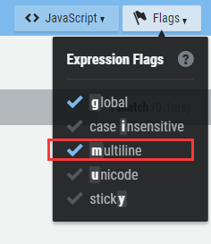

<!-- GFM-TOC -->
* [一、概述](#一概述)
* [二、匹配單個字符](#二匹配單個字符)
* [三、匹配一組字符](#三匹配一組字符)
* [四、使用元字符](#四使用元字符)
* [五、重複匹配](#五重複匹配)
* [六、位置匹配](#六位置匹配)
* [七、使用子表達式](#七使用子表達式)
* [八、回溯引用](#八回溯引用)
* [九、前後查找](#九前後查找)
* [十、嵌入條件](#十嵌入條件)
* [參考資料](#參考資料)
<!-- GFM-TOC -->


# 一、概述

正則表達式用於文本內容的查找和替換。

正則表達式內置於其它語言或者軟件產品中，它本身不是一種語言或者軟件。

[正則表達式在線工具](https://regexr.com/)

# 二、匹配單個字符

**.**  可以用來匹配任何的單個字符，但是在絕大多數實現裡面，不能匹配換行符；

**.**  是元字符，表示它有特殊的含義，而不是字符本身的含義。如果需要匹配 . ，那麼要用 \ 進行轉義，即在 . 前面加上 \ 。

正則表達式一般是區分大小寫的，但是也有些實現是不區分。

**正則表達式** 

```
nam.
```

**匹配結果** 

My  **name**  is Zheng.

# 三、匹配一組字符

**[ ]**  定義一個字符集合；

0-9、a-z 定義了一個字符區間，區間使用 ASCII 碼來確定，字符區間在 [ ] 中使用。

**-**  只有在 [ ] 之間才是元字符，在 [ ] 之外就是一個普通字符；

**^**  在 [ ] 中是取非操作。

**應用** 

匹配以 abc 為開頭，並且最後一個字母不為數字的字符串：

**正則表達式** 

```
abc[^0-9]
```

**匹配結果** 

1.  **abcd** 
2. abc1
3. abc2

# 四、使用元字符

## 匹配空白字符

|  元字符 | 說明  |
| :---: | :---: |
|  [\b] | 回退（刪除）一個字符   |
|  \f |  換頁符 |
|  \n |  換行符 |
|  \r |  回車符 |
|  \t |  製表符 |
|  \v |  垂直製表符 |

\r\n 是 Windows 中的文本行結束標籤，在 Unix/Linux 則是 \n。

\r\n\r\n 可以匹配 Windows 下的空白行，因為它匹配兩個連續的行尾標籤，而這正是兩條記錄之間的空白行；

## 匹配特定的字符類別

### 1. 數字元字符

|  元字符 | 說明  |
| :---: | :---: |
| \d  | 數字字符，等價於 [0-9]  |
| \D  | 非數字字符，等價於 [^0-9]   |

### 2. 字母數字元字符

|  元字符 | 說明  |
| :---: | :---: |
| \w  |  大小寫字母，下劃線和數字，等價於 [a-zA-Z0-9\_] |
|  \W |  對 \w 取非 |

### 3. 空白字符元字符

| 元字符  | 說明  |
| :---: | :---: |
|  \s | 任何一個空白字符，等價於 [\f\n\r\t\v]  |
| \S  |  對 \s 取非  |

\x 匹配十六進制字符，\0 匹配八進制，例如 \x0A 對應 ASCII 字符 10，等價於 \n。

# 五、重複匹配

-  **\+**  匹配 1 個或者多個字符
-  **\** * 匹配 0 個或者多個
-  **?**  匹配 0 個或者 1 個

**應用** 

匹配郵箱地址。

**正則表達式** 

```
[\w.]+@\w+\.\w+
```

[\w.] 匹配的是字母數字或者 . ，在其後面加上 + ，表示匹配多次。在字符集合 [ ] 裡，. 不是元字符；

**匹配結果** 

**abc.def<span>@</span>qq.com** 

-  **{n}**  匹配 n 個字符
-  **{m, n}**  匹配 m\~n 個字符
-  **{m,}**  至少匹配 m 個字符

\* 和 + 都是貪婪型元字符，會匹配儘可能多的內容。在後面加 ? 可以轉換為懶惰型元字符，例如 \*?、+? 和 {m, n}? 。

**正則表達式** 

```
a.+c
```

由於 + 是貪婪型的，因此 .+ 會匹配更可能多的內容，所以會把整個 abcabcabc 文本都匹配，而不是隻匹配前面的 abc 文本。用懶惰型可以實現匹配前面的。

**匹配結果** 

**abcabcabc** 

# 六、位置匹配

## 單詞邊界

**\b**  可以匹配一個單詞的邊界，邊界是指位於 \w 和 \W 之間的位置；**\B** 匹配一個不是單詞邊界的位置。

\b 只匹配位置，不匹配字符，因此 \babc\b 匹配出來的結果為 3 個字符。

## 字符串邊界

**^**  匹配整個字符串的開頭，**$** 匹配結尾。

^ 元字符在字符集合中用作求非，在字符集合外用作匹配字符串的開頭。

分行匹配模式（multiline）下，換行被當做字符串的邊界。

**應用** 

匹配代碼中以 // 開始的註釋行

**正則表達式** 

```
^\s*\/\/.*$
```

<div align="center">  </div><br>

**匹配結果** 

1. public void fun() {
2. &nbsp;&nbsp;&nbsp;&nbsp;     **// 註釋 1** 
3. &nbsp;&nbsp;&nbsp;&nbsp;    int a = 1;
4. &nbsp;&nbsp;&nbsp;&nbsp;    int b = 2;
5. &nbsp;&nbsp;&nbsp;&nbsp;     **// 註釋 2** 
6. &nbsp;&nbsp;&nbsp;&nbsp;    int c = a + b;
7. }

# 七、使用子表達式

使用  **( )**  定義一個子表達式。子表達式的內容可以當成一個獨立元素，即可以將它看成一個字符，並且使用 * 等元字符。

子表達式可以嵌套，但是嵌套層次過深會變得很難理解。

**正則表達式** 

```
(ab){2,}
```

**匹配結果** 

**ababab** 

**|**  是或元字符，它把左邊和右邊所有的部分都看成單獨的兩個部分，兩個部分只要有一個匹配就行。

**正則表達式** 

```
(19|20)\d{2}
```

**匹配結果** 

1.  **1900** 
2.  **2010** 
3. 1020

**應用** 

匹配 IP 地址。

IP 地址中每部分都是 0-255 的數字，用正則表達式匹配時以下情況是合法的：

- 一位數字
- 不以 0 開頭的兩位數字
- 1 開頭的三位數
- 2 開頭，第 2 位是 0-4 的三位數
- 25 開頭，第 3 位是 0-5 的三位數

**正則表達式** 

```
((25[0-5]|(2[0-4]\d)|(1\d{2})|([1-9]\d)|(\d))\.){3}(25[0-5]|(2[0-4]\d)|(1\d{2})|([1-9]\d)|(\d))
```

**匹配結果** 

1.  **192.168.0.1** 
2. 00.00.00.00
3. 555.555.555.555

# 八、回溯引用

回溯引用使用  **\n**  來引用某個子表達式，其中 n 代表的是子表達式的序號，從 1 開始。它和子表達式匹配的內容一致，比如子表達式匹配到 abc，那麼回溯引用部分也需要匹配 abc 。

**應用** 

匹配 HTML 中合法的標題元素。

**正則表達式** 

\1 將回溯引用子表達式 (h[1-6]) 匹配的內容，也就是說必須和子表達式匹配的內容一致。

```
<(h[1-6])>\w*?<\/\1>
```

**匹配結果** 

1.  **&lt;h1>x&lt;/h1>** 
2.  **&lt;h2>x&lt;/h2>** 
3. &lt;h3>x&lt;/h1>

## 替換

需要用到兩個正則表達式。

**應用** 

修改電話號碼格式。

**文本** 

313-555-1234

**查找正則表達式** 

```
(\d{3})(-)(\d{3})(-)(\d{4})
```

**替換正則表達式** 

在第一個子表達式查找的結果加上 () ，然後加一個空格，在第三個和第五個字表達式查找的結果中間加上 - 進行分隔。

```
($1) $3-$5
```

**結果** 

(313) 555-1234

## 大小寫轉換

|  元字符 | 說明  |
| :---: | :---: |
|  \l | 把下個字符轉換為小寫  |
|   \u| 把下個字符轉換為大寫  |
|  \L | 把\L 和\E 之間的字符全部轉換為小寫  |
|  \U | 把\U 和\E 之間的字符全部轉換為大寫  |
|  \E | 結束\L 或者\U  |

**應用** 

把文本的第二個和第三個字符轉換為大寫。

**文本** 

abcd

**查找** 

```
(\w)(\w{2})(\w)
```

**替換** 

```
$1\U$2\E$3
```

**結果** 

aBCd

# 九、前後查找

前後查找規定了匹配的內容首尾應該匹配的內容，但是又不包含首尾匹配的內容。向前查找用  **?=**  來定義，它規定了尾部匹配的內容，這個匹配的內容在 ?= 之後定義。所謂向前查找，就是規定了一個匹配的內容，然後以這個內容為尾部向前面查找需要匹配的內容。向後匹配用 ?<= 定義（注: javaScript 不支持向後匹配, java 對其支持也不完善）。

**應用** 

查找出郵件地址 @ 字符前面的部分。

**正則表達式** 

```
\w+(?=@)
```

**結果** 

**abc** @qq.com

對向前和向後查找取非，只要把 = 替換成 ! 即可，比如 (?=) 替換成 (?!) 。取非操作使得匹配那些首尾不符合要求的內容。

# 十、嵌入條件

## 回溯引用條件

條件判斷為某個子表達式是否匹配，如果匹配則需要繼續匹配條件表達式後面的內容。

**正則表達式** 

子表達式 (\\() 匹配一個左括號，其後的 ? 表示匹配 0 個或者 1 個。 ?(1) 為條件，當子表達式 1 匹配時條件成立，需要執行 \) 匹配，也就是匹配右括號。

```
(\()?abc(?(1)\))
```

**結果** 

1.  **(abc)** 
2.  **abc** 
3. (abc

## 前後查找條件

條件為定義的首尾是否匹配，如果匹配，則繼續執行後面的匹配。注意，首尾不包含在匹配的內容中。

**正則表達式** 

 ?(?=-) 為前向查找條件，只有在以 - 為前向查找的結尾能匹配 \d{5} ，才繼續匹配 -\d{4} 。

```
\d{5}(?(?=-)-\d{4})
```

**結果** 

1.  **11111** 
2. 22222-
3.  **33333-4444** 

# 參考資料

- BenForta. 正則表達式必知必會 [M]. 人民郵電出版社, 2007.


# 微信公眾號


更多精彩內容將發佈在微信公眾號 CyC2018 上，你也可以在公眾號後臺和我交流學習和求職相關的問題。另外，公眾號提供了該項目的 PDF 等離線閱讀版本，後臺回覆 "下載" 即可領取。公眾號也提供了一份技術面試複習大綱，不僅系統整理了面試知識點，而且標註了各個知識點的重要程度，從而幫你理清多而雜的面試知識點，後臺回覆 "大綱" 即可領取。我基本是按照這個大綱來進行復習的，對我拿到了 BAT 頭條等 Offer 起到很大的幫助。你們完全可以和我一樣根據大綱上列的知識點來進行復習，就不用看很多不重要的內容，也可以知道哪些內容很重要從而多安排一些複習時間。


<br><div align="center"></img></div>
