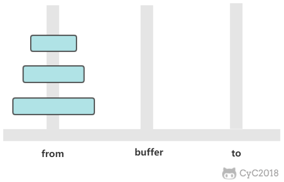
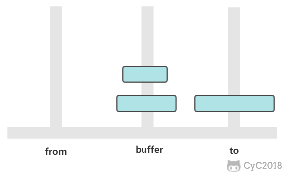

<!-- GFM-TOC -->
* [漢諾塔](#漢諾塔)
* [哈夫曼編碼](#哈夫曼編碼)
<!-- GFM-TOC -->


# 漢諾塔

<div align="center">  </div><br>

有三個柱子，分別為 from、buffer、to。需要將 from 上的圓盤全部移動到 to 上，並且要保證小圓盤始終在大圓盤上。

這是一個經典的遞歸問題，分為三步求解：

① 將 n-1 個圓盤從 from -> buffer

<div align="center">  </div><br>

② 將 1 個圓盤從 from -> to

<div align="center">  </div><br>

③ 將 n-1 個圓盤從 buffer -> to

<div align="center">  </div><br>

如果只有一個圓盤，那麼只需要進行一次移動操作。

從上面的討論可以知道，a<sub>n</sub> = 2 * a<sub>n-1</sub> + 1，顯然 a<sub>n</sub> = 2<sup>n</sup> - 1，n 個圓盤需要移動 2<sup>n</sup> - 1 次。

```java
public class Hanoi {
    public static void move(int n, String from, String buffer, String to) {
        if (n == 1) {
            System.out.println("from " + from + " to " + to);
            return;
        }
        move(n - 1, from, to, buffer);
        move(1, from, buffer, to);
        move(n - 1, buffer, from, to);
    }

    public static void main(String[] args) {
        Hanoi.move(3, "H1", "H2", "H3");
    }
}
```

```html
from H1 to H3
from H1 to H2
from H3 to H2
from H1 to H3
from H2 to H1
from H2 to H3
from H1 to H3
```

# 哈夫曼編碼

根據數據出現的頻率對數據進行編碼，從而壓縮原始數據。

例如對於一個文本文件，其中各種字符出現的次數如下：

- a : 10
- b : 20
- c : 40
- d : 80

可以將每種字符轉換成二進制編碼，例如將 a 轉換為 00，b 轉換為 01，c 轉換為 10，d 轉換為 11。這是最簡單的一種編碼方式，沒有考慮各個字符的權值（出現頻率）。而哈夫曼編碼採用了貪心策略，使出現頻率最高的字符的編碼最短，從而保證整體的編碼長度最短。

首先生成一顆哈夫曼樹，每次生成過程中選取頻率最少的兩個節點，生成一個新節點作為它們的父節點，並且新節點的頻率為兩個節點的和。選取頻率最少的原因是，生成過程使得先選取的節點位於樹的更低層，那麼需要的編碼長度更長，頻率更少可以使得總編碼長度更少。

生成編碼時，從根節點出發，向左遍歷則添加二進制位 0，向右則添加二進制位 1，直到遍歷到葉子節點，葉子節點代表的字符的編碼就是這個路徑編碼。

<div align="center">  </div><br>

```java
public class Huffman {

    private class Node implements Comparable<Node> {
        char ch;
        int freq;
        boolean isLeaf;
        Node left, right;

        public Node(char ch, int freq) {
            this.ch = ch;
            this.freq = freq;
            isLeaf = true;
        }

        public Node(Node left, Node right, int freq) {
            this.left = left;
            this.right = right;
            this.freq = freq;
            isLeaf = false;
        }

        @Override
        public int compareTo(Node o) {
            return this.freq - o.freq;
        }
    }

    public Map<Character, String> encode(Map<Character, Integer> frequencyForChar) {
        PriorityQueue<Node> priorityQueue = new PriorityQueue<>();
        for (Character c : frequencyForChar.keySet()) {
            priorityQueue.add(new Node(c, frequencyForChar.get(c)));
        }
        while (priorityQueue.size() != 1) {
            Node node1 = priorityQueue.poll();
            Node node2 = priorityQueue.poll();
            priorityQueue.add(new Node(node1, node2, node1.freq + node2.freq));
        }
        return encode(priorityQueue.poll());
    }

    private Map<Character, String> encode(Node root) {
        Map<Character, String> encodingForChar = new HashMap<>();
        encode(root, "", encodingForChar);
        return encodingForChar;
    }

    private void encode(Node node, String encoding, Map<Character, String> encodingForChar) {
        if (node.isLeaf) {
            encodingForChar.put(node.ch, encoding);
            return;
        }
        encode(node.left, encoding + '0', encodingForChar);
        encode(node.right, encoding + '1', encodingForChar);
    }
}
```


# 微信公眾號


更多精彩內容將發佈在微信公眾號 CyC2018 上，你也可以在公眾號後臺和我交流學習和求職相關的問題。另外，公眾號提供了該項目的 PDF 等離線閱讀版本，後臺回覆 "下載" 即可領取。公眾號也提供了一份技術面試複習大綱，不僅系統整理了面試知識點，而且標註了各個知識點的重要程度，從而幫你理清多而雜的面試知識點，後臺回覆 "大綱" 即可領取。我基本是按照這個大綱來進行復習的，對我拿到了 BAT 頭條等 Offer 起到很大的幫助。你們完全可以和我一樣根據大綱上列的知識點來進行復習，就不用看很多不重要的內容，也可以知道哪些內容很重要從而多安排一些複習時間。


<br><div align="center"></img></div>
