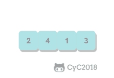
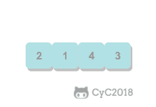
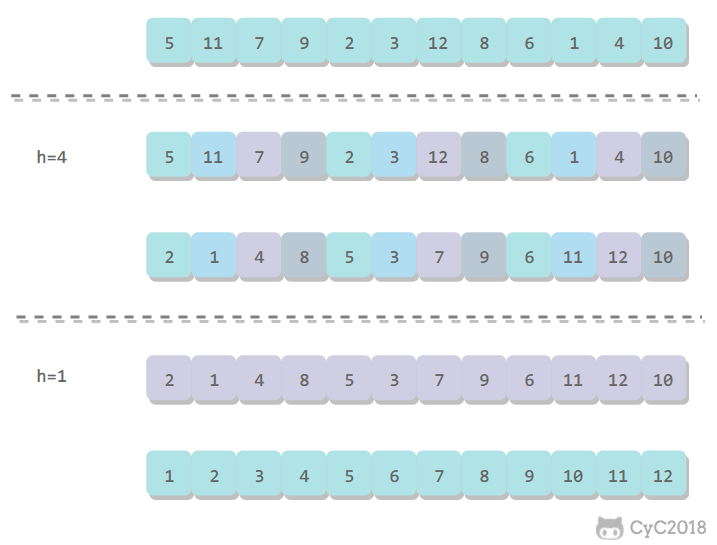
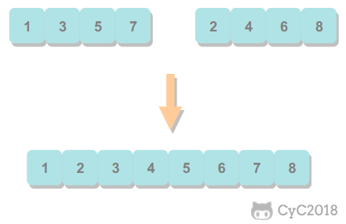

<!-- GFM-TOC -->
* [約定](#約定)
* [選擇排序](#選擇排序)
* [冒泡排序](#冒泡排序)
* [插入排序](#插入排序)
* [希爾排序](#希爾排序)
* [歸併排序](#歸併排序)
    * [1. 歸併方法](#1-歸併方法)
    * [2. 自頂向下歸併排序](#2-自頂向下歸併排序)
    * [3. 自底向上歸併排序](#3-自底向上歸併排序)
* [快速排序](#快速排序)
    * [1. 基本算法](#1-基本算法)
    * [2. 切分](#2-切分)
    * [3. 性能分析](#3-性能分析)
    * [4. 算法改進](#4-算法改進)
    * [5. 基於切分的快速選擇算法](#5-基於切分的快速選擇算法)
* [堆排序](#堆排序)
    * [1. 堆](#1-堆)
    * [2. 上浮和下沉](#2-上浮和下沉)
    * [3. 插入元素](#3-插入元素)
    * [4. 刪除最大元素](#4-刪除最大元素)
    * [5. 堆排序](#5-堆排序)
    * [6. 分析](#6-分析)
* [小結](#小結)
    * [1. 排序算法的比較](#1-排序算法的比較)
    * [2. Java 的排序算法實現](#2-java-的排序算法實現)
<!-- GFM-TOC -->


# 約定

待排序的元素需要實現 Java 的 Comparable 接口，該接口有 compareTo() 方法，可以用它來判斷兩個元素的大小關係。

使用輔助函數 less() 和 swap() 來進行比較和交換的操作，使得代碼的可讀性和可移植性更好。

排序算法的成本模型是比較和交換的次數。

```java
public abstract class Sort<T extends Comparable<T>> {

    public abstract void sort(T[] nums);

    protected boolean less(T v, T w) {
        return v.compareTo(w) < 0;
    }

    protected void swap(T[] a, int i, int j) {
        T t = a[i];
        a[i] = a[j];
        a[j] = t;
    }
}
```

# 選擇排序

從數組中選擇最小元素，將它與數組的第一個元素交換位置。再從數組剩下的元素中選擇出最小的元素，將它與數組的第二個元素交換位置。不斷進行這樣的操作，直到將整個數組排序。

選擇排序需要 \~N<sup>2</sup>/2 次比較和 \~N 次交換，它的運行時間與輸入無關，這個特點使得它對一個已經排序的數組也需要這麼多的比較和交換操作。

<div align="center">  </div><br>

```java
public class Selection<T extends Comparable<T>> extends Sort<T> {

    @Override
    public void sort(T[] nums) {
        int N = nums.length;
        for (int i = 0; i < N - 1; i++) {
            int min = i;
            for (int j = i + 1; j < N; j++) {
                if (less(nums[j], nums[min])) {
                    min = j;
                }
            }
            swap(nums, i, min);
        }
    }
}
```

# 冒泡排序

從左到右不斷交換相鄰逆序的元素，在一輪的循環之後，可以讓未排序的最大元素上浮到右側。

在一輪循環中，如果沒有發生交換，那麼說明數組已經是有序的，此時可以直接退出。

<div align="center">  </div><br>

```java
public class Bubble<T extends Comparable<T>> extends Sort<T> {

    @Override
    public void sort(T[] nums) {
        int N = nums.length;
        boolean isSorted = false;
        for (int i = N - 1; i > 0 && !isSorted; i--) {
            isSorted = true;
            for (int j = 0; j < i; j++) {
                if (less(nums[j + 1], nums[j])) {
                    isSorted = false;
                    swap(nums, j, j + 1);
                }
            }
        }
    }
}
```

# 插入排序

每次都將當前元素插入到左側已經排序的數組中，使得插入之後左側數組依然有序。

對於數組 {3, 5, 2, 4, 1}，它具有以下逆序：(3, 2), (3, 1), (5, 2), (5, 4), (5, 1), (2, 1), (4, 1)，插入排序每次只能交換相鄰元素，令逆序數量減少 1，因此插入排序需要交換的次數為逆序數量。

插入排序的時間複雜度取決於數組的初始順序，如果數組已經部分有序了，那麼逆序較少，需要的交換次數也就較少，時間複雜度較低。

- 平均情況下插入排序需要 \~N<sup>2</sup>/4 比較以及 \~N<sup>2</sup>/4 次交換；
- 最壞的情況下需要 \~N<sup>2</sup>/2 比較以及 \~N<sup>2</sup>/2 次交換，最壞的情況是數組是倒序的；
- 最好的情況下需要 N-1 次比較和 0 次交換，最好的情況就是數組已經有序了。

<div align="center">  </div><br>

```java
public class Insertion<T extends Comparable<T>> extends Sort<T> {

    @Override
    public void sort(T[] nums) {
        int N = nums.length;
        for (int i = 1; i < N; i++) {
            for (int j = i; j > 0 && less(nums[j], nums[j - 1]); j--) {
                swap(nums, j, j - 1);
            }
        }
    }
}
```

# 希爾排序

對於大規模的數組，插入排序很慢，因為它只能交換相鄰的元素，每次只能將逆序數量減少 1。希爾排序的出現就是為了解決插入排序的這種侷限性，它通過交換不相鄰的元素，每次可以將逆序數量減少大於 1。

希爾排序使用插入排序對間隔 h 的序列進行排序。通過不斷減小 h，最後令 h=1，就可以使得整個數組是有序的。

<div align="center">  </div><br>

```java
public class Shell<T extends Comparable<T>> extends Sort<T> {

    @Override
    public void sort(T[] nums) {

        int N = nums.length;
        int h = 1;

        while (h < N / 3) {
            h = 3 * h + 1; // 1, 4, 13, 40, ...
        }

        while (h >= 1) {
            for (int i = h; i < N; i++) {
                for (int j = i; j >= h && less(nums[j], nums[j - h]); j -= h) {
                    swap(nums, j, j - h);
                }
            }
            h = h / 3;
        }
    }
}

```

希爾排序的運行時間達不到平方級別，使用遞增序列 1, 4, 13, 40, ...  的希爾排序所需要的比較次數不會超過 N 的若干倍乘於遞增序列的長度。後面介紹的高級排序算法只會比希爾排序快兩倍左右。

# 歸併排序

歸併排序的思想是將數組分成兩部分，分別進行排序，然後歸併起來。

<div align="center">  </div><br>

## 1. 歸併方法

歸併方法將數組中兩個已經排序的部分歸併成一個。

```java
public abstract class MergeSort<T extends Comparable<T>> extends Sort<T> {

    protected T[] aux;


    protected void merge(T[] nums, int l, int m, int h) {

        int i = l, j = m + 1;

        for (int k = l; k <= h; k++) {
            aux[k] = nums[k]; // 將數據複製到輔助數組
        }

        for (int k = l; k <= h; k++) {
            if (i > m) {
                nums[k] = aux[j++];

            } else if (j > h) {
                nums[k] = aux[i++];

            } else if (aux[i].compareTo(aux[j]) <= 0) {
                nums[k] = aux[i++]; // 先進行這一步，保證穩定性

            } else {
                nums[k] = aux[j++];
            }
        }
    }
}
```

## 2. 自頂向下歸併排序

將一個大數組分成兩個小數組去求解。

因為每次都將問題對半分成兩個子問題，這種對半分的算法複雜度一般為 O(NlogN)。

```java
public class Up2DownMergeSort<T extends Comparable<T>> extends MergeSort<T> {

    @Override
    public void sort(T[] nums) {
        aux = (T[]) new Comparable[nums.length];
        sort(nums, 0, nums.length - 1);
    }

    private void sort(T[] nums, int l, int h) {
        if (h <= l) {
            return;
        }
        int mid = l + (h - l) / 2;
        sort(nums, l, mid);
        sort(nums, mid + 1, h);
        merge(nums, l, mid, h);
    }
}
```


## 3. 自底向上歸併排序

先歸併那些微型數組，然後成對歸併得到的微型數組。

```java
public class Down2UpMergeSort<T extends Comparable<T>> extends MergeSort<T> {

    @Override
    public void sort(T[] nums) {

        int N = nums.length;
        aux = (T[]) new Comparable[N];

        for (int sz = 1; sz < N; sz += sz) {
            for (int lo = 0; lo < N - sz; lo += sz + sz) {
                merge(nums, lo, lo + sz - 1, Math.min(lo + sz + sz - 1, N - 1));
            }
        }
    }
}

```

# 快速排序

## 1. 基本算法

- 歸併排序將數組分為兩個子數組分別排序，並將有序的子數組歸併使得整個數組排序；
- 快速排序通過一個切分元素將數組分為兩個子數組，左子數組小於等於切分元素，右子數組大於等於切分元素，將這兩個子數組排序也就將整個數組排序了。

<div align="center">  </div><br>

```java
public class QuickSort<T extends Comparable<T>> extends Sort<T> {

    @Override
    public void sort(T[] nums) {
        shuffle(nums);
        sort(nums, 0, nums.length - 1);
    }

    private void sort(T[] nums, int l, int h) {
        if (h <= l)
            return;
        int j = partition(nums, l, h);
        sort(nums, l, j - 1);
        sort(nums, j + 1, h);
    }

    private void shuffle(T[] nums) {
        List<Comparable> list = Arrays.asList(nums);
        Collections.shuffle(list);
        list.toArray(nums);
    }
}
```

## 2. 切分

取 a[l] 作為切分元素，然後從數組的左端向右掃描直到找到第一個大於等於它的元素，再從數組的右端向左掃描找到第一個小於它的元素，交換這兩個元素。不斷進行這個過程，就可以保證左指針 i 的左側元素都不大於切分元素，右指針 j 的右側元素都不小於切分元素。當兩個指針相遇時，將切分元素 a[l] 和 a[j] 交換位置。

<div align="center">  </div><br>

```java
private int partition(T[] nums, int l, int h) {
    int i = l, j = h + 1;
    T v = nums[l];
    while (true) {
        while (less(nums[++i], v) && i != h) ;
        while (less(v, nums[--j]) && j != l) ;
        if (i >= j)
            break;
        swap(nums, i, j);
    }
    swap(nums, l, j);
    return j;
}
```

## 3. 性能分析

快速排序是原地排序，不需要輔助數組，但是遞歸調用需要輔助棧。

快速排序最好的情況下是每次都正好將數組對半分，這樣遞歸調用次數才是最少的。這種情況下比較次數為 C<sub>N</sub>=2C<sub>N/2</sub>+N，複雜度為 O(NlogN)。

最壞的情況下，第一次從最小的元素切分，第二次從第二小的元素切分，如此這般。因此最壞的情況下需要比較 N<sup>2</sup>/2。為了防止數組最開始就是有序的，在進行快速排序時需要隨機打亂數組。

## 4. 算法改進

#### 4.1 切換到插入排序

因為快速排序在小數組中也會遞歸調用自己，對於小數組，插入排序比快速排序的性能更好，因此在小數組中可以切換到插入排序。

#### 4.2 三數取中

最好的情況下是每次都能取數組的中位數作為切分元素，但是計算中位數的代價很高。一種折中方法是取 3 個元素，並將大小居中的元素作為切分元素。

#### 4.3 三向切分

對於有大量重複元素的數組，可以將數組切分為三部分，分別對應小於、等於和大於切分元素。

三向切分快速排序對於有大量重複元素的隨機數組可以在線性時間內完成排序。

```java
public class ThreeWayQuickSort<T extends Comparable<T>> extends QuickSort<T> {

    @Override
    protected void sort(T[] nums, int l, int h) {
        if (h <= l) {
            return;
        }
        int lt = l, i = l + 1, gt = h;
        T v = nums[l];
        while (i <= gt) {
            int cmp = nums[i].compareTo(v);
            if (cmp < 0) {
                swap(nums, lt++, i++);
            } else if (cmp > 0) {
                swap(nums, i, gt--);
            } else {
                i++;
            }
        }
        sort(nums, l, lt - 1);
        sort(nums, gt + 1, h);
    }
}
```

## 5. 基於切分的快速選擇算法

快速排序的 partition() 方法，會返回一個整數 j 使得 a[l..j-1] 小於等於 a[j]，且 a[j+1..h] 大於等於 a[j]，此時 a[j] 就是數組的第 j 大元素。

可以利用這個特性找出數組的第 k 個元素。

該算法是線性級別的，假設每次能將數組二分，那麼比較的總次數為 (N+N/2+N/4+..)，直到找到第 k 個元素，這個和顯然小於 2N。

```java
public T select(T[] nums, int k) {
    int l = 0, h = nums.length - 1;
    while (h > l) {
        int j = partition(nums, l, h);

        if (j == k) {
            return nums[k];

        } else if (j > k) {
            h = j - 1;

        } else {
            l = j + 1;
        }
    }
    return nums[k];
}
```

# 堆排序

## 1. 堆

堆中某個節點的值總是大於等於其子節點的值，並且堆是一顆完全二叉樹。

堆可以用數組來表示，這是因為堆是完全二叉樹，而完全二叉樹很容易就存儲在數組中。位置 k 的節點的父節點位置為 k/2，而它的兩個子節點的位置分別為 2k 和 2k+1。這裡不使用數組索引為 0 的位置，是為了更清晰地描述節點的位置關係。

<div align="center">  </div><br>

```java
public class Heap<T extends Comparable<T>> {

    private T[] heap;
    private int N = 0;

    public Heap(int maxN) {
        this.heap = (T[]) new Comparable[maxN + 1];
    }

    public boolean isEmpty() {
        return N == 0;
    }

    public int size() {
        return N;
    }

    private boolean less(int i, int j) {
        return heap[i].compareTo(heap[j]) < 0;
    }

    private void swap(int i, int j) {
        T t = heap[i];
        heap[i] = heap[j];
        heap[j] = t;
    }
}
```

## 2. 上浮和下沉

在堆中，當一個節點比父節點大，那麼需要交換這個兩個節點。交換後還可能比它新的父節點大，因此需要不斷地進行比較和交換操作，把這種操作稱為上浮。

<div align="center">  </div><br>

```java
private void swim(int k) {
    while (k > 1 && less(k / 2, k)) {
        swap(k / 2, k);
        k = k / 2;
    }
}
```

類似地，當一個節點比子節點來得小，也需要不斷地向下進行比較和交換操作，把這種操作稱為下沉。一個節點如果有兩個子節點，應當與兩個子節點中最大那個節點進行交換。

<div align="center">  </div><br>

```java
private void sink(int k) {
    while (2 * k <= N) {
        int j = 2 * k;
        if (j < N && less(j, j + 1))
            j++;
        if (!less(k, j))
            break;
        swap(k, j);
        k = j;
    }
}
```

## 3. 插入元素

將新元素放到數組末尾，然後上浮到合適的位置。

```java
public void insert(Comparable v) {
    heap[++N] = v;
    swim(N);
}
```

## 4. 刪除最大元素

從數組頂端刪除最大的元素，並將數組的最後一個元素放到頂端，並讓這個元素下沉到合適的位置。

```java
public T delMax() {
    T max = heap[1];
    swap(1, N--);
    heap[N + 1] = null;
    sink(1);
    return max;
}
```

## 5. 堆排序

把最大元素和當前堆中數組的最後一個元素交換位置，並且不刪除它，那麼就可以得到一個從尾到頭的遞減序列，從正向來看就是一個遞增序列，這就是堆排序。

#### 5.1 構建堆

無序數組建立堆最直接的方法是從左到右遍歷數組進行上浮操作。一個更高效的方法是從右至左進行下沉操作，如果一個節點的兩個節點都已經是堆有序，那麼進行下沉操作可以使得這個節點為根節點的堆有序。葉子節點不需要進行下沉操作，可以忽略葉子節點的元素，因此只需要遍歷一半的元素即可。

<div align="center">  </div><br>

#### 5.2 交換堆頂元素與最後一個元素

交換之後需要進行下沉操作維持堆的有序狀態。

<div align="center">  </div><br>

```java
public class HeapSort<T extends Comparable<T>> extends Sort<T> {
    /**
     * 數組第 0 個位置不能有元素
     */
    @Override
    public void sort(T[] nums) {
        int N = nums.length - 1;
        for (int k = N / 2; k >= 1; k--)
            sink(nums, k, N);

        while (N > 1) {
            swap(nums, 1, N--);
            sink(nums, 1, N);
        }
    }

    private void sink(T[] nums, int k, int N) {
        while (2 * k <= N) {
            int j = 2 * k;
            if (j < N && less(nums, j, j + 1))
                j++;
            if (!less(nums, k, j))
                break;
            swap(nums, k, j);
            k = j;
        }
    }

    private boolean less(T[] nums, int i, int j) {
        return nums[i].compareTo(nums[j]) < 0;
    }
}
```

## 6. 分析

一個堆的高度為 logN，因此在堆中插入元素和刪除最大元素的複雜度都為 logN。

對於堆排序，由於要對 N 個節點進行下沉操作，因此複雜度為 NlogN。

堆排序是一種原地排序，沒有利用額外的空間。

現代操作系統很少使用堆排序，因為它無法利用局部性原理進行緩存，也就是數組元素很少和相鄰的元素進行比較和交換。

# 小結

## 1. 排序算法的比較

| 算法 | 穩定性 | 時間複雜度 | 空間複雜度 | 備註 |
| :---: | :---: |:---: | :---: | :---: |
| 選擇排序 | × | N<sup>2</sup> | 1 | |
| 冒泡排序 | √ |  N<sup>2</sup> | 1 | |
| 插入排序 | √ |  N \~ N<sup>2</sup> | 1 | 時間複雜度和初始順序有關 |
| 希爾排序 | ×  |  N 的若干倍乘於遞增序列的長度 | 1 | 改進版插入排序 |
| 快速排序 | ×  | NlogN | logN | |
| 三向切分快速排序 | ×  |  N \~ NlogN | logN | 適用於有大量重複主鍵|
| 歸併排序 | √ |  NlogN | N | |
| 堆排序 | ×  |  NlogN | 1 | 無法利用局部性原理|

快速排序是最快的通用排序算法，它的內循環的指令很少，而且它還能利用緩存，因為它總是順序地訪問數據。它的運行時間近似為 \~cNlogN，這裡的 c 比其它線性對數級別的排序算法都要小。

使用三向切分快速排序，實際應用中可能出現的某些分佈的輸入能夠達到線性級別，而其它排序算法仍然需要線性對數時間。

## 2. Java 的排序算法實現

Java 主要排序方法為 java.util.Arrays.sort()，對於原始數據類型使用三向切分的快速排序，對於引用類型使用歸併排序。 


# 微信公眾號


更多精彩內容將發佈在微信公眾號 CyC2018 上，你也可以在公眾號後臺和我交流學習和求職相關的問題。另外，公眾號提供了該項目的 PDF 等離線閱讀版本，後臺回覆 "下載" 即可領取。公眾號也提供了一份技術面試複習大綱，不僅系統整理了面試知識點，而且標註了各個知識點的重要程度，從而幫你理清多而雜的面試知識點，後臺回覆 "大綱" 即可領取。我基本是按照這個大綱來進行復習的，對我拿到了 BAT 頭條等 Offer 起到很大的幫助。你們完全可以和我一樣根據大綱上列的知識點來進行復習，就不用看很多不重要的內容，也可以知道哪些內容很重要從而多安排一些複習時間。


<br><div align="center"></img></div>
