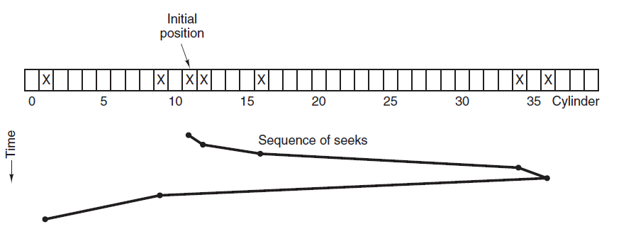

<!-- GFM-TOC -->
* [磁盤結構](#磁盤結構)
* [磁盤調度算法](#磁盤調度算法)
    * [1. 先來先服務](#1-先來先服務)
    * [2. 最短尋道時間優先](#2-最短尋道時間優先)
    * [3. 電梯算法](#3-電梯算法)
<!-- GFM-TOC -->

# 磁盤結構

- 盤面（Platter）：一個磁盤有多個盤面；
- 磁道（Track）：盤面上的圓形帶狀區域，一個盤面可以有多個磁道；
- 扇區（Track Sector）：磁道上的一個弧段，一個磁道可以有多個扇區，它是最小的物理儲存單位，目前主要有 512 bytes 與 4 K 兩種大小；
- 磁頭（Head）：與盤面非常接近，能夠將盤面上的磁場轉換為電信號（讀），或者將電信號轉換為盤面的磁場（寫）；
- 制動手臂（Actuator arm）：用於在磁道之間移動磁頭；
- 主軸（Spindle）：使整個盤面轉動。

  
 

# 磁盤調度算法

讀寫一個磁盤塊的時間的影響因素有：

- 旋轉時間（主軸轉動盤面，使得磁頭移動到適當的扇區上）
- 尋道時間（制動手臂移動，使得磁頭移動到適當的磁道上）
- 實際的數據傳輸時間

其中，尋道時間最長，因此磁盤調度的主要目標是使磁盤的平均尋道時間最短。

## 1. 先來先服務

> FCFS, First Come First Served

按照磁盤請求的順序進行調度。

優點是公平和簡單。缺點也很明顯，因為未對尋道做任何優化，使平均尋道時間可能較長。

## 2. 最短尋道時間優先

> SSTF, Shortest Seek Time First

優先調度與當前磁頭所在磁道距離最近的磁道。

雖然平均尋道時間比較低，但是不夠公平。如果新到達的磁道請求總是比一個在等待的磁道請求近，那麼在等待的磁道請求會一直等待下去，也就是出現飢餓現象。具體來說，兩端的磁道請求更容易出現飢餓現象。

  
 

## 3. 電梯算法

> SCAN

電梯總是保持一個方向運行，直到該方向沒有請求為止，然後改變運行方向。

電梯算法（掃描算法）和電梯的運行過程類似，總是按一個方向來進行磁盤調度，直到該方向上沒有未完成的磁盤請求，然後改變方向。

因為考慮了移動方向，因此所有的磁盤請求都會被滿足，解決了 SSTF 的飢餓問題。

  
 

# 微信公眾號

更多精彩內容將發佈在微信公眾號 CyC2018 上，你也可以在公眾號後臺和我交流學習和求職相關的問題。另外，公眾號提供了該項目的 PDF 等離線閱讀版本，後臺回覆 "下載" 即可領取。公眾號也提供了一份技術面試複習大綱，不僅系統整理了面試知識點，而且標註了各個知識點的重要程度，從而幫你理清多而雜的面試知識點，後臺回覆 "大綱" 即可領取。我基本是按照這個大綱來進行復習的，對我拿到了 BAT 頭條等 Offer 起到很大的幫助。你們完全可以和我一樣根據大綱上列的知識點來進行復習，就不用看很多不重要的內容，也可以知道哪些內容很重要從而多安排一些複習時間。

 
</img>

