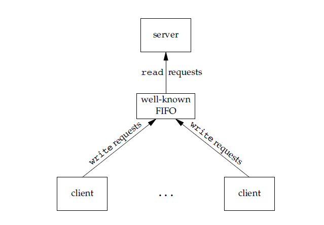

<!-- GFM-TOC -->
* [進程與線程](#進程與線程)
    * [1. 進程](#1-進程)
    * [2. 線程](#2-線程)
    * [3. 區別](#3-區別)
* [進程狀態的切換](#進程狀態的切換)
* [進程調度算法](#進程調度算法)
    * [1. 批處理系統](#1-批處理系統)
    * [2. 交互式系統](#2-交互式系統)
    * [3. 實時系統](#3-實時系統)
* [進程同步](#進程同步)
    * [1. 臨界區](#1-臨界區)
    * [2. 同步與互斥](#2-同步與互斥)
    * [3. 信號量](#3-信號量)
    * [4. 管程](#4-管程)
* [經典同步問題](#經典同步問題)
    * [1. 讀者-寫者問題](#1-讀者-寫者問題)
    * [2. 哲學家進餐問題](#2-哲學家進餐問題)
* [進程通信](#進程通信)
    * [1. 管道](#1-管道)
    * [2. FIFO](#2-fifo)
    * [3. 消息隊列](#3-消息隊列)
    * [4. 信號量](#4-信號量)
    * [5. 共享存儲](#5-共享存儲)
    * [6. 套接字](#6-套接字)
<!-- GFM-TOC -->


# 進程與線程

## 1. 進程

進程是資源分配的基本單位。

進程控制塊 (Process Control Block, PCB) 描述進程的基本信息和運行狀態，所謂的創建進程和撤銷進程，都是指對 PCB 的操作。

下圖顯示了 4 個程序創建了 4 個進程，這 4 個進程可以併發地執行。

<div align="center">  </div><br>

## 2. 線程

線程是獨立調度的基本單位。

一個進程中可以有多個線程，它們共享進程資源。

QQ 和瀏覽器是兩個進程，瀏覽器進程裡面有很多線程，例如 HTTP 請求線程、事件響應線程、渲染線程等等，線程的併發執行使得在瀏覽器中點擊一個新鏈接從而發起 HTTP 請求時，瀏覽器還可以響應用戶的其它事件。

<div align="center">  </div><br>

## 3. 區別

Ⅰ 擁有資源

進程是資源分配的基本單位，但是線程不擁有資源，線程可以訪問隸屬進程的資源。

Ⅱ 調度

線程是獨立調度的基本單位，在同一進程中，線程的切換不會引起進程切換，從一個進程中的線程切換到另一個進程中的線程時，會引起進程切換。

Ⅲ 系統開銷

由於創建或撤銷進程時，系統都要為之分配或回收資源，如內存空間、I/O 設備等，所付出的開銷遠大於創建或撤銷線程時的開銷。類似地，在進行進程切換時，涉及當前執行進程 CPU 環境的保存及新調度進程 CPU 環境的設置，而線程切換時只需保存和設置少量寄存器內容，開銷很小。

Ⅳ 通信方面

線程間可以通過直接讀寫同一進程中的數據進行通信，但是進程通信需要藉助 IPC。

# 進程狀態的切換

<div align="center">  </div><br>

- 就緒狀態（ready）：等待被調度
- 運行狀態（running）
- 阻塞狀態（waiting）：等待資源

應該注意以下內容：

- 只有就緒態和運行態可以相互轉換，其它的都是單向轉換。就緒狀態的進程通過調度算法從而獲得 CPU 時間，轉為運行狀態；而運行狀態的進程，在分配給它的 CPU 時間片用完之後就會轉為就緒狀態，等待下一次調度。
- 阻塞狀態是缺少需要的資源從而由運行狀態轉換而來，但是該資源不包括 CPU 時間，缺少 CPU 時間會從運行態轉換為就緒態。

# 進程調度算法

不同環境的調度算法目標不同，因此需要針對不同環境來討論調度算法。

## 1. 批處理系統

批處理系統沒有太多的用戶操作，在該系統中，調度算法目標是保證吞吐量和週轉時間（從提交到終止的時間）。

**1.1 先來先服務 first-come first-serverd（FCFS）** 

非搶佔式的調度算法，按照請求的順序進行調度。

有利於長作業，但不利於短作業，因為短作業必須一直等待前面的長作業執行完畢才能執行，而長作業又需要執行很長時間，造成了短作業等待時間過長。

**1.2 短作業優先 shortest job first（SJF）** 

非搶佔式的調度算法，按估計運行時間最短的順序進行調度。

長作業有可能會餓死，處於一直等待短作業執行完畢的狀態。因為如果一直有短作業到來，那麼長作業永遠得不到調度。

**1.3 最短剩餘時間優先 shortest remaining time next（SRTN）** 

最短作業優先的搶佔式版本，按剩餘運行時間的順序進行調度。 當一個新的作業到達時，其整個運行時間與當前進程的剩餘時間作比較。如果新的進程需要的時間更少，則掛起當前進程，運行新的進程。否則新的進程等待。

## 2. 交互式系統

交互式系統有大量的用戶交互操作，在該系統中調度算法的目標是快速地進行響應。

**2.1 時間片輪轉** 

將所有就緒進程按 FCFS 的原則排成一個隊列，每次調度時，把 CPU 時間分配給隊首進程，該進程可以執行一個時間片。當時間片用完時，由計時器發出時鐘中斷，調度程序便停止該進程的執行，並將它送往就緒隊列的末尾，同時繼續把 CPU 時間分配給隊首的進程。

時間片輪轉算法的效率和時間片的大小有很大關係：

- 因為進程切換都要保存進程的信息並且載入新進程的信息，如果時間片太小，會導致進程切換得太頻繁，在進程切換上就會花過多時間。
- 而如果時間片過長，那麼實時性就不能得到保證。

<div align="center">  </div><br>

**2.2 優先級調度** 

為每個進程分配一個優先級，按優先級進行調度。

為了防止低優先級的進程永遠等不到調度，可以隨著時間的推移增加等待進程的優先級。

**2.3 多級反饋隊列** 

一個進程需要執行 100 個時間片，如果採用時間片輪轉調度算法，那麼需要交換 100 次。

多級隊列是為這種需要連續執行多個時間片的進程考慮，它設置了多個隊列，每個隊列時間片大小都不同，例如 1,2,4,8,..。進程在第一個隊列沒執行完，就會被移到下一個隊列。這種方式下，之前的進程只需要交換 7 次。

每個隊列優先權也不同，最上面的優先權最高。因此只有上一個隊列沒有進程在排隊，才能調度當前隊列上的進程。

可以將這種調度算法看成是時間片輪轉調度算法和優先級調度算法的結合。

<div align="center">  </div><br>

## 3. 實時系統

實時系統要求一個請求在一個確定時間內得到響應。

分為硬實時和軟實時，前者必須滿足絕對的截止時間，後者可以容忍一定的超時。

# 進程同步

## 1. 臨界區

對臨界資源進行訪問的那段代碼稱為臨界區。

為了互斥訪問臨界資源，每個進程在進入臨界區之前，需要先進行檢查。

```html
// entry section
// critical section;
// exit section
```

## 2. 同步與互斥

- 同步：多個進程因為合作產生的直接制約關係，使得進程有一定的先後執行關係。
- 互斥：多個進程在同一時刻只有一個進程能進入臨界區。

## 3. 信號量

信號量（Semaphore）是一個整型變量，可以對其執行 down 和 up 操作，也就是常見的 P 和 V 操作。

-  **down**  : 如果信號量大於 0 ，執行 -1 操作；如果信號量等於 0，進程睡眠，等待信號量大於 0；
-  **up** ：對信號量執行 +1 操作，喚醒睡眠的進程讓其完成 down 操作。

down 和 up 操作需要被設計成原語，不可分割，通常的做法是在執行這些操作的時候屏蔽中斷。

如果信號量的取值只能為 0 或者 1，那麼就成為了  **互斥量（Mutex）** ，0 表示臨界區已經加鎖，1 表示臨界區解鎖。

```c
typedef int semaphore;
semaphore mutex = 1;
void P1() {
    down(&mutex);
    // 臨界區
    up(&mutex);
}

void P2() {
    down(&mutex);
    // 臨界區
    up(&mutex);
}
```

<font size=3>  **使用信號量實現生產者-消費者問題**  </font> </br>

問題描述：使用一個緩衝區來保存物品，只有緩衝區沒有滿，生產者才可以放入物品；只有緩衝區不為空，消費者才可以拿走物品。

因為緩衝區屬於臨界資源，因此需要使用一個互斥量 mutex 來控制對緩衝區的互斥訪問。

為了同步生產者和消費者的行為，需要記錄緩衝區中物品的數量。數量可以使用信號量來進行統計，這裡需要使用兩個信號量：empty 記錄空緩衝區的數量，full 記錄滿緩衝區的數量。其中，empty 信號量是在生產者進程中使用，當 empty 不為 0 時，生產者才可以放入物品；full 信號量是在消費者進程中使用，當 full 信號量不為 0 時，消費者才可以取走物品。

注意，不能先對緩衝區進行加鎖，再測試信號量。也就是說，不能先執行 down(mutex) 再執行 down(empty)。如果這麼做了，那麼可能會出現這種情況：生產者對緩衝區加鎖後，執行 down(empty) 操作，發現 empty = 0，此時生產者睡眠。消費者不能進入臨界區，因為生產者對緩衝區加鎖了，消費者就無法執行 up(empty) 操作，empty 永遠都為 0，導致生產者永遠等待下，不會釋放鎖，消費者因此也會永遠等待下去。

```c
#define N 100
typedef int semaphore;
semaphore mutex = 1;
semaphore empty = N;
semaphore full = 0;

void producer() {
    while(TRUE) {
        int item = produce_item();
        down(&empty);
        down(&mutex);
        insert_item(item);
        up(&mutex);
        up(&full);
    }
}

void consumer() {
    while(TRUE) {
        down(&full);
        down(&mutex);
        int item = remove_item();
        consume_item(item);
        up(&mutex);
        up(&empty);
    }
}
```

## 4. 管程

使用信號量機制實現的生產者消費者問題需要客戶端代碼做很多控制，而管程把控制的代碼獨立出來，不僅不容易出錯，也使得客戶端代碼調用更容易。

c 語言不支持管程，下面的示例代碼使用了類 Pascal 語言來描述管程。示例代碼的管程提供了 insert() 和 remove() 方法，客戶端代碼通過調用這兩個方法來解決生產者-消費者問題。

```pascal
monitor ProducerConsumer
    integer i;
    condition c;

    procedure insert();
    begin
        // ...
    end;

    procedure remove();
    begin
        // ...
    end;
end monitor;
```

管程有一個重要特性：在一個時刻只能有一個進程使用管程。進程在無法繼續執行的時候不能一直佔用管程，否則其它進程永遠不能使用管程。

管程引入了  **條件變量**  以及相關的操作：**wait()** 和 **signal()** 來實現同步操作。對條件變量執行 wait() 操作會導致調用進程阻塞，把管程讓出來給另一個進程持有。signal() 操作用於喚醒被阻塞的進程。

<font size=3> **使用管程實現生產者-消費者問題** </font><br>

```pascal
// 管程
monitor ProducerConsumer
    condition full, empty;
    integer count := 0;
    condition c;

    procedure insert(item: integer);
    begin
        if count = N then wait(full);
        insert_item(item);
        count := count + 1;
        if count = 1 then signal(empty);
    end;

    function remove: integer;
    begin
        if count = 0 then wait(empty);
        remove = remove_item;
        count := count - 1;
        if count = N -1 then signal(full);
    end;
end monitor;

// 生產者客戶端
procedure producer
begin
    while true do
    begin
        item = produce_item;
        ProducerConsumer.insert(item);
    end
end;

// 消費者客戶端
procedure consumer
begin
    while true do
    begin
        item = ProducerConsumer.remove;
        consume_item(item);
    end
end;
```

# 經典同步問題

生產者和消費者問題前面已經討論過了。

## 1. 讀者-寫者問題

允許多個進程同時對數據進行讀操作，但是不允許讀和寫以及寫和寫操作同時發生。

一個整型變量 count 記錄在對數據進行讀操作的進程數量，一個互斥量 count_mutex 用於對 count 加鎖，一個互斥量 data_mutex 用於對讀寫的數據加鎖。

```c
typedef int semaphore;
semaphore count_mutex = 1;
semaphore data_mutex = 1;
int count = 0;

void reader() {
    while(TRUE) {
        down(&count_mutex);
        count++;
        if(count == 1) down(&data_mutex); // 第一個讀者需要對數據進行加鎖，防止寫進程訪問
        up(&count_mutex);
        read();
        down(&count_mutex);
        count--;
        if(count == 0) up(&data_mutex);
        up(&count_mutex);
    }
}

void writer() {
    while(TRUE) {
        down(&data_mutex);
        write();
        up(&data_mutex);
    }
}
```

以下內容由 [@Bandi Yugandhar](https://github.com/yugandharbandi) 提供。

The first case may result Writer to starve. This case favous Writers i.e no writer, once added to the queue, shall be kept waiting longer than absolutely necessary(only when there are readers that entered the queue before the writer).

```source-c
int readcount, writecount;                   //(initial value = 0)
semaphore rmutex, wmutex, readLock, resource; //(initial value = 1)

//READER
void reader() {
<ENTRY Section>
 down(&readLock);                 //  reader is trying to enter
 down(&rmutex);                  //   lock to increase readcount
  readcount++;                 
  if (readcount == 1)          
   down(&resource);              //if you are the first reader then lock  the resource
 up(&rmutex);                  //release  for other readers
 up(&readLock);                 //Done with trying to access the resource

<CRITICAL Section>
//reading is performed

<EXIT Section>
 down(&rmutex);                  //reserve exit section - avoids race condition with readers
 readcount--;                       //indicate you're leaving
  if (readcount == 0)          //checks if you are last reader leaving
   up(&resource);              //if last, you must release the locked resource
 up(&rmutex);                  //release exit section for other readers
}

//WRITER
void writer() {
  <ENTRY Section>
  down(&wmutex);                  //reserve entry section for writers - avoids race conditions
  writecount++;                //report yourself as a writer entering
  if (writecount == 1)         //checks if you're first writer
   down(&readLock);               //if you're first, then you must lock the readers out. Prevent them from trying to enter CS
  up(&wmutex);                  //release entry section

<CRITICAL Section>
 down(&resource);                //reserve the resource for yourself - prevents other writers from simultaneously editing the shared resource
  //writing is performed
 up(&resource);                //release file

<EXIT Section>
  down(&wmutex);                  //reserve exit section
  writecount--;                //indicate you're leaving
  if (writecount == 0)         //checks if you're the last writer
   up(&readLock);               //if you're last writer, you must unlock the readers. Allows them to try enter CS for reading
  up(&wmutex);                  //release exit section
}
```

We can observe that every reader is forced to acquire ReadLock. On the otherhand, writers doesn’t need to lock individually. Once the first writer locks the ReadLock, it will be released only when there is no writer left in the queue.

From the both cases we observed that either reader or writer has to starve. Below solutionadds the constraint that no thread shall be allowed to starve; that is, the operation of obtaining a lock on the shared data will always terminate in a bounded amount of time.

```source-c
int readCount;                  // init to 0; number of readers currently accessing resource

// all semaphores initialised to 1
Semaphore resourceAccess;       // controls access (read/write) to the resource
Semaphore readCountAccess;      // for syncing changes to shared variable readCount
Semaphore serviceQueue;         // FAIRNESS: preserves ordering of requests (signaling must be FIFO)

void writer()
{ 
    down(&serviceQueue);           // wait in line to be servicexs
    // <ENTER>
    down(&resourceAccess);         // request exclusive access to resource
    // </ENTER>
    up(&serviceQueue);           // let next in line be serviced

    // <WRITE>
    writeResource();            // writing is performed
    // </WRITE>

    // <EXIT>
    up(&resourceAccess);         // release resource access for next reader/writer
    // </EXIT>
}

void reader()
{ 
    down(&serviceQueue);           // wait in line to be serviced
    down(&readCountAccess);        // request exclusive access to readCount
    // <ENTER>
    if (readCount == 0)         // if there are no readers already reading:
        down(&resourceAccess);     // request resource access for readers (writers blocked)
    readCount++;                // update count of active readers
    // </ENTER>
    up(&serviceQueue);           // let next in line be serviced
    up(&readCountAccess);        // release access to readCount

    // <READ>
    readResource();             // reading is performed
    // </READ>

    down(&readCountAccess);        // request exclusive access to readCount
    // <EXIT>
    readCount--;                // update count of active readers
    if (readCount == 0)         // if there are no readers left:
        up(&resourceAccess);     // release resource access for all
    // </EXIT>
    up(&readCountAccess);        // release access to readCount
}

```


## 2. 哲學家進餐問題

<div align="center">  </div><br>

五個哲學家圍著一張圓桌，每個哲學家面前放著食物。哲學家的生活有兩種交替活動：吃飯以及思考。當一個哲學家吃飯時，需要先拿起自己左右兩邊的兩根筷子，並且一次只能拿起一根筷子。

下面是一種錯誤的解法，考慮到如果所有哲學家同時拿起左手邊的筷子，那麼就無法拿起右手邊的筷子，造成死鎖。

```c
#define N 5

void philosopher(int i) {
    while(TRUE) {
        think();
        take(i);       // 拿起左邊的筷子
        take((i+1)%N); // 拿起右邊的筷子
        eat();
        put(i);
        put((i+1)%N);
    }
}
```

為了防止死鎖的發生，可以設置兩個條件：

- 必須同時拿起左右兩根筷子；
- 只有在兩個鄰居都沒有進餐的情況下才允許進餐。

```c
#define N 5
#define LEFT (i + N - 1) % N // 左鄰居
#define RIGHT (i + 1) % N    // 右鄰居
#define THINKING 0
#define HUNGRY   1
#define EATING   2
typedef int semaphore;
int state[N];                // 跟蹤每個哲學家的狀態
semaphore mutex = 1;         // 臨界區的互斥
semaphore s[N];              // 每個哲學家一個信號量

void philosopher(int i) {
    while(TRUE) {
        think();
        take_two(i);
        eat();
        put_two(i);
    }
}

void take_two(int i) {
    down(&mutex);
    state[i] = HUNGRY;
    test(i);
    up(&mutex);
    down(&s[i]);
}

void put_two(i) {
    down(&mutex);
    state[i] = THINKING;
    test(LEFT);
    test(RIGHT);
    up(&mutex);
}

void test(i) {         // 嘗試拿起兩把筷子
    if(state[i] == HUNGRY && state[LEFT] != EATING && state[RIGHT] !=EATING) {
        state[i] = EATING;
        up(&s[i]);
    }
}
```

# 進程通信

進程同步與進程通信很容易混淆，它們的區別在於：

- 進程同步：控制多個進程按一定順序執行；
- 進程通信：進程間傳輸信息。

進程通信是一種手段，而進程同步是一種目的。也可以說，為了能夠達到進程同步的目的，需要讓進程進行通信，傳輸一些進程同步所需要的信息。

## 1. 管道

管道是通過調用 pipe 函數創建的，fd[0] 用於讀，fd[1] 用於寫。

```c
#include <unistd.h>
int pipe(int fd[2]);
```

它具有以下限制：

- 只支持半雙工通信（單向交替傳輸）；
- 只能在父子進程或者兄弟進程中使用。

<div align="center">  </div><br>

## 2. FIFO

也稱為命名管道，去除了管道只能在父子進程中使用的限制。

```c
#include <sys/stat.h>
int mkfifo(const char *path, mode_t mode);
int mkfifoat(int fd, const char *path, mode_t mode);
```

FIFO 常用於客戶-服務器應用程序中，FIFO 用作匯聚點，在客戶進程和服務器進程之間傳遞數據。

<div align="center">  </div><br>

## 3. 消息隊列

相比於 FIFO，消息隊列具有以下優點：

- 消息隊列可以獨立於讀寫進程存在，從而避免了 FIFO 中同步管道的打開和關閉時可能產生的困難；
- 避免了 FIFO 的同步阻塞問題，不需要進程自己提供同步方法；
- 讀進程可以根據消息類型有選擇地接收消息，而不像 FIFO 那樣只能默認地接收。

## 4. 信號量

它是一個計數器，用於為多個進程提供對共享數據對象的訪問。

## 5. 共享存儲

允許多個進程共享一個給定的存儲區。因為數據不需要在進程之間複製，所以這是最快的一種 IPC。

需要使用信號量用來同步對共享存儲的訪問。

多個進程可以將同一個文件映射到它們的地址空間從而實現共享內存。另外 XSI 共享內存不是使用文件，而是使用內存的匿名段。

## 6. 套接字

與其它通信機制不同的是，它可用於不同機器間的進程通信。


# 微信公眾號


更多精彩內容將發佈在微信公眾號 CyC2018 上，你也可以在公眾號後臺和我交流學習和求職相關的問題。另外，公眾號提供了該項目的 PDF 等離線閱讀版本，後臺回覆 "下載" 即可領取。公眾號也提供了一份技術面試複習大綱，不僅系統整理了面試知識點，而且標註了各個知識點的重要程度，從而幫你理清多而雜的面試知識點，後臺回覆 "大綱" 即可領取。我基本是按照這個大綱來進行復習的，對我拿到了 BAT 頭條等 Offer 起到很大的幫助。你們完全可以和我一樣根據大綱上列的知識點來進行復習，就不用看很多不重要的內容，也可以知道哪些內容很重要從而多安排一些複習時間。


<br><div align="center"></img></div>
