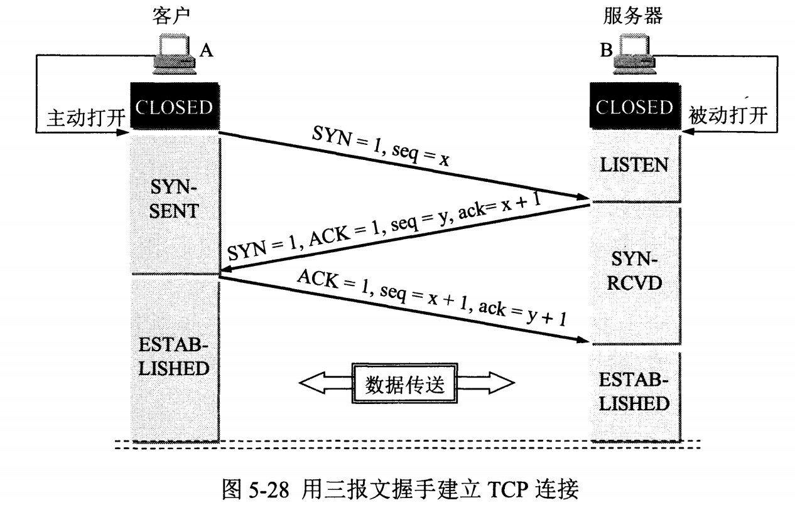
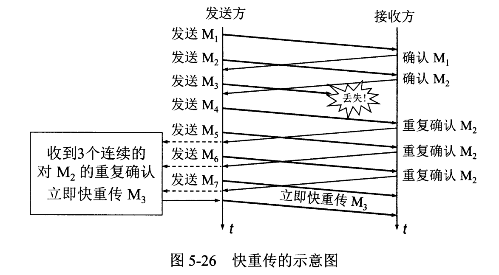

<!-- GFM-TOC -->
* [UDP 和 TCP 的特點](#udp-和-tcp-的特點)
* [UDP 首部格式](#udp-首部格式)
* [TCP 首部格式](#tcp-首部格式)
* [TCP 的三次握手](#tcp-的三次握手)
* [TCP 的四次揮手](#tcp-的四次揮手)
* [TCP 可靠傳輸](#tcp-可靠傳輸)
* [TCP 滑動窗口](#tcp-滑動窗口)
* [TCP 流量控制](#tcp-流量控制)
* [TCP 擁塞控制](#tcp-擁塞控制)
    * [1. 慢開始與擁塞避免](#1-慢開始與擁塞避免)
    * [2. 快重傳與快恢復](#2-快重傳與快恢復)
<!-- GFM-TOC -->

網絡層只把分組發送到目的主機，但是真正通信的並不是主機而是主機中的進程。傳輸層提供了進程間的邏輯通信，傳輸層向高層用戶屏蔽了下面網絡層的核心細節，使應用程序看起來像是在兩個傳輸層實體之間有一條端到端的邏輯通信信道。

# UDP 和 TCP 的特點

- 用戶數據報協議 UDP（User Datagram Protocol）是無連接的，盡最大可能交付，沒有擁塞控制，面向報文（對於應用程序傳下來的報文不合並也不拆分，只是添加 UDP 首部），支持一對一、一對多、多對一和多對多的交互通信。

- 傳輸控制協議 TCP（Transmission Control Protocol）是面向連接的，提供可靠交付，有流量控制，擁塞控制，提供全雙工通信，面向字節流（把應用層傳下來的報文看成字節流，把字節流組織成大小不等的數據塊），每一條 TCP 連接只能是點對點的（一對一）。

# UDP 首部格式

  
 

首部字段只有 8 個字節，包括源端口、目的端口、長度、檢驗和。12 字節的偽首部是為了計算檢驗和臨時添加的。

# TCP 首部格式

  
 

-  **序號**  ：用於對字節流進行編號，例如序號為 301，表示第一個字節的編號為 301，如果攜帶的數據長度為 100 字節，那麼下一個報文段的序號應為 401。

-  **確認號**  ：期望收到的下一個報文段的序號。例如 B 正確收到 A 發送來的一個報文段，序號為 501，攜帶的數據長度為 200 字節，因此 B 期望下一個報文段的序號為 701，B 發送給 A 的確認報文段中確認號就為 701。

-  **數據偏移**  ：指的是數據部分距離報文段起始處的偏移量，實際上指的是首部的長度。

-  **確認 ACK**  ：當 ACK=1 時確認號字段有效，否則無效。TCP 規定，在連接建立後所有傳送的報文段都必須把 ACK 置 1。

-  **同步 SYN**  ：在連接建立時用來同步序號。當 SYN=1，ACK=0 時表示這是一個連接請求報文段。若對方同意建立連接，則響應報文中 SYN=1，ACK=1。

-  **終止 FIN**  ：用來釋放一個連接，當 FIN=1 時，表示此報文段的發送方的數據已發送完畢，並要求釋放連接。

-  **窗口**  ：窗口值作為接收方讓發送方設置其發送窗口的依據。之所以要有這個限制，是因為接收方的數據緩存空間是有限的。

# TCP 的三次握手

  
 

假設 A 為客戶端，B 為服務器端。

- 首先 B 處於 LISTEN（監聽）狀態，等待客戶的連接請求。

- A 向 B 發送連接請求報文，SYN=1，ACK=0，選擇一個初始的序號 x。

- B 收到連接請求報文，如果同意建立連接，則向 A 發送連接確認報文，SYN=1，ACK=1，確認號為 x+1，同時也選擇一個初始的序號 y。

- A 收到 B 的連接確認報文後，還要向 B 發出確認，確認號為 y+1，序號為 x+1。

- B 收到 A 的確認後，連接建立。

**三次握手的原因** 

第三次握手是為了防止失效的連接請求到達服務器，讓服務器錯誤打開連接。

客戶端發送的連接請求如果在網絡中滯留，那麼就會隔很長一段時間才能收到服務器端發回的連接確認。客戶端等待一個超時重傳時間之後，就會重新請求連接。但是這個滯留的連接請求最後還是會到達服務器，如果不進行三次握手，那麼服務器就會打開兩個連接。如果有第三次握手，客戶端會忽略服務器之後發送的對滯留連接請求的連接確認，不進行第三次握手，因此就不會再次打開連接。

# TCP 的四次揮手

  
 

以下描述不討論序號和確認號，因為序號和確認號的規則比較簡單。並且不討論 ACK，因為 ACK 在連接建立之後都為 1。

- A 發送連接釋放報文，FIN=1。

- B 收到之後發出確認，此時 TCP 屬於半關閉狀態，B 能向 A 發送數據但是 A 不能向 B 發送數據。

- 當 B 不再需要連接時，發送連接釋放報文，FIN=1。

- A 收到後發出確認，進入 TIME-WAIT 狀態，等待 2 MSL（最大報文存活時間）後釋放連接。

- B 收到 A 的確認後釋放連接。

**四次揮手的原因** 

客戶端發送了 FIN 連接釋放報文之後，服務器收到了這個報文，就進入了 CLOSE-WAIT 狀態。這個狀態是為了讓服務器端發送還未傳送完畢的數據，傳送完畢之後，服務器會發送 FIN 連接釋放報文。

**TIME_WAIT** 

客戶端接收到服務器端的 FIN 報文後進入此狀態，此時並不是直接進入 CLOSED 狀態，還需要等待一個時間計時器設置的時間 2MSL。這麼做有兩個理由：

- 確保最後一個確認報文能夠到達。如果 B 沒收到 A 發送來的確認報文，那麼就會重新發送連接釋放請求報文，A 等待一段時間就是為了處理這種情況的發生。

- 等待一段時間是為了讓本連接持續時間內所產生的所有報文都從網絡中消失，使得下一個新的連接不會出現舊的連接請求報文。

# TCP 可靠傳輸

TCP 使用超時重傳來實現可靠傳輸：如果一個已經發送的報文段在超時時間內沒有收到確認，那麼就重傳這個報文段。

一個報文段從發送再到接收到確認所經過的時間稱為往返時間 RTT，加權平均往返時間 RTTs 計算如下：

  

其中，0 ≤ a ＜ 1，RTTs 隨著 a 的增加更容易受到 RTT 的影響。

超時時間 RTO 應該略大於 RTTs，TCP 使用的超時時間計算如下：

  

其中 RTTd 為偏差的加權平均值。

# TCP 滑動窗口

窗口是緩存的一部分，用來暫時存放字節流。發送方和接收方各有一個窗口，接收方通過 TCP 報文段中的窗口字段告訴發送方自己的窗口大小，發送方根據這個值和其它信息設置自己的窗口大小。

發送窗口內的字節都允許被髮送，接收窗口內的字節都允許被接收。如果發送窗口左部的字節已經發送並且收到了確認，那麼就將發送窗口向右滑動一定距離，直到左部第一個字節不是已發送並且已確認的狀態；接收窗口的滑動類似，接收窗口左部字節已經發送確認並交付主機，就向右滑動接收窗口。

接收窗口只會對窗口內最後一個按序到達的字節進行確認，例如接收窗口已經收到的字節為 {31, 34, 35}，其中 {31} 按序到達，而 {34, 35} 就不是，因此只對字節 31 進行確認。發送方得到一個字節的確認之後，就知道這個字節之前的所有字節都已經被接收。

  
 

# TCP 流量控制

流量控制是為了控制發送方發送速率，保證接收方來得及接收。

接收方發送的確認報文中的窗口字段可以用來控制發送方窗口大小，從而影響發送方的發送速率。將窗口字段設置為 0，則發送方不能發送數據。

# TCP 擁塞控制

如果網絡出現擁塞，分組將會丟失，此時發送方會繼續重傳，從而導致網絡擁塞程度更高。因此當出現擁塞時，應當控制發送方的速率。這一點和流量控制很像，但是出發點不同。流量控制是為了讓接收方能來得及接收，而擁塞控制是為了降低整個網絡的擁塞程度。

  
 

TCP 主要通過四個算法來進行擁塞控制：慢開始、擁塞避免、快重傳、快恢復。

發送方需要維護一個叫做擁塞窗口（cwnd）的狀態變量，注意擁塞窗口與發送方窗口的區別：擁塞窗口只是一個狀態變量，實際決定發送方能發送多少數據的是發送方窗口。

為了便於討論，做如下假設：

- 接收方有足夠大的接收緩存，因此不會發生流量控制；
- 雖然 TCP 的窗口基於字節，但是這裡設窗口的大小單位為報文段。

  
 

## 1. 慢開始與擁塞避免

發送的最初執行慢開始，令 cwnd = 1，發送方只能發送 1 個報文段；當收到確認後，將 cwnd 加倍，因此之後發送方能夠發送的報文段數量為：2、4、8 ...

注意到慢開始每個輪次都將 cwnd 加倍，這樣會讓 cwnd 增長速度非常快，從而使得發送方發送的速度增長速度過快，網絡擁塞的可能性也就更高。設置一個慢開始門限 ssthresh，當 cwnd >= ssthresh 時，進入擁塞避免，每個輪次只將 cwnd 加 1。

如果出現了超時，則令 ssthresh = cwnd / 2，然後重新執行慢開始。

## 2. 快重傳與快恢復

在接收方，要求每次接收到報文段都應該對最後一個已收到的有序報文段進行確認。例如已經接收到 M1 和 M2，此時收到 M4，應當發送對 M2 的確認。

在發送方，如果收到三個重複確認，那麼可以知道下一個報文段丟失，此時執行快重傳，立即重傳下一個報文段。例如收到三個 M2，則 M3 丟失，立即重傳 M3。

在這種情況下，只是丟失個別報文段，而不是網絡擁塞。因此執行快恢復，令 ssthresh = cwnd / 2 ，cwnd = ssthresh，注意到此時直接進入擁塞避免。

慢開始和快恢復的快慢指的是 cwnd 的設定值，而不是 cwnd 的增長速率。慢開始 cwnd 設定為 1，而快恢復 cwnd 設定為 ssthresh。

  
 

# 微信公眾號

更多精彩內容將發佈在微信公眾號 CyC2018 上，你也可以在公眾號後臺和我交流學習和求職相關的問題。另外，公眾號提供了該項目的 PDF 等離線閱讀版本，後臺回覆 "下載" 即可領取。公眾號也提供了一份技術面試複習大綱，不僅系統整理了面試知識點，而且標註了各個知識點的重要程度，從而幫你理清多而雜的面試知識點，後臺回覆 "大綱" 即可領取。我基本是按照這個大綱來進行復習的，對我拿到了 BAT 頭條等 Offer 起到很大的幫助。你們完全可以和我一樣根據大綱上列的知識點來進行復習，就不用看很多不重要的內容，也可以知道哪些內容很重要從而多安排一些複習時間。

 
</img>

