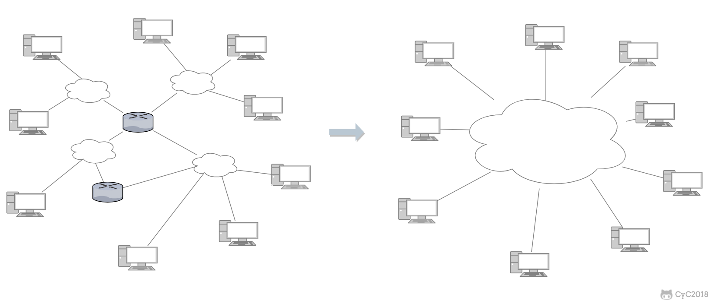
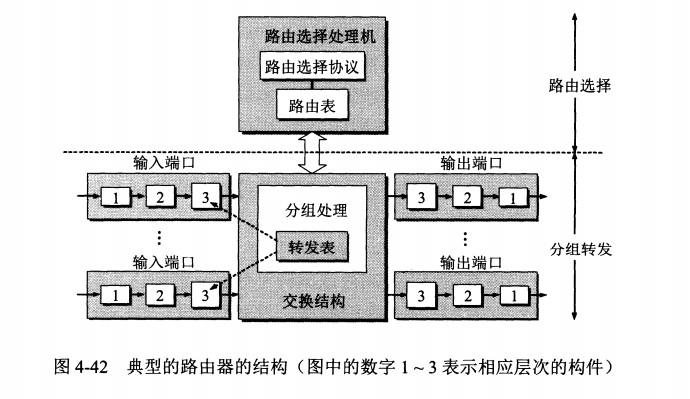

<!-- GFM-TOC -->
* [概述](#概述)
* [IP 數據報格式](#ip-數據報格式)
* [IP 地址編址方式](#ip-地址編址方式)
    * [1. 分類](#1-分類)
    * [2. 子網劃分](#2-子網劃分)
    * [3. 無分類](#3-無分類)
* [地址解析協議 ARP](#地址解析協議-arp)
* [網際控制報文協議 ICMP](#網際控制報文協議-icmp)
    * [1. Ping](#1-ping)
    * [2. Traceroute](#2-traceroute)
* [虛擬專用網 VPN](#虛擬專用網-vpn)
* [網絡地址轉換 NAT](#網絡地址轉換-nat)
* [路由器的結構](#路由器的結構)
* [路由器分組轉發流程](#路由器分組轉發流程)
* [路由選擇協議](#路由選擇協議)
    * [1. 內部網關協議 RIP](#1-內部網關協議-rip)
    * [2. 內部網關協議 OSPF](#2-內部網關協議-ospf)
    * [3. 外部網關協議 BGP](#3-外部網關協議-bgp)
<!-- GFM-TOC -->

# 概述

因為網絡層是整個互聯網的核心，因此應當讓網絡層儘可能簡單。網絡層向上只提供簡單靈活的、無連接的、盡最大努力交互的數據報服務。

使用 IP 協議，可以把異構的物理網絡連接起來，使得在網絡層看起來好像是一個統一的網絡。

  
 

與 IP 協議配套使用的還有三個協議：

- 地址解析協議 ARP（Address Resolution Protocol）
- 網際控制報文協議 ICMP（Internet Control Message Protocol）
- 網際組管理協議 IGMP（Internet Group Management Protocol）

# IP 數據報格式

  
 

-  **版本**  : 有 4（IPv4）和 6（IPv6）兩個值；

-  **首部長度**  : 佔 4 位，因此最大值為 15。值為 1 表示的是 1 個 32 位字的長度，也就是 4 字節。因為固定部分長度為 20 字節，因此該值最小為 5。如果可選字段的長度不是 4 字節的整數倍，就用尾部的填充部分來填充。

-  **區分服務**  : 用來獲得更好的服務，一般情況下不使用。

-  **總長度**  : 包括首部長度和數據部分長度。

-  **生存時間**  ：TTL，它的存在是為了防止無法交付的數據報在互聯網中不斷兜圈子。以路由器跳數為單位，當 TTL 為 0 時就丟棄數據報。

-  **協議** ：指出攜帶的數據應該上交給哪個協議進行處理，例如 ICMP、TCP、UDP 等。

-  **首部檢驗和** ：因為數據報每經過一個路由器，都要重新計算檢驗和，因此檢驗和不包含數據部分可以減少計算的工作量。

-  **標識**  : 在數據報長度過長從而發生分片的情況下，相同數據報的不同分片具有相同的標識符。

-  **片偏移**  : 和標識符一起，用於發生分片的情況。片偏移的單位為 8 字節。

  
 

# IP 地址編址方式

IP 地址的編址方式經歷了三個歷史階段：

- 分類
- 子網劃分
- 無分類

## 1. 分類

由兩部分組成，網絡號和主機號，其中不同分類具有不同的網絡號長度，並且是固定的。

IP 地址 ::= {< 網絡號 >, < 主機號 >}

  
 

## 2. 子網劃分

通過在主機號字段中拿一部分作為子網號，把兩級 IP 地址劃分為三級 IP 地址。

IP 地址 ::= {< 網絡號 >, < 子網號 >, < 主機號 >}

要使用子網，必須配置子網掩碼。一個 B 類地址的默認子網掩碼為 255.255.0.0，如果 B 類地址的子網佔兩個比特，那麼子網掩碼為 11111111 11111111 11000000 00000000，也就是 255.255.192.0。

注意，外部網絡看不到子網的存在。

## 3. 無分類

無分類編址 CIDR 消除了傳統 A 類、B 類和 C 類地址以及劃分子網的概念，使用網絡前綴和主機號來對 IP 地址進行編碼，網絡前綴的長度可以根據需要變化。

IP 地址 ::= {< 網絡前綴號 >, < 主機號 >}

CIDR 的記法上採用在 IP 地址後面加上網絡前綴長度的方法，例如 128.14.35.7/20 表示前 20 位為網絡前綴。

CIDR 的地址掩碼可以繼續稱為子網掩碼，子網掩碼首 1 長度為網絡前綴的長度。

一個 CIDR 地址塊中有很多地址，一個 CIDR 表示的網絡就可以表示原來的很多個網絡，並且在路由表中只需要一個路由就可以代替原來的多個路由，減少了路由表項的數量。把這種通過使用網絡前綴來減少路由表項的方式稱為路由聚合，也稱為  **構成超網** 。

在路由表中的項目由“網絡前綴”和“下一跳地址”組成，在查找時可能會得到不止一個匹配結果，應當採用最長前綴匹配來確定應該匹配哪一個。

# 地址解析協議 ARP

網絡層實現主機之間的通信，而鏈路層實現具體每段鏈路之間的通信。因此在通信過程中，IP 數據報的源地址和目的地址始終不變，而 MAC 地址隨著鏈路的改變而改變。

  
 

ARP 實現由 IP 地址得到 MAC 地址。

  
 

每個主機都有一個 ARP 高速緩存，裡面有本局域網上的各主機和路由器的 IP 地址到 MAC 地址的映射表。

如果主機 A 知道主機 B 的 IP 地址，但是 ARP 高速緩存中沒有該 IP 地址到 MAC 地址的映射，此時主機 A 通過廣播的方式發送 ARP 請求分組，主機 B 收到該請求後會發送 ARP 響應分組給主機 A 告知其 MAC 地址，隨後主機 A 向其高速緩存中寫入主機 B 的 IP 地址到 MAC 地址的映射。

  
 

# 網際控制報文協議 ICMP

ICMP 是為了更有效地轉發 IP 數據報和提高交付成功的機會。它封裝在 IP 數據報中，但是不屬於高層協議。

  
 

ICMP 報文分為差錯報告報文和詢問報文。

  
 

## 1. Ping

Ping 是 ICMP 的一個重要應用，主要用來測試兩臺主機之間的連通性。

Ping 的原理是通過向目的主機發送 ICMP Echo 請求報文，目的主機收到之後會發送 Echo 回答報文。Ping 會根據時間和成功響應的次數估算出數據包往返時間以及丟包率。

## 2. Traceroute

Traceroute 是 ICMP 的另一個應用，用來跟蹤一個分組從源點到終點的路徑。

Traceroute 發送的 IP 數據報封裝的是無法交付的 UDP 用戶數據報，並由目的主機發送終點不可達差錯報告報文。

- 源主機向目的主機發送一連串的 IP 數據報。第一個數據報 P1 的生存時間 TTL 設置為 1，當 P1 到達路徑上的第一個路由器 R1 時，R1 收下它並把 TTL 減 1，此時 TTL 等於 0，R1 就把 P1 丟棄，並向源主機發送一個 ICMP 時間超過差錯報告報文；
- 源主機接著發送第二個數據報 P2，並把 TTL 設置為 2。P2 先到達 R1，R1 收下後把 TTL 減 1 再轉發給 R2，R2 收下後也把 TTL 減 1，由於此時 TTL 等於 0，R2 就丟棄 P2，並向源主機發送一個 ICMP 時間超過差錯報文。
- 不斷執行這樣的步驟，直到最後一個數據報剛剛到達目的主機，主機不轉發數據報，也不把 TTL 值減 1。但是因為數據報封裝的是無法交付的 UDP，因此目的主機要向源主機發送 ICMP 終點不可達差錯報告報文。
- 之後源主機知道了到達目的主機所經過的路由器 IP 地址以及到達每個路由器的往返時間。

# 虛擬專用網 VPN

由於 IP 地址的緊缺，一個機構能申請到的 IP 地址數往往遠小於本機構所擁有的主機數。並且一個機構並不需要把所有的主機接入到外部的互聯網中，機構內的計算機可以使用僅在本機構有效的 IP 地址（專用地址）。

有三個專用地址塊：

- 10.0.0.0 \~ 10.255.255.255
- 172.16.0.0 \~ 172.31.255.255
- 192.168.0.0 \~ 192.168.255.255

VPN 使用公用的互聯網作為本機構各專用網之間的通信載體。專用指機構內的主機只與本機構內的其它主機通信；虛擬指好像是，而實際上並不是，它有經過公用的互聯網。

下圖中，場所 A 和 B 的通信經過互聯網，如果場所 A 的主機 X 要和另一個場所 B 的主機 Y 通信，IP 數據報的源地址是 10.1.0.1，目的地址是 10.2.0.3。數據報先發送到與互聯網相連的路由器 R1，R1 對內部數據進行加密，然後重新加上數據報的首部，源地址是路由器 R1 的全球地址 125.1.2.3，目的地址是路由器 R2 的全球地址 194.4.5.6。路由器 R2 收到數據報後將數據部分進行解密，恢復原來的數據報，此時目的地址為 10.2.0.3，就交付給 Y。

  
 

# 網絡地址轉換 NAT

專用網內部的主機使用本地 IP 地址又想和互聯網上的主機通信時，可以使用 NAT 來將本地 IP 轉換為全球 IP。

在以前，NAT 將本地 IP 和全球 IP 一一對應，這種方式下擁有 n 個全球 IP 地址的專用網內最多隻可以同時有 n 臺主機接入互聯網。為了更有效地利用全球 IP 地址，現在常用的 NAT 轉換表把傳輸層的端口號也用上了，使得多個專用網內部的主機共用一個全球 IP 地址。使用端口號的 NAT 也叫做網絡地址與端口轉換 NAPT。

  
 

# 路由器的結構

路由器從功能上可以劃分為：路由選擇和分組轉發。

分組轉發結構由三個部分組成：交換結構、一組輸入端口和一組輸出端口。

  
 

# 路由器分組轉發流程

- 從數據報的首部提取目的主機的 IP 地址 D，得到目的網絡地址 N。
- 若 N 就是與此路由器直接相連的某個網絡地址，則進行直接交付；
- 若路由表中有目的地址為 D 的特定主機路由，則把數據報傳送給表中所指明的下一跳路由器；
- 若路由表中有到達網絡 N 的路由，則把數據報傳送給路由表中所指明的下一跳路由器；
- 若路由表中有一個默認路由，則把數據報傳送給路由表中所指明的默認路由器；
- 報告轉發分組出錯。

  
 

# 路由選擇協議

路由選擇協議都是自適應的，能隨著網絡通信量和拓撲結構的變化而自適應地進行調整。

互聯網可以劃分為許多較小的自治系統 AS，一個 AS 可以使用一種和別的 AS 不同的路由選擇協議。

可以把路由選擇協議劃分為兩大類：

- 自治系統內部的路由選擇：RIP 和 OSPF
- 自治系統間的路由選擇：BGP

## 1. 內部網關協議 RIP

RIP 是一種基於距離向量的路由選擇協議。距離是指跳數，直接相連的路由器跳數為 1。跳數最多為 15，超過 15 表示不可達。

RIP 按固定的時間間隔僅和相鄰路由器交換自己的路由表，經過若干次交換之後，所有路由器最終會知道到達本自治系統中任何一個網絡的最短距離和下一跳路由器地址。

距離向量算法：

- 對地址為 X 的相鄰路由器發來的 RIP 報文，先修改報文中的所有項目，把下一跳字段中的地址改為 X，並把所有的距離字段加 1；
- 對修改後的 RIP 報文中的每一個項目，進行以下步驟：
 - 若原來的路由表中沒有目的網絡 N，則把該項目添加到路由表中；
 - 否則：若下一跳路由器地址是 X，則把收到的項目替換原來路由表中的項目；否則：若收到的項目中的距離 d 小於路由表中的距離，則進行更新（例如原始路由表項為 Net2, 5, P，新表項為 Net2, 4, X，則更新）；否則什麼也不做。
- 若 3 分鐘還沒有收到相鄰路由器的更新路由表，則把該相鄰路由器標為不可達，即把距離置為 16。

RIP 協議實現簡單，開銷小。但是 RIP 能使用的最大距離為 15，限制了網絡的規模。並且當網絡出現故障時，要經過比較長的時間才能將此消息傳送到所有路由器。

## 2. 內部網關協議 OSPF

開放最短路徑優先 OSPF，是為了克服 RIP 的缺點而開發出來的。

開放表示 OSPF 不受某一家廠商控制，而是公開發表的；最短路徑優先表示使用了 Dijkstra 提出的最短路徑算法 SPF。

OSPF 具有以下特點：

- 向本自治系統中的所有路由器發送信息，這種方法是洪泛法。
- 發送的信息就是與相鄰路由器的鏈路狀態，鏈路狀態包括與哪些路由器相連以及鏈路的度量，度量用費用、距離、時延、帶寬等來表示。
- 只有當鏈路狀態發生變化時，路由器才會發送信息。

所有路由器都具有全網的拓撲結構圖，並且是一致的。相比於 RIP，OSPF 的更新過程收斂的很快。

## 3. 外部網關協議 BGP

BGP（Border Gateway Protocol，邊界網關協議）

AS 之間的路由選擇很困難，主要是由於：

- 互聯網規模很大；
- 各個 AS 內部使用不同的路由選擇協議，無法準確定義路徑的度量；
- AS 之間的路由選擇必須考慮有關的策略，比如有些 AS 不願意讓其它 AS 經過。

BGP 只能尋找一條比較好的路由，而不是最佳路由。

每個 AS 都必須配置 BGP 發言人，通過在兩個相鄰 BGP 發言人之間建立 TCP 連接來交換路由信息。

  
 

# 微信公眾號

更多精彩內容將發佈在微信公眾號 CyC2018 上，你也可以在公眾號後臺和我交流學習和求職相關的問題。另外，公眾號提供了該項目的 PDF 等離線閱讀版本，後臺回覆 "下載" 即可領取。公眾號也提供了一份技術面試複習大綱，不僅系統整理了面試知識點，而且標註了各個知識點的重要程度，從而幫你理清多而雜的面試知識點，後臺回覆 "大綱" 即可領取。我基本是按照這個大綱來進行復習的，對我拿到了 BAT 頭條等 Offer 起到很大的幫助。你們完全可以和我一樣根據大綱上列的知識點來進行復習，就不用看很多不重要的內容，也可以知道哪些內容很重要從而多安排一些複習時間。

 
</img>

