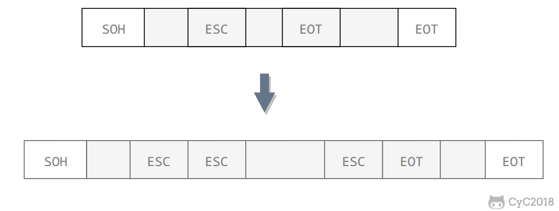
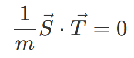
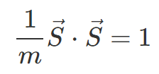
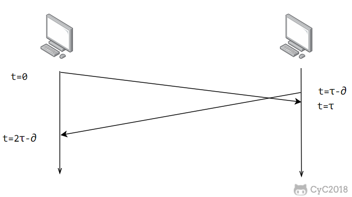

<!-- GFM-TOC -->
* [基本問題](#基本問題)
    * [1. 封裝成幀](#1-封裝成幀)
    * [2. 透明傳輸](#2-透明傳輸)
    * [3. 差錯檢測](#3-差錯檢測)
* [信道分類](#信道分類)
    * [1. 廣播信道](#1-廣播信道)
    * [2. 點對點信道](#2-點對點信道)
* [信道複用技術](#信道複用技術)
    * [1. 頻分複用](#1-頻分複用)
    * [2. 時分複用](#2-時分複用)
    * [3. 統計時分複用](#3-統計時分複用)
    * [4. 波分複用](#4-波分複用)
    * [5. 碼分複用](#5-碼分複用)
* [CSMA/CD 協議](#csmacd-協議)
* [PPP 協議](#ppp-協議)
* [MAC 地址](#mac-地址)
* [局域網](#局域網)
* [以太網](#以太網)
* [交換機](#交換機)
* [虛擬局域網](#虛擬局域網)
<!-- GFM-TOC -->

# 基本問題

## 1. 封裝成幀

將網絡層傳下來的分組添加首部和尾部，用於標記幀的開始和結束。

  
 

## 2. 透明傳輸

透明表示一個實際存在的事物看起來好像不存在一樣。

幀使用首部和尾部進行定界，如果幀的數據部分含有和首部尾部相同的內容，那麼幀的開始和結束位置就會被錯誤的判定。需要在數據部分出現首部尾部相同的內容前面插入轉義字符。如果數據部分出現轉義字符，那麼就在轉義字符前面再加個轉義字符。在接收端進行處理之後可以還原出原始數據。這個過程透明傳輸的內容是轉義字符，用戶察覺不到轉義字符的存在。

  
 

## 3. 差錯檢測

目前數據鏈路層廣泛使用了循環冗餘檢驗（CRC）來檢查比特差錯。

# 信道分類

## 1. 廣播信道

一對多通信，一個節點發送的數據能夠被廣播信道上所有的節點接收到。

所有的節點都在同一個廣播信道上發送數據，因此需要有專門的控制方法進行協調，避免發生衝突（衝突也叫碰撞）。

主要有兩種控制方法進行協調，一個是使用信道複用技術，一是使用 CSMA/CD 協議。

## 2. 點對點信道

一對一通信。

因為不會發生碰撞，因此也比較簡單，使用 PPP 協議進行控制。

# 信道複用技術

## 1. 頻分複用

頻分複用的所有主機在相同的時間佔用不同的頻率帶寬資源。

  
 

## 2. 時分複用

時分複用的所有主機在不同的時間佔用相同的頻率帶寬資源。

  
 

使用頻分複用和時分複用進行通信，在通信的過程中主機會一直佔用一部分信道資源。但是由於計算機數據的突發性質，通信過程沒必要一直佔用信道資源而不讓出給其它用戶使用，因此這兩種方式對信道的利用率都不高。

## 3. 統計時分複用

是對時分複用的一種改進，不固定每個用戶在時分複用幀中的位置，只要有數據就集中起來組成統計時分複用幀然後發送。

  
 

## 4. 波分複用

光的頻分複用。由於光的頻率很高，因此習慣上用波長而不是頻率來表示所使用的光載波。

## 5. 碼分複用

為每個用戶分配 m bit 的碼片，並且所有的碼片正交，對於任意兩個碼片  和  有

<!-- 

   -->

  
 

為了討論方便，取 m=8，設碼片  為 00011011。在擁有該碼片的用戶發送比特 1 時就發送該碼片，發送比特 0 時就發送該碼片的反碼 11100100。

在計算時將 00011011 記作 (-1 -1 -1 +1 +1 -1 +1 +1)，可以得到

<!-- 

   -->

<!-- 

   -->

  
 

  
 

其中  為  的反碼。

利用上面的式子我們知道，當接收端使用碼片  對接收到的數據進行內積運算時，結果為 0 的是其它用戶發送的數據，結果為 1 的是用戶發送的比特 1，結果為 -1 的是用戶發送的比特 0。

碼分複用需要發送的數據量為原先的 m 倍。

  
 

# CSMA/CD 協議

CSMA/CD 表示載波監聽多點接入 / 碰撞檢測。

-  **多點接入** ：說明這是總線型網絡，許多主機以多點的方式連接到總線上。
-  **載波監聽** ：每個主機都必須不停地監聽信道。在發送前，如果監聽到信道正在使用，就必須等待。
-  **碰撞檢測** ：在發送中，如果監聽到信道已有其它主機正在發送數據，就表示發生了碰撞。雖然每個主機在發送數據之前都已經監聽到信道為空閒，但是由於電磁波的傳播時延的存在，還是有可能會發生碰撞。

記端到端的傳播時延為 τ，最先發送的站點最多經過 2τ 就可以知道是否發生了碰撞，稱 2τ 為  **爭用期** 。只有經過爭用期之後還沒有檢測到碰撞，才能肯定這次發送不會發生碰撞。

當發生碰撞時，站點要停止發送，等待一段時間再發送。這個時間採用  **截斷二進制指數退避算法**  來確定。從離散的整數集合 {0, 1, .., (2k-1)} 中隨機取出一個數，記作 r，然後取 r 倍的爭用期作為重傳等待時間。

  
 

# PPP 協議

互聯網用戶通常需要連接到某個 ISP 之後才能接入到互聯網，PPP 協議是用戶計算機和 ISP 進行通信時所使用的數據鏈路層協議。

  
 

PPP 的幀格式：

- F 字段為幀的定界符
- A 和 C 字段暫時沒有意義
- FCS 字段是使用 CRC 的檢驗序列
- 信息部分的長度不超過 1500

  
 

# MAC 地址

MAC 地址是鏈路層地址，長度為 6 字節（48 位），用於唯一標識網絡適配器（網卡）。

一臺主機擁有多少個網絡適配器就有多少個 MAC 地址。例如筆記本電腦普遍存在無線網絡適配器和有線網絡適配器，因此就有兩個 MAC 地址。

# 局域網

局域網是一種典型的廣播信道，主要特點是網絡為一個單位所擁有，且地理範圍和站點數目均有限。

主要有以太網、令牌環網、FDDI 和 ATM 等局域網技術，目前以太網佔領著有線局域網市場。

可以按照網絡拓撲結構對局域網進行分類：

  
 

# 以太網

以太網是一種星型拓撲結構局域網。

早期使用集線器進行連接，集線器是一種物理層設備， 作用於比特而不是幀，當一個比特到達接口時，集線器重新生成這個比特，並將其能量強度放大，從而擴大網絡的傳輸距離，之後再將這個比特發送到其它所有接口。如果集線器同時收到兩個不同接口的幀，那麼就發生了碰撞。

目前以太網使用交換機替代了集線器，交換機是一種鏈路層設備，它不會發生碰撞，能根據 MAC 地址進行存儲轉發。

以太網幀格式：

-  **類型** ：標記上層使用的協議；
-  **數據** ：長度在 46-1500 之間，如果太小則需要填充；
-  **FCS** ：幀檢驗序列，使用的是 CRC 檢驗方法；

  
 

# 交換機

交換機具有自學習能力，學習的是交換表的內容，交換表中存儲著 MAC 地址到接口的映射。

正是由於這種自學習能力，因此交換機是一種即插即用設備，不需要網絡管理員手動配置交換表內容。

下圖中，交換機有 4 個接口，主機 A 向主機 B 發送數據幀時，交換機把主機 A 到接口 1 的映射寫入交換表中。為了發送數據幀到 B，先查交換表，此時沒有主機 B 的表項，那麼主機 A 就發送廣播幀，主機 C 和主機 D 會丟棄該幀，主機 B 迴應該幀向主機 A 發送數據包時，交換機查找交換表得到主機 A 映射的接口為 1，就發送數據幀到接口 1，同時交換機添加主機 B 到接口 2 的映射。

  
 

# 虛擬局域網

虛擬局域網可以建立與物理位置無關的邏輯組，只有在同一個虛擬局域網中的成員才會收到鏈路層廣播信息。

例如下圖中 (A1, A2, A3, A4) 屬於一個虛擬局域網，A1 發送的廣播會被 A2、A3、A4 收到，而其它站點收不到。

使用 VLAN 幹線連接來建立虛擬局域網，每臺交換機上的一個特殊接口被設置為幹線接口，以互連 VLAN 交換機。IEEE 定義了一種擴展的以太網幀格式 802.1Q，它在標準以太網幀上加進了 4 字節首部 VLAN 標籤，用於表示該幀屬於哪一個虛擬局域網。

  
 

# 微信公眾號

更多精彩內容將發佈在微信公眾號 CyC2018 上，你也可以在公眾號後臺和我交流學習和求職相關的問題。另外，公眾號提供了該項目的 PDF 等離線閱讀版本，後臺回覆 "下載" 即可領取。公眾號也提供了一份技術面試複習大綱，不僅系統整理了面試知識點，而且標註了各個知識點的重要程度，從而幫你理清多而雜的面試知識點，後臺回覆 "大綱" 即可領取。我基本是按照這個大綱來進行復習的，對我拿到了 BAT 頭條等 Offer 起到很大的幫助。你們完全可以和我一樣根據大綱上列的知識點來進行復習，就不用看很多不重要的內容，也可以知道哪些內容很重要從而多安排一些複習時間。

 
</img>

