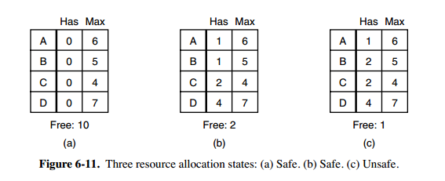

<!-- GFM-TOC -->
* [必要條件](#必要條件)
* [處理方法](#處理方法)
* [鴕鳥策略](#鴕鳥策略)
* [死鎖檢測與死鎖恢復](#死鎖檢測與死鎖恢復)
    * [1. 每種類型一個資源的死鎖檢測](#1-每種類型一個資源的死鎖檢測)
    * [2. 每種類型多個資源的死鎖檢測](#2-每種類型多個資源的死鎖檢測)
    * [3. 死鎖恢復](#3-死鎖恢復)
* [死鎖預防](#死鎖預防)
    * [1. 破壞互斥條件](#1-破壞互斥條件)
    * [2. 破壞佔有和等待條件](#2-破壞佔有和等待條件)
    * [3. 破壞不可搶佔條件](#3-破壞不可搶佔條件)
    * [4. 破壞環路等待](#4-破壞環路等待)
* [死鎖避免](#死鎖避免)
    * [1. 安全狀態](#1-安全狀態)
    * [2. 單個資源的銀行家算法](#2-單個資源的銀行家算法)
    * [3. 多個資源的銀行家算法](#3-多個資源的銀行家算法)
<!-- GFM-TOC -->

# 必要條件

  
 

- 互斥：每個資源要麼已經分配給了一個進程，要麼就是可用的。
- 佔有和等待：已經得到了某個資源的進程可以再請求新的資源。
- 不可搶佔：已經分配給一個進程的資源不能強制性地被搶佔，它只能被佔有它的進程顯式地釋放。
- 環路等待：有兩個或者兩個以上的進程組成一條環路，該環路中的每個進程都在等待下一個進程所佔有的資源。

# 處理方法

主要有以下四種方法：

- 鴕鳥策略
- 死鎖檢測與死鎖恢復
- 死鎖預防
- 死鎖避免

# 鴕鳥策略

把頭埋在沙子裡，假裝根本沒發生問題。

因為解決死鎖問題的代價很高，因此鴕鳥策略這種不採取任務措施的方案會獲得更高的性能。

當發生死鎖時不會對用戶造成多大影響，或發生死鎖的概率很低，可以採用鴕鳥策略。

大多數操作系統，包括 Unix，Linux 和 Windows，處理死鎖問題的辦法僅僅是忽略它。

# 死鎖檢測與死鎖恢復

不試圖阻止死鎖，而是當檢測到死鎖發生時，採取措施進行恢復。

## 1. 每種類型一個資源的死鎖檢測

  
 

上圖為資源分配圖，其中方框表示資源，圓圈表示進程。資源指向進程表示該資源已經分配給該進程，進程指向資源表示進程請求獲取該資源。

圖 a 可以抽取出環，如圖 b，它滿足了環路等待條件，因此會發生死鎖。

每種類型一個資源的死鎖檢測算法是通過檢測有向圖是否存在環來實現，從一個節點出發進行深度優先搜索，對訪問過的節點進行標記，如果訪問了已經標記的節點，就表示有向圖存在環，也就是檢測到死鎖的發生。

## 2. 每種類型多個資源的死鎖檢測

  
 

上圖中，有三個進程四個資源，每個數據代表的含義如下：

- E 向量：資源總量
- A 向量：資源剩餘量
- C 矩陣：每個進程所擁有的資源數量，每一行都代表一個進程擁有資源的數量
- R 矩陣：每個進程請求的資源數量

進程 P1 和 P2 所請求的資源都得不到滿足，只有進程 P3 可以，讓 P3 執行，之後釋放 P3 擁有的資源，此時 A = (2 2 2 0)。P2 可以執行，執行後釋放 P2 擁有的資源，A = (4 2 2 1) 。P1 也可以執行。所有進程都可以順利執行，沒有死鎖。

算法總結如下：

每個進程最開始時都不被標記，執行過程有可能被標記。當算法結束時，任何沒有被標記的進程都是死鎖進程。

1. 尋找一個沒有標記的進程 Pi，它所請求的資源小於等於 A。
2. 如果找到了這樣一個進程，那麼將 C 矩陣的第 i 行向量加到 A 中，標記該進程，並轉回 1。
3. 如果沒有這樣一個進程，算法終止。

## 3. 死鎖恢復

- 利用搶佔恢復
- 利用回滾恢復
- 通過殺死進程恢復

# 死鎖預防

在程序運行之前預防發生死鎖。

## 1. 破壞互斥條件

例如假脫機打印機技術允許若干個進程同時輸出，唯一真正請求物理打印機的進程是打印機守護進程。

## 2. 破壞佔有和等待條件

一種實現方式是規定所有進程在開始執行前請求所需要的全部資源。

## 3. 破壞不可搶佔條件

## 4. 破壞環路等待

給資源統一編號，進程只能按編號順序來請求資源。

# 死鎖避免

在程序運行時避免發生死鎖。

## 1. 安全狀態

  
 

圖 a 的第二列 Has 表示已擁有的資源數，第三列 Max 表示總共需要的資源數，Free 表示還有可以使用的資源數。從圖 a 開始出發，先讓 B 擁有所需的所有資源（圖 b），運行結束後釋放 B，此時 Free 變為 5（圖 c）；接著以同樣的方式運行 C 和 A，使得所有進程都能成功運行，因此可以稱圖 a 所示的狀態時安全的。

定義：如果沒有死鎖發生，並且即使所有進程突然請求對資源的最大需求，也仍然存在某種調度次序能夠使得每一個進程運行完畢，則稱該狀態是安全的。

安全狀態的檢測與死鎖的檢測類似，因為安全狀態必須要求不能發生死鎖。下面的銀行家算法與死鎖檢測算法非常類似，可以結合著做參考對比。

## 2. 單個資源的銀行家算法

一個小城鎮的銀行家，他向一群客戶分別承諾了一定的貸款額度，算法要做的是判斷對請求的滿足是否會進入不安全狀態，如果是，就拒絕請求；否則予以分配。

  
 

上圖 c 為不安全狀態，因此算法會拒絕之前的請求，從而避免進入圖 c 中的狀態。

## 3. 多個資源的銀行家算法

  
 

上圖中有五個進程，四個資源。左邊的圖表示已經分配的資源，右邊的圖表示還需要分配的資源。最右邊的 E、P 以及 A 分別表示：總資源、已分配資源以及可用資源，注意這三個為向量，而不是具體數值，例如 A=(1020)，表示 4 個資源分別還剩下 1/0/2/0。

檢查一個狀態是否安全的算法如下：

- 查找右邊的矩陣是否存在一行小於等於向量 A。如果不存在這樣的行，那麼系統將會發生死鎖，狀態是不安全的。
- 假若找到這樣一行，將該進程標記為終止，並將其已分配資源加到 A 中。
- 重複以上兩步，直到所有進程都標記為終止，則狀態時安全的。

如果一個狀態不是安全的，需要拒絕進入這個狀態。

# 微信公眾號

更多精彩內容將發佈在微信公眾號 CyC2018 上，你也可以在公眾號後臺和我交流學習和求職相關的問題。另外，公眾號提供了該項目的 PDF 等離線閱讀版本，後臺回覆 "下載" 即可領取。公眾號也提供了一份技術面試複習大綱，不僅系統整理了面試知識點，而且標註了各個知識點的重要程度，從而幫你理清多而雜的面試知識點，後臺回覆 "大綱" 即可領取。我基本是按照這個大綱來進行復習的，對我拿到了 BAT 頭條等 Offer 起到很大的幫助。你們完全可以和我一樣根據大綱上列的知識點來進行復習，就不用看很多不重要的內容，也可以知道哪些內容很重要從而多安排一些複習時間。

 
</img>

