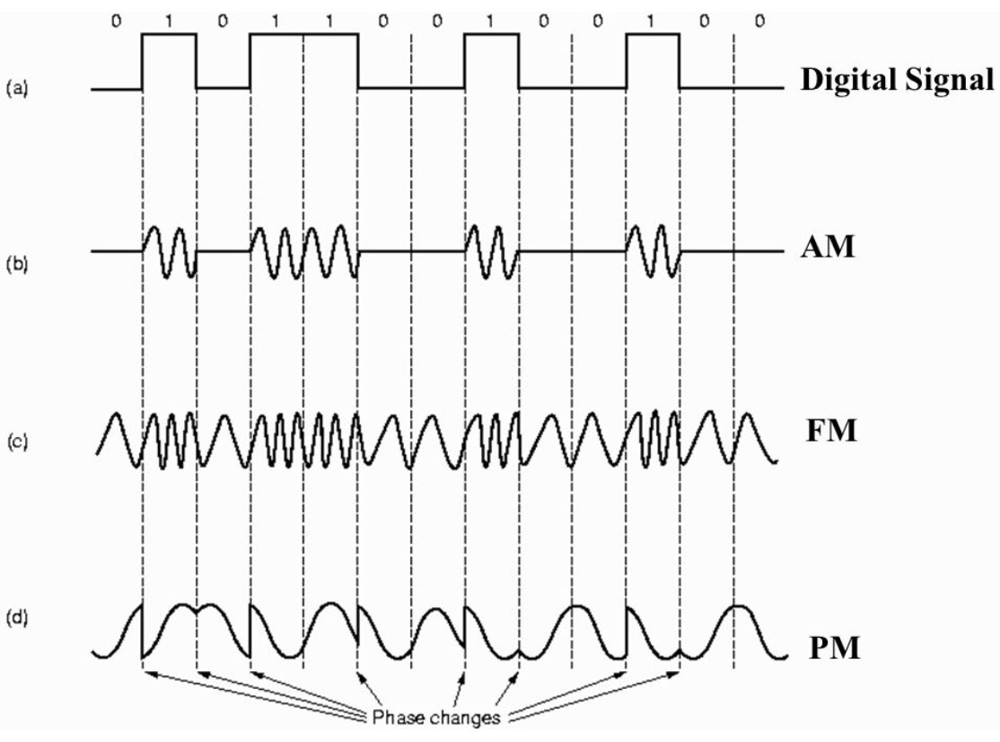

<!-- GFM-TOC -->
* [通信方式](#通信方式)
* [帶通調製](#帶通調製)
<!-- GFM-TOC -->

# 通信方式

根據信息在傳輸線上的傳送方向，分為以下三種通信方式：

- 單工通信：單向傳輸
- 半雙工通信：雙向交替傳輸
- 全雙工通信：雙向同時傳輸

# 帶通調製

模擬信號是連續的信號，數字信號是離散的信號。帶通調製把數字信號轉換為模擬信號。

  
 

# 微信公眾號

更多精彩內容將發佈在微信公眾號 CyC2018 上，你也可以在公眾號後臺和我交流學習和求職相關的問題。另外，公眾號提供了該項目的 PDF 等離線閱讀版本，後臺回覆 "下載" 即可領取。公眾號也提供了一份技術面試複習大綱，不僅系統整理了面試知識點，而且標註了各個知識點的重要程度，從而幫你理清多而雜的面試知識點，後臺回覆 "大綱" 即可領取。我基本是按照這個大綱來進行復習的，對我拿到了 BAT 頭條等 Offer 起到很大的幫助。你們完全可以和我一樣根據大綱上列的知識點來進行復習，就不用看很多不重要的內容，也可以知道哪些內容很重要從而多安排一些複習時間。

 
</img>

